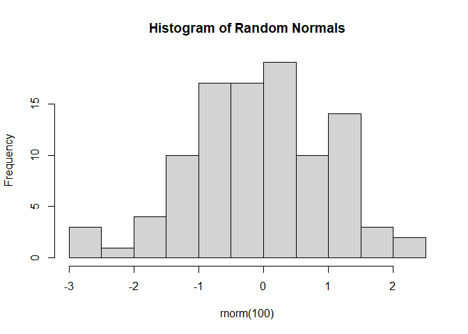

---
author:
- Elizabeth Waterfield
authors:
- Elizabeth Waterfield
date: 13/10/2025
date-format: DD/MM/YYYY
execute:
  echo: true
  engine: knitr
  eval: true
title: Introduction to Collaborative Coding with GitHub
toc-title: Table of contents
---

## Feedback Slide - please DELETE at the end

::: {style="font-size: 0.6em;"}
[From Beth: `<br>`{=html} - do they need to do advanced r skills lesson?
]{style="color:red"}
:::

------------------------------------------------------------------------

## Contribution statement and licence

**Creator**: Waterfield, Elizabeth (
[0009-0006-3725-6730](https://orcid.org/my-orcid?orcid=0009-0006-3725-6730)

**Reviewer**: von Grebmer zu Wolfsthurn, Sarah (
[0000-0002-6413-3895](https://orcid.org/my-orcid?orcid=0000-0002-6413-3895))

**Acknowledgments**: Middleton, Sara Lil (
orcid)

`<br>`{=html} `<br>`{=html}

::: {style="font-size: 0.6em;"}
This work by Elizabeth Waterfield, Sara Lil Middleton and Sarah von
Grebmer zu Wolfsthurn is licensed under a CC-BY 4.0 [Creative Commons
Attribution 4.0 International
License](https://creativecommons.org/licenses/by/4.0/deed.en).
:::

::: notes
**Speaker Notes**: Speaker notes may act as a guiding script for
delivering the presentation. These notes contain key information, such
as phrases, explanations, or transitions, that can be said aloud to
clarify concepts, emphasize important points, or maintain the flow of
information.

**Instructor Notes**: Instructor notes provide teaching support but are
not intended to be communicated to the students directly. These notes
contain additional context, such as learning objectives, common issues,
and pedagogical tips, to help the instructor adapt their teaching to the
learner's needs as well as anticipate challenges.

**Acessibility Tips**: Where applicable, this is a space to add any tips
you may have to facilitate the accessibility of your slides and
activities.
:::

------------------------------------------------------------------------

### Prerequisites

<div>

> **Prerequisites**
>
> Before completing this submodule, please carefully read about the
> necessary prerequisites.

</div>

::: {style="font-size: 0.8em;"}
  -----------------------------------------------------------------------
  Prerequisite            Description             Link/Where to find it
  ----------------------- ----------------------- -----------------------
  Basic R skills          3.2. Introduction to    Module 3.2.
                          R - Part I              

  Basic Git skills        3.4. Introduction       Module 3.4.
                          version control (Git)   
                          with RStudio            
  -----------------------------------------------------------------------
:::

::: notes
**Speaker Notes**: Let us first take a look at these prerequisites.
These are important to complete in order to fully understand what will
be covered in this submodule.

**Instructor Notes**: These are the prerequisites for this submodule.
Before you get started on this submodule with your audience, you need to
ensure that the audience fulfills these criteria. In this session, we
will assume that your audience has basic R skills and completed the
corresponding workshops. We also assume familiariy with Git and that the
audience has also completed that submodule. Finally, we assume that,
through the previos workshops, participants have downloaded and
installed R and RStudio on their local machines.
:::

------------------------------------------------------------------------

## Preparation for Collaboration on GitHub

**How to create an account on GitHub**

1.  Got to the [GitHub website](https://github.com/) and click on *Sign
    Up* in the top-right corner.
2.  Use your email, create a Password, choose a unique username, and
    select the country.
3.  Click *Create account* and verify your email to finish signing up.

::: notes
**Speaker Notes**: If you already have an account on GitHub, then great!
Please sign in now. But if not, follow these steps to create one.

**Instructor Notes**: Students should create their own GitHub account
that they can continue using for future projects, not just for this
lesson.
:::

------------------------------------------------------------------------

## Questions from previous submodule

::: notes
**Speaker Notes**: Are there any questions from what was discussed
during the last session? Are there any remaining thoughts or discussion
points?

**Instructor Notes**: `<br>`{=html} - Aim: clarify questions from the
previous submodule and/or to discuss assignments. - Additional slides
may need to be added depending on the nature of the homework
assignments. - It is critical for the learning process to ensure that
students are on the same page and have been able to achieve the learning
goals of the previous workshop. - Not applicable if this set of slides
corresponds to the first submodule of a new module.
:::

------------------------------------------------------------------------

## Before we start: Survey time!

::: notes
**Speaker Notes**: `<br>`{=html} - Let's start the session by gauging
where our Quarto skills are at this point. Please answer honestly and
don't worry about having little to no prior knowledge about Quarto. This
lesson is for beginners.

**Instructor Notes**: `<br>`{=html} - Aim: the pre-submodule survey
serves to examine students' prior knowledge about the submodule's
topic. - Use free survey software such as particify to establish this.
You can use the example survey, edit it or create your own. Make sure to
have a QR code for easy scanning, as well as the link displayed on the
slides.
:::

------------------------------------------------------------------------

**What is your level of familiarity with working on GitHub?**

a.  I have never heard of it before.

b.  I have heard of it but have never worked with it.

c.  I have basic understanding and experience with it.

d.  I am very familiar and have worked with it extensively.

------------------------------------------------------------------------

**Which of the following concepts or skills do you feel most confident
about in relation to Git and GitHub? (Select all that apply)**

a.  Creating and initializing a new Git repository.

b.  Making commits and writing meaningful commit messages.

c.  Cloning a repository from GitHub to my local machine.

d.  Pushing local changes to a remote repository.

e.  Pulling or fetching updates from a remote repository.

f.  Forking a repository and working on my own copy.

g.  I am not sure about any of these concepts.

------------------------------------------------------------------------

**On a scale of 1 to 5, how comfortable are you with using Git and
GitHub for collaborative coding and version control? (1 = Not
comfortable at all, 5 = Very comfortable)**

a.  1

b.  2

c.  3

d.  4

e.  5

------------------------------------------------------------------------

**When working collaboratively on a GitHub project, what aspect do you
find most challenging?**

a.  Understanding Git commands (commit, push, pull).

b.  Managing merge conflicts.

c.  Navigating the GitHub interface.

d.  Other

e.  I haven't collaborated on GitHub yet.

------------------------------------------------------------------------

## Discussion of survey results

**What can we take from this?**

::: notes
**Speaker Notes**: Looking at the results from this small survey, what
can we take from this? There will be a similar post-submodule survey to
examine understanding and learning progress.

**Instructor Notes**: `<br>`{=html} - Aim: briefly examine the answers
given to each question interactively with the group. - Use visuals from
the survey to highlight specific answers. - Make it clear to the group
that there will be a similar post-submodule survey to examine
understanding and learning progress.
:::

------------------------------------------------------------------------

## Where are we at?

**Open Science** builds a culture of transparency, collaboration, and
reproducibility. `<br>`{=html}

**GitHub** contributes to this by allowing researchers to

-   Share their projects openly
-   Collaborate remotely
-   Track changes

GitHub offers a collaborative platform that enables transparent sharing,
version control, and reproducible workflows. These are the core pillars
of Open Science.

::: notes
**Speaker Notes**:

**Instructor Notes**: `<br>`{=html} - Aim: Place the topic of the
current submodule within a broader context. `<br>`{=html} - Consider
GitHub as a solution to some existing challenges in Open Research to
remind students what they are working towards and what the bigger
picture is.
:::

------------------------------------------------------------------------

## Learning goals

At the end of this session, you should be able to:

-   **Navigate** GitHub to collaborate on shared projects.
-   **Fork** and **clone** repositories to work locally without altering
    the main branch.
-   **Commit**, **push**, and **pull** changes to keep your project
    tracked and synchronized.
-   **Design** a collaborative workflow that enhances the openness and
    reproducibility of your research.

::: notes
**Speaker Notes**:

**Instructor Notes**: `<br>`{=html} - Aim: Formulate specific,
action-oriented goals learning goals which are measurable and observable
in line with Bloom's taxonomy (Anderson et al., 2001; Bloom et al.,
1956) `<br>`{=html} - Emphasis is placed on the VERBS of the learning
goals that align with the skills you want to develop or assess.
:::

------------------------------------------------------------------------

## Covered in this session

::: {style="font-size: 1.2em;"}
-   **GitHub Workflow**: Overview on the actions involved in using
    GitHub to create a workflow
-   **Fork a Repo**
-   **Clone a Repo**
-   **Commit to a Project**
-   **Push Changes**
-   **Pull Request**
-   **Merge Changes**
-   **Pull Upstream**
:::

::: notes
**Speaker Notes**: This session will be an introduction on how to
navigate GitHub and the language (coding) used to communicate with
GitHub using your RStudio terminal. What follows are essentially
commands you can use to collaborate with others on projects by accessing
the files, making changes without affecting anyone else's progress,
keeping your work updated, and more.

**Instructor Notes**: `<br>`{=html} - Aim: To establish the core
theoretical introduction of submodule topics. `<br>`{=html} - Pair
theoretical aspects with practical exercises and group discussions
according to the Think-Pair-Share style and according to Cognitive Load
Theory (Sweller, 1980).
:::

------------------------------------------------------------------------

## Key terms and definitions

-   **Git**: A tool that tracks changes made to files over time.\
-   **Version Control**: A system that records and manages changes so
    you can revisit or collaborate on different versions of your work.\
-   **Git Repository**: (repo) A folder that contains your project files
    and the history of all changes made to them.
-   **Branch**: A separate workspace where you can make changes without
    affecting the main project.

::: notes
**Speaker Notes**: `<br>`{=html} - These are some of the key terms that
will come up throughout this lesson, let's define them. `<br>`{=html} -
Think of Git is like a time machine for your project as it keeps track
of every edit so you can go back to earlier versions or see who changed
what. Git runs locally on your computer but connects easily with
platforms like GitHub for sharing. `<br>`{=html} - Version control is
the process of tracking and managing updates to your files over time. It
allows multiple people to work on the same project without overwriting
each other's work, making research more organized, transparent, and
reproducible. `<br>`{=html} - A Git repository is a folder that contains
your project files and a full history of their changes. This folder can
live locally on your computer or online (for example, on GitHub) so
others can collaborate. `<br>`{=html} - A Branch is a copy of your
project where you can test changes without affecting the main version.
The Main Branch is the stable, official version of your project. You can
work on a branch, then merge your updates back into the main branch once
they're reviewed or ready.

**Instructor Notes**: Base yourself on conceptual change theory and
examine existing concepts in relation to some key terms. Re-examine
formation of new concepts at the end of the lesson.
:::

------------------------------------------------------------------------

## What is GitHub

**GitHub** is an online platform that helps people store, share, and
collaborate on projects using Git

::::: {style="display: flex; gap: 1em;"}
::: {style="flex: 0.5;"}

:::

::: {style="flex: 1.5;"}
On **GitHub**, you can:

-   Host repositories online so teams can work from anywhere.
-   Track changes and keep project history.
-   Collaborate through branches, commits, and pull requests.
-   Promote openness, transparency, and reproducibility in research.
:::
:::::

::: notes
**Speaker Notes**:

**Instructor Notes**: For a 90-minute lesson, the instructor should try
to "lecture" for only 20 minutes, students should work in
groups/pairs/on their own for at least 55 minutes of the lesson (+ a 15
minute break). `<br>`{=html} - Aim: Core theoretical introduction of
submodule topic. `<br>`{=html} - Pair theoretical aspects with practical
exercises and group discussions according to the Think-Pair-Share style
and according to Cognitive Load Theory (Sweller, 1980).
:::

------------------------------------------------------------------------

## What is collaborative coding?

**Collaborative coding** is the process of working together on the same
code or project (like on GitHub) where everyone can contribute, review,
and improve the work collectively.

::::: {style="display: flex; gap: 1em;"}
::: {style="flex: 0.5;"}

:::

::: {style="flex: 1.5;"}
With **Collaborative coding**:

-   Multiple people can work on different parts of the same project at
    once.
-   Git and GitHub keep everyone's work organized, merged, and tracked.
-   There's more transparency and reproducibility in research projects.
:::
:::::

::: notes
**Speaker Notes**:

**Instructor Notes**:
:::

------------------------------------------------------------------------

## Creating a workflow with GitHub

:::::::::::::::::::::::::::: {style="display: flex; gap: 1em;"}
::: {style="flex: 0.5;"}

:::

:::::::::::::::::::::::::: {style="flex: 1.5;"}
*What a workflow using GitHub can look like*:

-   there's a repo with the project files that everyone will use
-   fork the repo to have your own copy on GitHub
-   clone the repo to download it to your local device
-   make changes locally and commit it to track your progress
-   push changes to your fork without disturbing anyone else's progress
-   pull changes from the main branch to keep your copy up to date
-   when finished, make a pull request so your changes can be reviewed
    and then merged into the main branch

------------------------------------------------------------------------

## Fork a repo

To **fork** a GitHub repo means to copy a collaborator's repo to your
own *GitHub account*.

::::::::::::::::::::::::: notes
**Speaker Notes**:

**Instructor Notes**: This lesson introduces both point-and-click and
command-line (Git) methods. Students can choose the workflow they prefer
for connecting RStudio with GitHub.

------------------------------------------------------------------------

## Practical exercise 1

**Fork a repo**

 - \[ \] Go to the repo on GitHub - \[ \] Click
on Fork in the top-right toolbar

------------------------------------------------------------------------

## Clone a repo

To **clone** a GitHub repo means to copy the project files to your
*local device*, such as your personal computer.

<div>

> **Important Difference**
>
> When you **fork** the repo, a copy is made on your *GitHub account*.
> When you **clone** a repo, a copy is downloaded from GitHub onto your
> *local device*.

</div>

------------------------------------------------------------------------

## How to clone a repo

------------------------------------------------------------------------

## Commit to a project

To **commit** to a project is to save the file locally in your version
control system.

-   A commit is like a saved snapshot of your project at a specific
    point in time.
-   Usually with a short message describing the changes you made.

::: notes
**Speaker Notes**: A commit is like taking a snapshot of your project
after you make changes. Each commit records what was changed, when, and
by whom. You usually include a short message describing the update, for
example, "Updated code for analysis."

Commits make it possible to track progress, go back to earlier versions,
and understand how the project evolved over time.\
In collaborative projects, they also help others see your contributions
clearly.
:::

------------------------------------------------------------------------

## Push changes

------------------------------------------------------------------------

## Pull request

------------------------------------------------------------------------

## Merge changes

------------------------------------------------------------------------

## Pull upstream

------------------------------------------------------------------------

## Practical exercise 1

-   **Aim**: Design more practical exercises for students to apply the
    new skills in practise.

-   Depending on the topic, the exercises should be in accordance with
    the learning objective(s).

-   Add a description of the task, as well as a checklist as an overview
    of that your students need to be doing.

-   [x] Step 1

-   [ ] Step 2

-   [ ] Step 3

::: notes
**Instructor Notes**: `<br>`{=html} - Practical exercises on topic
`<br>`{=html} - Aim: practical exercises for students to apply the new
skills in practise. Each submodule topic will include corresponding
Tasks- adopting a "learn by doing" approach. `<br>`{=html} - Depending
on the topic, the exercises should be in accordance with the learning
objective(s). `<br>`{=html} - It's useful to have exercises directly
after a topic is taught to reinforce what was learnt. `<br>`{=html} -
For students who advance faster: Prepare extra exercises or redirect
them to resources that provide advanced activities.
:::

------------------------------------------------------------------------

## Pre-break survey

-   **Aim**: This pre-break survey serves to examine students' current
    understanding of key concepts of the submodule

-   ## Use free survey software such as or other survey software (particify, formR) to establish the following questions (shown on separate slides):

**Which species is the largest type of penguin**?

a.  Chinstrap Penguin

b.  Emperor Penguin ✅

c.  Adélie Penguin

d.  King Penguin

------------------------------------------------------------------------

**What is the key biological feature that helps penguins swim
efficiently?**

a.  Hollow bones for buoyancy

b.  Webbed feet for paddling

c.  Waterproof feathers and flipper-like wings ✅

d.  Gills to breathe underwater

------------------------------------------------------------------------

# Break! 15 minutes

------------------------------------------------------------------------

## Post-break survey discussion

-   **Aim**: To clarify concepts and aspects that are not yet understood
-   Highlight specific answers given during the survey

------------------------------------------------------------------------

## Practical Exercise 2

-   **Aim**: Design more practical exercises for students to apply the
    new skills in practise.

-   Depending on the topic, the exercises should be in accordance with
    the learning objective(s).

-   Add a description of the task, as well as a checklist as an overview
    of that your students need to be doing.

-   [x] Step 1

-   [ ] Step 2

-   [ ] Step 3

::: notes
For students who advance faster: Prepare extra exercises.
:::

------------------------------------------------------------------------

## Relevance and implications

-   **Aim**: To work out the relevance of the topic to your students.
-   In an interactive setting, discuss how the new skills could be
    applied in practise with specific examples.
-   Examine downfalls and practical obstacles.

------------------------------------------------------------------------

## Take-home message

**Aim**: End lesson on clear take-home message that are interactively
compiled by students.

<div>

> **Tip with Title**
>
> Add one practical tips or take-home message.

</div>

------------------------------------------------------------------------

## Assignment

-   **Aim**: Explain the homework assignment and the rationale behind
    the homework.
-   Examine whether/how it will be assessed
-   Mention scoring rubrics, if applicable
-   Design a peer-review system for assignments to place students in
    role of reviewer and author

------------------------------------------------------------------------

## To conclude: Survey time!

-   **Aim**: This post-submodule survey serves to examine students'
    current knowledge about the sumodule's topic.
-   Use free survey software such as or other survey software
    (particify, formR) to establish the following questions (shown on
    separate slides):

------------------------------------------------------------------------

**What is your level of familiarity with \[Topic\] (e.g., basic
concepts, terminology, or tools)?**

a.  I have never heard of it before.

b.  I have heard of it but have never worked with it.

c.  I have basic understanding and experience with it.

d.  I am very familiar and have worked with it extensively.

------------------------------------------------------------------------

**Which of the following concepts or skills do you feel most confident
about in relation to \[Topic\]? (Select all that apply)**

a.  Concept 1

b.  Concept 2

c.  Concept 3

d.  Concept 4

e.  I am not sure about any of these concepts.

------------------------------------------------------------------------

**On a scale of 1 to 5, how comfortable are you with using \[specific
tool/technology\] related to \[Topic\]? (1 = Not comfortable at all, 5 =
Very comfortable)**

a.  1

b.  2

c.  3

d.  4

e.  5

------------------------------------------------------------------------

## Discussion of survey results

-   **Aim**: Briefly examine the answers given to each question
    interactively with the group.
-   Compare and highlight specific differences in answers between pre-
    and post-survey answers

------------------------------------------------------------------------

## References

-   Provide literature you refer to throughout this lesson.

------------------------------------------------------------------------

# Thanks! `<br>`{=html}

See you next class :)

------------------------------------------------------------------------

## Pedagogical add-on tools for instructors

-   This section is dedicated to ideas on how to incorporate pedagogical
    tools into teaching for this specific submodule topic. This could
    mean:
    -   Information about the scientific evidence on the theory of the
        pedagogical add-on tool and the evidence for its efficacy.
    -   Discussion/reflection on how tools can be incorporated into the
        teaching for this particular content.
    -   Extra exercises for faster students.

------------------------------------------------------------------------

## Additional literature for instructors

-   References for content
-   References for pedagogical add-on tools\
-   Other resources (videos etc.)

------------------------------------------------------------------------

# Formatting elements for instructors

-   **Aim**: This section contains templates for different formatting
    elements, which can be modified and adapted for the instructor's
    individual purposes.

------------------------------------------------------------------------

## Text with example links

-   [Quarto Documentation](https://quarto.org/docs/)
-   [Reveal.js Documentation](https://revealjs.com/)
-   [Markdown Guide](https://www.markdownguide.org/)
-   [GitHub](https://github.com/)

------------------------------------------------------------------------

## Basic text formatting

-   **Bold:** `**bold**` → **bold**

-   *Italic:* `*italic*` → *italic*

-   ~~Strikethrough:~~ `~~text~~` → ~~text~~

-   `Inline code:` `` `code` `` → `code`

-   > Blockquote: `> Quote` →\
    > "This is a quote"

------------------------------------------------------------------------

## Figure with caption

-   Centered image and caption below in italics

:::: {style="text-align: center;"}
``{=html}

::: {style="font-size: 0.6em; margin-top: 0.5em;"}
`<em>`{=html}This is a Penguin.`</em>`{=html}
:::
::::

------------------------------------------------------------------------

## Figure with bullet points

<div style="display: flex; align-items: flex-start; gap: 2em;">

  <!-- Left side: single image -->
  <div style="flex: 1; text-align: center;">
    
  </div>
  
`<!-- Right side: bullet points -->`{=html}

::: {style="flex: 1;"}
-   First bullet point
-   Second bullet point
-   Third bullet point
:::

</div>

------------------------------------------------------------------------

## Side-by-side figures

<div style="display: flex; justify-content: center; gap: 2em; align-items: flex-start;">

  <div style="text-align: center; width: 45%;">
    
    <div style="font-size: 0.9em; margin-top: 0.5em;"><em>Figure 1: Penguin</em></div>
  </div>

  <div style="text-align: center; width: 45%;">
    
    <div style="font-size: 0.9em; margin-top: 0.5em;"><em>Figure 2: Seal</em></div>
  </div>

</div>

------------------------------------------------------------------------

## Stacked figures with text

<div style="display: flex; align-items: flex-start; gap: 0.5em;">

  <!-- Left side: two images stacked vertically -->
  <div style="flex: 1; display: flex; flex-direction: column; gap: 0.5em;">

    
    

  </div>
  
`<!-- Right side: bullet points -->`{=html}

::: {style="flex: 1;"}
-   First bullet point
-   Second bullet point
-   Third bullet point
:::

</div>

------------------------------------------------------------------------

## Two-column text slide

::::: {style="display: flex; gap: 2em;"}
::: {style="flex: 1;"}
**Column 1**

Lorem ipsum dolor sit amet, consectetur adipiscing elit.\
Vivamus lacinia odio vitae vestibulum vestibulum.\
Cras venenatis euismod malesuada.
:::

::: {style="flex: 1;"}
**Column 2**

Sed do eiusmod tempor incididunt ut labore et dolore magna aliqua.\
Ut enim ad minim veniam, quis nostrud exercitation ullamco laboris.
:::
:::::

------------------------------------------------------------------------

## Three-column text slide

:::::: {style="display: flex; gap: 1em;"}
::: {style="flex: 1;"}
**Column 1**

Lorem ipsum dolor sit amet, consectetur adipiscing elit.\
Vivamus lacinia odio vitae vestibulum vestibulum.
:::

::: {style="flex: 1;"}
**Column 2**

Sed do eiusmod tempor incididunt ut labore et dolore magna aliqua.\
Ut enim ad minim veniam, quis nostrud exercitation ullamco laboris.
:::

::: {style="flex: 1;"}
**Column 3**

Duis aute irure dolor in reprehenderit in voluptate velit esse cillum
dolore eu fugiat nulla pariatur.
:::
::::::

------------------------------------------------------------------------

## Simple table

::: {style="height: 2cm;"}
:::

  Column 1     Column 2     Column 3
  ------------ ------------ ------------
  Row 1 Cell   Row 1 Cell   Row 1 Cell
  Row 2 Cell   Row 2 Cell   Row 2 Cell
  Row 3 Cell   Row 3 Cell   Row 3 Cell
  Row 4 Cell   Row 4 Cell   Row 4 Cell

------------------------------------------------------------------------

## Complex table

::: {style="height: 2cm;"}
:::

  Column 1     Column 2     Column 3
  ------------ ------------ ------------
  Row 1 Cell   Row 1 Cell   Row 1 Cell
  Row 2 Cell   Row 2 Cell   Row 2 Cell
  Row 3 Cell   Row 3 Cell   Row 3 Cell
  Row 4 Cell   Row 4 Cell   Row 4 Cell

------------------------------------------------------------------------

## Task list

-   [x] Done
-   [ ] To do

------------------------------------------------------------------------

## Embedding videos

::: {style="text-align: center;"}
`<iframe width="560" height="315"
    src="https://www.youtube.com/embed/q3uXXh1sHcI"
    title="YouTube video player"
    frameborder="0"
    allow="accelerometer; autoplay; clipboard-write; encrypted-media; gyroscope; picture-in-picture"
    allowfullscreen>`{=html} `</iframe>`{=html}
:::

------------------------------------------------------------------------

## Code blocks

::::: cell
``` {.r .cell-code}
# A basic R code chunk
x <- 1:10
mean(x)
```

::: {.cell-output .cell-output-stdout}
    [1] 5.5
:::

``` {.r .cell-code}
# A simple plot
hist(rnorm(100), main = "Histogram of Random Normals")
```

::: cell-output-display

:::
:::::

------------------------------------------------------------------------

## Attribution and license details

-   This slide should contain information about the license and
    attribution details of this current set of slides.

-   The default for the created materials is [CC-BY-SA
    4.0](https://creativecommons.org/licenses/by/4.0/)

    -   = Creative Commons license that allows others to **share, adapt,
        and build upon** the original work
    -   **only** if they attribute the creator and also share their new
        work under the **same terms**
    -   allows for both **commercial and non-commercial** use of the
        licensed material

-   Components of attributions:

    -   `Title`
    -   `Author`
    -   `Source`
    -   `License`

------------------------------------------------------------------------

## Example attribution (for previous slide)

"[Tutorial template for student
track](https://github.com/SvonGrebmer/Template-Slides-Students)" by
Sarah von Grebmer is licensed under [CC-BY-SA
4.0](https://creativecommons.org/licenses/by/4.0/).

------------------------------------------------------------------------
:::::::::::::::::::::::::
::::::::::::::::::::::::::
::::::::::::::::::::::::::::
