## Licence

{width="10%" fig-align="center"}

<small>This work was originally created by [Malika Ihle](https://www.osc.lmu.de/people/people/malika-ihle.html). This current work by Sarah von Grebmer zu Wolfsthurn and Malika Ihle is licensed under a CC-BY-SA 4.0 [Creative Commons Attribution 4.0 International SA License](https://creativecommons.org/licenses/by-sa/4.0/deed.en). It permits unrestricted re-use, distribution, and reproduction in any medium, provided the original work is properly cited. If you remix, transform, or build upon the material, you must distribute your contributions under the same license as the original.
Code snippets are dedicated to the public domain and licenced under a CC0 1.0 [Creative Commons Universal Licence](https://creativecommons.org/publicdomain/zero/1.0/). You may use, modify, distribute, and sell the code snippets for any purpose, without permission or attribution. The code snippets are provided “as is”, without warranty of any kind.</small>

::: {.notes}
**Presenter Notes**: The Creative Commons Attribution–ShareAlike 4.0 license, or CC BY-SA 4.0, allows others to copy, share, and adapt a work in any medium, including for commercial purposes. These permissions are broad and cannot be withdrawn as long as the license terms are followed. The main requirement is attribution: users must give appropriate credit to the original creator, provide a link to the license, and clearly indicate whether any changes were made, without implying endorsement by the original author. In addition, the ShareAlike condition means that if someone modifies or builds upon the work, the resulting material must be distributed under the same CC BY-SA 4.0 license, or a compatible one. Finally, users are not allowed to apply legal or technical restrictions, such as DRM, that would prevent others from exercising these same rights. Code snippets are dedicated to the public domain and licenced under a CC0 1.0 meaning that users can use, modify, distribute, and sell the code snippets for any purpose, without permission or attribution. The code snippets are provided “as is”, without warranty of any kind.
:::

---

## Contribution statement

**Creator**: Ihle, Malika ({fig-alt="orcid logo"} [0000-0002-3242-5981](https://orcid.org/0000-0002-3242-5981))

**Reviewer**: Von Grebmer zu Wolfsthurn, Sarah ({fig-alt="orcid logo"}
[0000-0002-6413-3895](https://orcid.org/0000-0002-6413-3895))

**Consultant**: Schönbrodt, Felix ({fig-alt="orcid logo"}[0000-0002-8282-3910](https://orcid.org/0000-0002-8282-3910))

::: {.notes}
**Presenter Notes**: These are the **presenter notes**. You will a script for the presenter for every slide. In presentation mode, your audience will not be able to see these presenter notes, they are only visible to the presenter. 

**Instructor Notes**: There are also **instructor notes**. For some slides, there will be pedagogical tips, suggestons for acitivities and troubleshooting tips for issues your audience might run into. You can find these notes underneath the speaker notes.

**Accessibility Tips**: Where applicable, this is a space to add any tips you may have to facilitate the accessibility of your slides and activities. 
:::

---

## Prerequisites - EDIT

::: {.callout-important}
Before completing this submodule, please carefully read about the prerequisites.
:::

| Prerequisite   |  Description  | Link/Where to find it   |
|------------|------------|------------|
| Topic Name | Basic intro to X | Module + Submodule |
| Software Name | Configuring the environment | [Download Link](https://quarto.org) |

::: {.notes}
**Presenter Notes**: Script for the slide here. 

**Instructor Notes**: These are the prerequisites for this submodule. Before you get started on this submodule with your audience, you need to ensure that the audience fulfills these criteria. Outline any essential prerequisites (software, tools, other submodules etc.) here in table format. If you prefer bullet points to list the prerequisites, delete the table and use bullet points instead. 
:::

---

## Questions from previous submodule

- **Aim**:  This first slide is dedicated to clarifying questions from the previous submodule and/or to discuss assignments. 
- Additional slides may need to be added depending on the nature of the homework assignments. 
- Critical for the learning process to ensure that learners are on the same page and have been able to achieve the learning goals of the previous workshop. 
- Not applicable if this set of slides corresponds to the first submodule of a new module. 

::: {.notes}
**Presenter Notes**: Script for the slide here.  

**Instructor Notes**:  

- **Aim**:  This first slide is dedicated to clarifying questions from the previous submodule and/or to discuss assignments. 
- Additional slides may need to be added depending on the nature of the homework assignments. 
- Critical for the learning process to ensure that learners are on the same page and have been able to achieve the learning goals of the previous workshop. 
- Not applicable if this set of slides corresponds to the first submodule of a new module. 
:::

---

## Quiz!

QR code here

---

### Refreshing our memories...

::: {.panel-tabset}

### Question 1

**What is replicability?**

a. Obtaining consistent results when the same data and methods are used again

b. Obtaining statistically significant results when repeating an analysis

c. Obtaining consistent results when a study is conducted again using new data and following the same methods

d.  Reanalyzing the original data using a different statistical method

### Question 2

**What is reproducibility?**

a. Obtaining statistically significant results when repeating an analysis

b. Collecting new data to test whether an original finding generalizes to a different population

c. Using multiple statistical methods to determine which produces the strongest result

d. Obtaining consistent results when the same data and methods are used again

### Question 3

**What is HARK-ing?**

a. Changing your statistical analysis plan before collecting data and preregistering the new plan

b. Presenting a hypothesis developed after seeing the data as if it had been predicted before the study

c. Repeating an analysis using a different statistical software package to check its accuracy

d. Reporting both significant and non-significant results in a research paper

### Question 4

**What is p-hacking?**

a. Changing a hypothesis after seeing the results and presenting it as if it were predicted beforehand

b. Registering multiple hypotheses before collecting data to reduce the risk of false positives

c. Repeating an analysis using a different statistical method to assess the robustness of a finding

d. Using flexibility in data collection, analysis, or reporting to find and report statistically significant results

:::

::: {.notes}
**Instructor Notes**: Correct answers: 1c, 2d, 3b, 4d
:::

---

## Reminder: (Idealized) Research life cycle

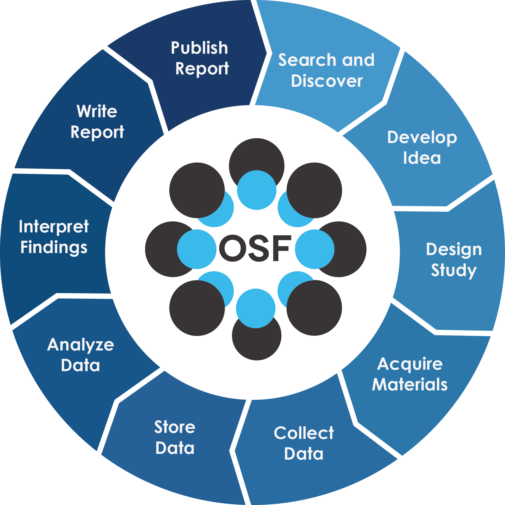{fig-align=center width=70% fig-alt="Figure by the Center for Open Science depciting the traditional research cycle"}

:::footer
The Research Life Cycle from the [Open Science Framework](https://osf.io/).
:::

::: {.notes}
**Presenter Notes**: A brief recap of the research life cycle, that perhaps some of you are already familiar with. We will be referring back to this throughout this session, so to get everyone onto the same page, here is briefly what it depicts: he research life cycle describes the different stages a research project goes through, from the initial idea to sharing and reusing the results. First, researchers plan their study by defining the research question, goals, and methods. They then collect and analyze data to answer their research question. Once the research is complete, the findings are shared through publications or other forms of communication. The research data and materials are then preserved so they remain accessible and can be reused. Finally, other researchers can reuse the data and findings to build on existing knowledge and develop new research. In this way, the research life cycle is a continuous process, where new research builds on previous work.

**Instructor Notes**: Repetition helps consolidation, since you will be referring back to this later it is a good moment to refresh your learners' minds what you mean by research cycle.
:::

---

## Before we start: Survey time!

QR Code here

---

### Remember: There are no correct answers!

::: {.panel-tabset}

### Question 1

**Which research methodologies do you use in your research? (Select all that apply)**

a. Quantitative or experimental methods

b. Observational methods

c. Qualitative methods

d. Theoretical methods

e. Mixed qualitative and quantitative methods

f. None of the above

### Question 2

**Which of the following Open Science practices have you already heard of? (Select all that apply)**

a. Preregistration

b. Registered reports

c. Simulation methods for power analysis

d. Computational reproducibility (e.g., code documentation, RStudio projects, version control ...)

e. None of the above

### Question 3

**Which of the following concepts or skills do you feel most confident about in relation to computational reproducibility? (Select all that apply)**

a. Creating and using RStudio projects

b. Using a standardized folder structure for your projects

c. Automatizing workflows through different scripts for different processing steps

d. Commenting my code

e. Using Quarto to combine code, text, figures etc. in one location

f. Version control with Git

g. None of the above

:::

---

## Discussion of survey results

What do we see in the results?

::: {.notes}
**Presenter Notes**: Let us have a look at these results. 

**Instructor Notes**: Briefly examine the answers given to each question interactively with the group. Use visuals from the survey to highlight specific answers.

**Accessibility Tip**: Have people work in pairs if someone did not bring their phone/does not have a phone. This survey also cannot be completed in an asynchronous setting. 
:::

---

## Covered in this session - EDIT

- Topic 1
- Topic 2
- Topic 3

::: {.notes}
**Presenter Notes**: This slides serves as an overview of the topics that are discussed, presented as bullet points.
:::

---

## Learning goals - EDIT

After this session, learners will be able to:

- **Verb**
  
::: {.notes}
**Presenter Notes**:

**Instructor Notes**:  
:::

---

## Key terms and definitions - EDIT

- **Aim**: Introduce key terms and definitions that learners will come across throughout the session.
  
- **Open Research**: Definition
- **Preregistration**: Definition
- **Registered report**: Definition
- **Data simulation**: Definition
- **Computational reproducibility**: Definition

::: {.notes}
**Presenter Notes**: Add script for slide here.

**Instructor Notes**: Base yourself on conceptual change theory and examine existing concepts in relation to some key terms. Re-examine the formation of new concepts at the end of the lesson. 
:::

---

## Remember the replicability crisis?

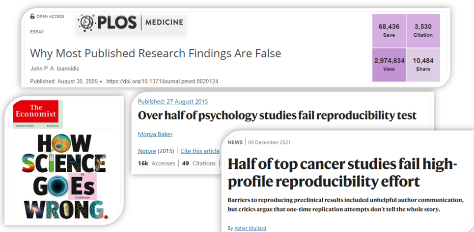{fig-align=center width=100% fig-alt="articles discussing the reproducibility crisis"}

::: footer
Adapted from Malika Ihle: [https: https://osf.io/u3znx](https://osf.io/u3znx)
:::

::: {.notes}
**Presenter Notes**: In the last session, we talked about apparent difficulties of replicating and reproducing study results across different fields, among which psychology, medicine, sociology etc. We talked a little about potential sources for these replication difficulties, for example underpowered studies, publication bias, pressure to publish, human errors, accidential p-hacking etc. These underlying sources for the replication crisis are important to keep in mind, since this session will be about mitigating the effects of them.
:::

---

## Threats to reliable research: Biases
### Remember these..?

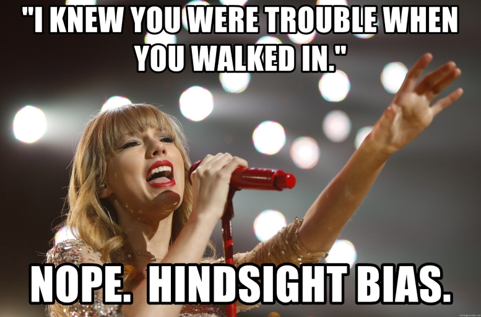{fig-align=center width=40% fig-alt="ADD"}

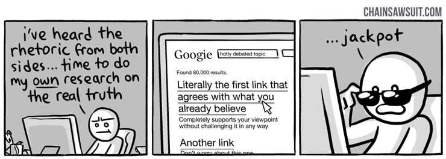{fig-align=center width=60% fig-alt="ADD"}

::: {.notes}
**Presenter Notes**: In the context of replication difficulties, we also talked about these two biases: the hindsight bias and the cognitive bias. Hindsight bias is the tendency to believe, after seeing the results, that the outcome was more predictable or expected than it actually was beforehand. It is the "I knew this would happen" feeling. The cognitive bias, on the other hand, is a systematic tendency in the way people think or make judgments that can lead to errors or distortions when collecting, analyzing or interpreting results.

These two biases are critical to remember, because today we will focus on how we could mitigate the effects of these biases. 

**Instructor Notes**: Reactivate your learners' memories from the previous session and actively encourage them to bring the previously discussed context into this session, since it logically builds up on that previous session.
:::

---

## Threats to reliable research:   p-hacking

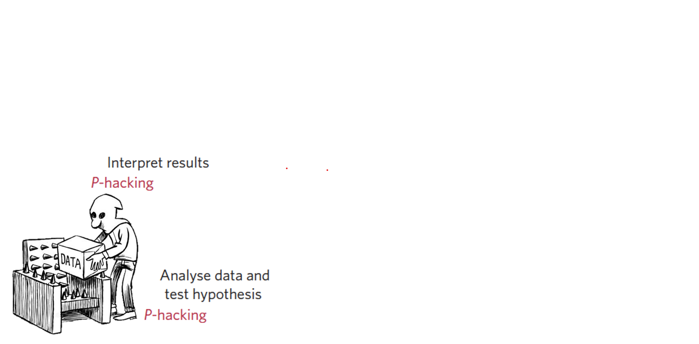{fig-align=center width=100% fig-alt="ADD"}

:::footer
Forstmeier et al. (2016); Munafo et al. (2017); Wagenmakers et al. (2012) 
:::

::: {.notes}
**Presenter Notes**: Cherry picking results can be done in many insidious ways. It’s often call p-hacking or fishing for significant effects. It means engaging in questionable or fraudulent practices to obtain a desired results, such as a significant effect.

**Instructor Notes**: Refer back to the detailed exploration of p-hacking in the previous session.
:::

---

## Threats to reliable research: HARK-ing

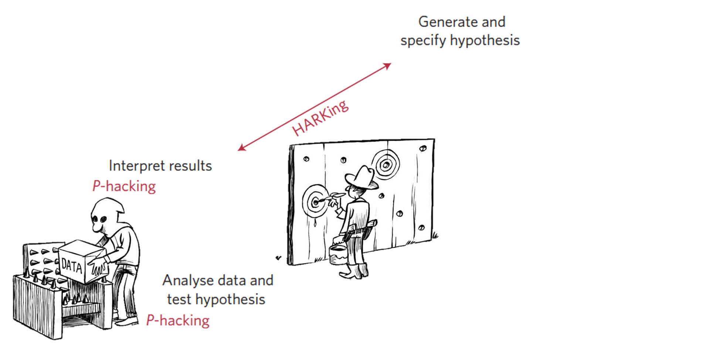{fig-align=center width=100% fig-alt="ADD"}

:::footer
Forstmeier et al. (2016); Munafo et al. (2017); Wagenmakers et al. (2012) 
:::

::: {.notes}
**Presenter Notes**: Another version of that is HARKing, which stands for hypothesizing after the result are known. This is when a researcher disseminate a result that was found only by chance, by performing a multitude of tests, as if this significant result had been predicted from the start, leading readers unable to assess that this result particularly needs replication to be validated.

HARKing is in fact sometimes still recommended by reviewers or editors to make stories more compelling, even though the likelihood of the results being wrong in such cases is very high.

**Instructor Notes**: Highlight that HARK-ing was discussed in the previous session.
:::

---

## Threats to reliable research:   Big picture

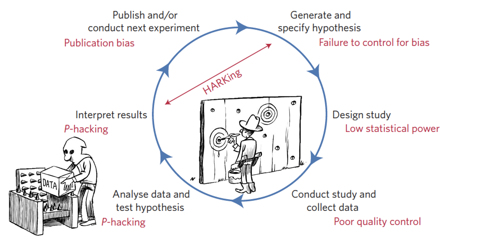{fig-align=center width=100% fig-alt="ADD"}

:::footer
Forstmeier et al. (2016); Munafo et al. (2017); Wagenmakers et al. (2012)
:::

::: {.notes}
**Presenter Notes**: In fact, they are a few more threats to reliable research, highlighted here in this idealized version of the research life cycle, whereby researchers first generate a hypothesis, then design a study and conduct it, test their hypothesis with the data collected, interpret result and publish them before generating new hypotheses.

The credibility of research is, in fact, compromised at all different stages of the research life cycle. Here, the threats to reliable research are visualized in red font for each stage, and of course, this is not a complete list. For example, reliable outcomes can be threatened during the design phase when opting for a low-powered study. Another example for how the credibility of outcomes can come under threat is through the publication bias at the publish and dissemination phase of the research life cycle.

**Instructor Notes**: The main point here is that credible research comes under threat during all the different stages of the research cycle. Give your learners a moment to digest this information.
:::

---

## The effects of unrealiable research

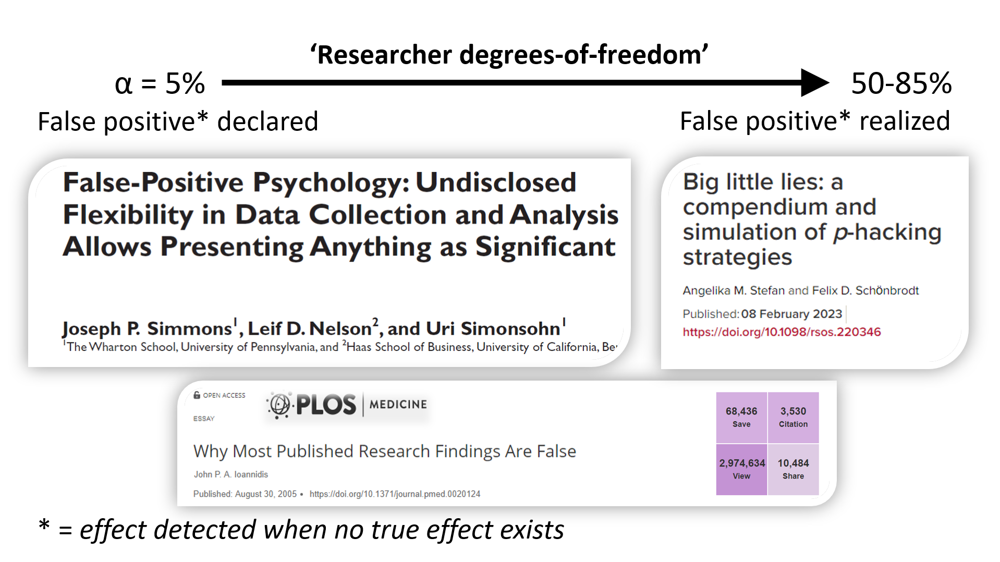{fig-align=center width=100% fig-alt="crossroads"}

::: {.notes}
**Presenter Notes**: I wanted to illustrate the effects of biases and other threats to credible science to research outcomes. 

In most quantitative research, we accept a false positive rate of 5%. That is if we conduct 100 statistical tests, we acknowledge that, by chance, we will obtain about 5 of them significant while in fact no true effect exist. I repeat, when there is no effect of a drug for instance, we will still by chance, due to the way our statistical tests work, find an effect  in 1 out of 20 tests.

However, the researcher degrees of freedom, which is a term that was coined to describe all the arbitrary decisions a researcher can take during the course of collecting and analyzing data, will lead researchers to sometimes bring this false positive rate of the way up to 50 or even 85%. This is how we can end up with most published research being false.

This happens when we as researchers take decisions on how to perform their analyses AFTER having seen the impact that this decision has on the results. For example, we might increase the sample size after not reaching significance, perhaps seeing a trend in the "right" direction and thinking that we simply do not have the power yet to reach significance.

When we do so, we cannot guaranty that our decision is not influenced by having already seen the outcome of our decision, we cannot guaranty that we didn’t fall victim of their confirmation and hindsight biases. 

To be clear, I’m not saying that researchers do this intentionally, because I would then personally actually call this misconduct - likely due to a lack of appropriate incentives in the academic system but still misconduct, but what I’m trying to say is that this can be achieved simply with our best intentions to get to the truth, if we make the mistake of taking certain decisions post hoc rather than a priori.
:::

---

## Researcher degrees of freedom

Possible researcher "decisions" could be:

- **Increasing** our sample size N after failure
- **Removing outliers** after seeing their effect
- Post-hoc **categorizing** or **transforming** predictors
- **Removing** a treatment category
- **Adding** baseline measures as covariate
- **Controlling for covariates** or interaction terms
- ...

::: {.notes}
**Presenter Notes**: In fact, each time one takes the decision of conducting a second statistical test conditionally on the first p value one gets, we will mathematically increase our chances of false positive results. It is mathematic because these two tests are not independent. 

That is the case if we remove outliers depending on their effect, when we try out different versions of categorizing or transforming a predictor, dropping a treatment category, consider both relative and absolute measures, control for covariate or interaction terms. 

Those research practices, now labelled as questionable, have been performed for generations at incredible high rates just with the intention of best describing the data and searching for the effects they contain, but these procedure actually bring to light effects that are less and less likely to be real.

From the last session, we were already asking us: Ok, but then how do we mitigate these threats? The good news is that there are approaches for this, in particular a specific movement that aims to raise scientific standards and the quality of research, so that society and researchers can trust the published work. 
:::

---

## A new way of doing research

 

**Open Research**  
*a.k.a.*  
**A scientific framework for the 21. century**

::: {.notes}
**Presenter Notes**: This movement is known as Open Research, which we will use as a framework for how to do research in the 21st century. We will spend this session to dive deeper into what Open Research even means or how it can possibly make research more credible and mitigate the different threats we discussed in this and in the last session.

A solution to most of those threats, marked in red on the previous slide, for example, low statistical power, p hacking, Harking, publication bias, would be to be transparent with our entire workflow  and blind to the results when we take decisions, and ideally, to get feedback on our study methodology before data collection happen.

Let us look at what this would mean concretely.

**Instructor  Notes**: Make the shift from describing the problem, threats and challenges of research from the previous session to a more solution-focused framework of reference of this current session.
:::

---

## Your turn: 6 minutes

::: {.columns}

::: {.column width="33%"}

### Think (2 min)
- For yourself: Write down what you **associate** with the term **Open Research**

 

:::{.timer #think1 seconds=120 starton=interaction size=70% sound=true}
::: 

:::

::: {.column width="33%"}

### Pair (2 min)
- Discuss your thoughts with your neighbor.

 
 
 

:::{.timer #pair1 seconds=120 starton=interaction size=70% sound=true}
:::

:::

::: {.column width="33%"}

### Share (2 min)
- Share your thoughts with the larger group.

 
 
 

:::{.timer #share1 seconds=120 starton=interaction size=70% sound=true}
:::

:::

::::

[(without internet search - your current understanding)]{.smallnote}

::: {.notes}
**Presenter Notes**: We will do a small activity. What comes to mind when you hear the term Open Research? What does it mean to you? Think first about this for yourself and write down your thoughts. Then discuss your thoughts and ideas with your neighbors and see what they came up with. Finally, we will collect your thoughts in the larger group.

**Instructor Notes**: Using the think-pair-share paradigm, explore prior knowledge about Open Research and reactivate existing concepts.
:::

---

## Introducing Open Research

::: {.panel-tabset}

### Definition

::: {.callout-note}
## UNESCO defines it as:

*"[...] **open  science**  is  defined  as  an  inclusive construct that combines various movements and practices aiming to  **make**  multilingual  scientific  **knowledge  openly  available,  accessible  and  reusable  for  everyone**,  to  **increase  scientific  collaborations**  and  **sharing  of  information** for the benefits of science and society, and to **open the processes** of scientific knowledge creation, evaluation and communication to societal actors beyond the traditional scientific community."*
:::

### Values and principles

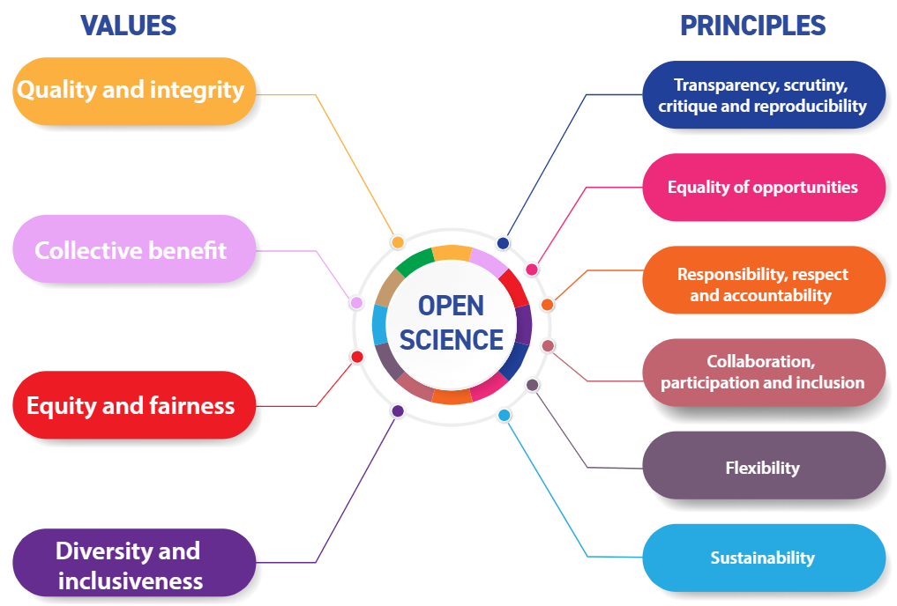{fig-align=center width=100% fig-alt="Figure from the UNESCO Recommendations on Open Science depicting the guiding values and principles of Open Science"}

### Pillars of Open Research

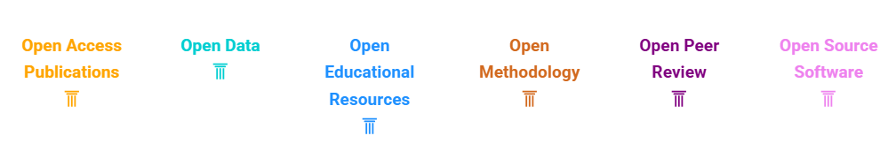{fig-align=center width=100% fig-alt="Figure from CyVerse 2025 depicting the six pillars of Open Science: open access publications, open data, open educational resources, open methodology, open peer review, and open source software"}

::: {.callout-note}
These pillars are not set in stone, different frameworks and disciplines identify different pillars.
:::

:::

:::footer
Adapted from the [UNESCO Recommendations on Open Science](https://unesdoc.unesco.org/ark:/48223/pf0000379949/PDF/379949eng.pdf.multi) and from [CyVerse (2025)](https://foss.cyverse.org/01_intro_open_sci/#6-pillars-of-open-science).
:::

::: {.notes}
**Presenter Notes**: At its core. Open Research  aims to make scientific knowledge more openly available, accessible, and reusable. It also promotes collaboration and sharing, while making research processes more transparent and inclusive. UNESCO emphasizes that Open Science extends beyond simply making publications available: it can also open up research data, methods, infrastructure, and processes to a wider community.

Open Research is guided by values such as quality, integrity, transparency, openness, and inclusiveness. These principles aim to make research more trustworthy, accessible, and collaborative, while recognizing the diversity of scientific communities, disciplines, and forms of knowledge.

Open Research can also be conceputalized as being carried by a set of pillars, or core elements or components of "doing" open research. There is no single universally agreed set of pillars. The framework shown here identifies six commonly discussed areas: open access publications, open data, open educational resources, open methodology, open peer review, and open-source software. Each of these pillars has many associated sets of tools and methods to apply this "pillar" to one's own research.

Also note that the exact pillars and terminology vary between frameworks and disciplines, in some disciplines they identify four pillars, in some eight. For our purpose, this is not that relevant, the main message here is that Open Research can be split up into these different pillar and each have tools linked to them, but not all pillars apply equally to each field or discipline.
:::

---

## Introducing Open Research: Tools and integration

::: {.panel-tabset}

### Tools of Open Research

::: {.columns}

::: {.column width="70%"}

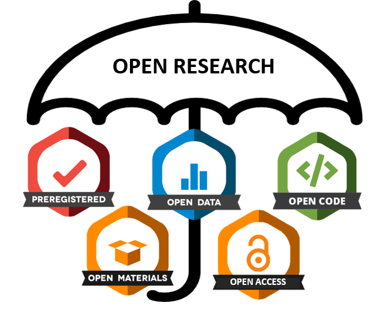{width=100% fig-alt="Figure depicting the umbrella term Open Research and connected research practices"}

:::

::: {.column width="30%"}

Adapted from Danielle Robinson and Robin Champieux (Robinson, 2018)
[https://osaos.codeforscience.org/what-is-open/](https://osaos.codeforscience.org/what-is-open/). Badges from the [Center for Open Science](https://www.cos.io/initiatives/badges).

:::

:::

### Open Research in the research cycle

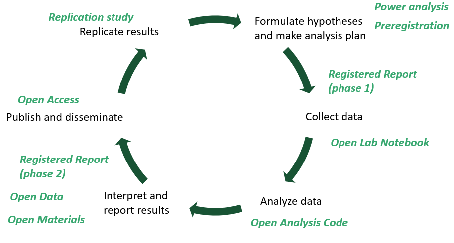{fig-align=center width=100% fig-alt="Figure by the Center for Open Science depciting the traditional research cycle"}

::: {.small}
Adapted from [Christina Bergmann' slides.](https://docs.google.com/presentation/d/1bdICPzPOFs7V5aOZA2OdQgSAvgoB6WQweI21kVpk9Gg/edit?slide=id.g43f5346e6d_0_1113#slide=id.g43f5346e6d_0_1113)
:::

:::

::: {.notes}
**Presenter Notes**: One way to make Open Research less abstract and more tangible for one's own research flow is illustrated in this figure. The ultimate goal is to share key research outputs across the different stages of the research cycle: preregister your study, share data and materials, make code available, and provide open access to findings.
:::

---

## Our path to replicability

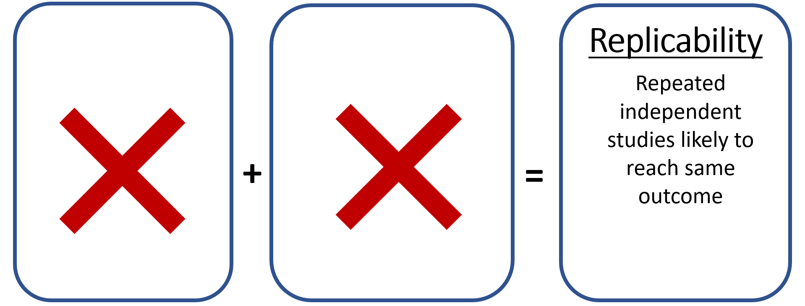{fig-align=center width=100% fig-alt="ADD"}

::: {.notes}
**Presenter Notes**: From here on, we will focus on the proximate causes, things researchers could actually do in their daily research to start improving this. 

We will argue here that the lack of replicability of studies, that is the fact that when a study is repeated independently, it does not reach the same outcomes, comes from the lack of two things.
:::

---

## Reliability

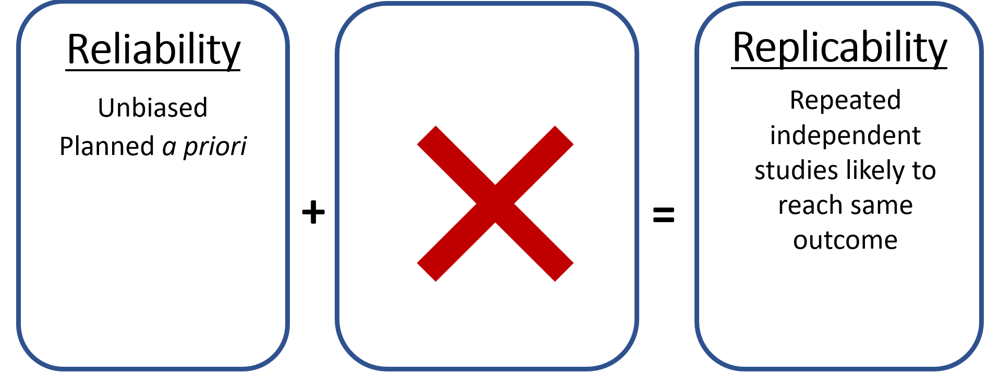{fig-align=center width=100% fig-alt="ADD"}

::: {.notes}
**Presenter Notes**: First, what should happen before starting data collection, the way a study is planned and therefore whether the output produced are actually reliable. This is connected the bigger, overarching theme of reliability.

This is where all the biases we previously discussed would fall under, hindsight bias, cognitive bias, publication bias. For example "I knew this experiment covariable wouldn’t be significant, we shouldn’t have included it, let’s remove it from our model and not even mention it… well nope, you only knew when facing the outcome."
:::

---

## 1. Preregistration

 

::: {.columns}

::: {.column width="30%"}

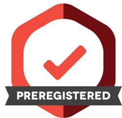{fig-align=center width=100% fig-alt="Preregistration badge from the Center for Open Science"}

:::

::: {.column width="70%"}

> =  *"**specifying** your research plan in **advance** of your study and **submitting** it to a **registry**".*

:::

:::

:::footer
Text and badge from the [Center for Open Science](https://www.cos.io/initiatives/badges).
:::

::: {.notes}
**Presenter Notes**: We can do so by preregistering our study, that is, we can write down our hypothesis and intended statistical tests prior to seeing or even collecting the data, put it online behind an embargo, that is it stays private for a while, and then release this plan along our published paper to help prove mostly ourselves but to some extend also others that we were unbiased. 

Preregistering creates a specific plan for the upcoming study. Doing so helps to distinguish planned from unplanned work. Both are important. But the same data cannot be used to generate and test a hypothesis, which can happen unintentionally and reduce the credibility of your results. Addressing this problem through planning improves the transparency of your research. This helps you clearly report your study and helps others who may wish to build on it.
:::

---

### Where to preregister?

 

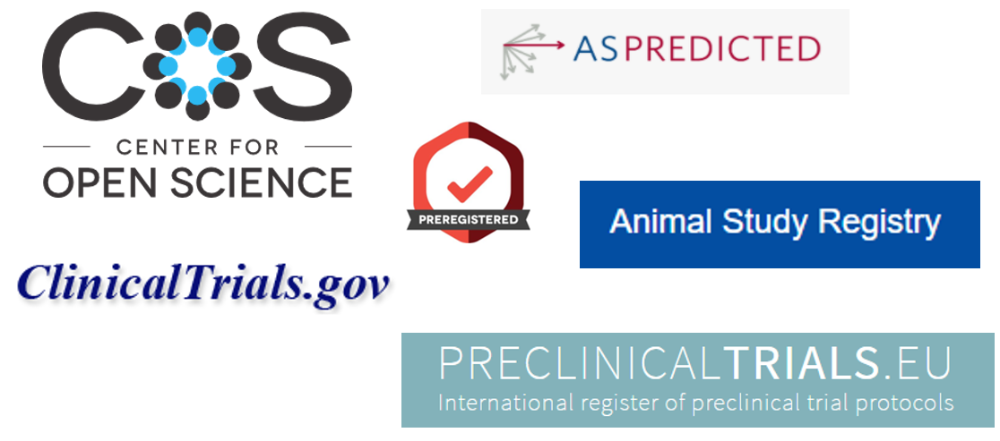{fig-align=center width=60% fig-alt="Resources for preregistration including aspredicted.com, Center for Open Science, Animal Study Registry, ClinicalTrials.gov and PreclinicalTrials.eu"}

::: {.notes}
**Presenter Notes**: The key here is to find a registry that has a clear timestamp of your a priori planning. Common options include the Open Science Framework Registries by the Center for Open Science and AsPredicted for general research, ClinicalTrials.gov for clinical trials, and discipline-specific registries when one is available for the field, such as animal study registry or preclinicaltrials.eu.
:::

---

### Decisions process (I)

::: {.columns}

::: {.column width="50%"}
#### Decisions needed

- Choosing dependent variable 
- Choosing sample size
- Choosing covariate
- Variable transformation
- Data exclusion criteria
- How to deal with missing data
- What to report

:::

::: {.column width="50%"}
#### **Post-hoc** decision rules

- Confirmation bias
- Hindsight bias
- ...
- Direction of effect that *obviously* makes sense

= **p-hacking**

:::

:::

::: {.notes}
**Presenter Notes**: In preregistration forms and templates, one should lay down all the decisions regarding all those aspects we now know to massively influence chances of getting false positives. In other words, the a priori decisions should include: Choosing dependent variable, choosing sample size, choosing covariate, variable transformation, data exclusion criteria, how to deal with missing data, what to report etc. In oter words, you are trying to 

:::

---

### Decisions process (II)

::: {.columns}

::: {.column width="50%"}
#### Decisions needed

- Choosing dependent variable 
- Choosing sample size
- Choosing covariate
- Variable transformation
- Data exclusion criteria
- How to deal with missing data
- What to report

:::

::: {.column width="50%"}
#### **Post-hoc** decision rules

- Biological relevance
- e.g. Power analysis
- e.g. Collinearity
- if distribution condition is met
- if criteria are met
- Decision rule (average/exclude) 
- All!

:::

:::

::: {.notes}
**Presenter Notes**: If you are struggling with taking these decisions a priori, there are some support cues that can help you create a foundation for your decision. For example, you can choose your sample size by conducting a power analysis, you can decide to transform a variable if a specific distribution is met, you can decide how to deal with missing data by establishing clear rules of when to include cases or exclude cases or based on the statistical test you use. All these decisions and how you came to those decisions you then also report in the preregistration template or form.
:::

---

### A prior hypothesis testing and exploratory analyses

- **Exploratory analyses** are still allowed!
  - But: have **higher false positive rates** (> 5%) compared to a prior hypothesis testing (= 5%)
  - Can motivate future work
- Need to be **clearly distinguishable** from a priory hypotheses testing!
  

::: {.notes}
**Presenter Notes**: Of course preregistering a study does not limit researchers in the exploratory analysis they could add in their manuscript, but they will be clearly distinguishable from the a priori hypothesis testing.

As far as I know, only by preregistering, one can distinguish a priori hypothesis testing, that truly have only 5% chances of leading to false positive findings, from exploratory analyses which will have a much higher rate of false positive results but will have the advantage of generating hypotheses that motivates further work. 
:::

---

### Preregistration submission process

 

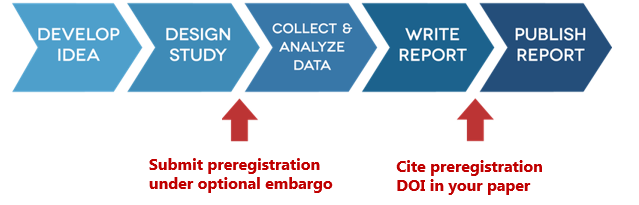{fig-align=center width=60% fig-alt="ADD"}

:::footer
[https://www.cos.io/initiatives/prereg](https://www.cos.io/initiatives/prereg)
:::

::: {.notes}
**Presenter Notes**: Alright, so in practice, when one is finally ready to either start data collection  or to look at already existing data for the first time if one works with longitudinal datasets for instance, one would submit their analysis plan to an online platform. After one submits a preregistration, it creates a time-stamped, publicly accessible record of their planned study.

If one is worried about being scooped, one can put their preregistration under an embargo so it stays private for a few years, and then they make that file public and give it a digital object identifier, or DOI, when they finally publish their paper. 

Writing and submitting a preregistration could therefore be a crucial part of the workflow where we really think about the details of our study before conducting it. Sometimes this can be time-efficient, especially if we have submitted a grant proposal or ethic proposal for this study, from which large parts can be reused for the preregistration. 

And another advantage of preregistration, besides being able to prove to ourselves and others that our work is unbiased, is that we will usually also increase our chances of obtaining high quality feedback from our team by giving them a detailed protocol to review prior to conducting our study.

In fact, why not send preregistrations to journals directly so that we also get the feedback from peer reviewers at a time where it is still feasible for us to address their concerns? 
:::

---

## 2. Registered reports

 

::: {.columns}

::: {.column width="30%"}

{fig-align=center width=100% fig-alt="Logo of the Center for Open Science"}

:::

::: {.column width="70%"}

> =  *"a publishing format that emphasizes the importance of the research question and the quality of methodology by conducting peer review **prior to data collection**."*

:::

:::

:::footer
[https://www.cos.io/initiatives/registered-reports](https://www.cos.io/initiatives/registered-reports)
:::

::: {.notes}
**Presenter Notes**: Sending your detailed study plan to a journal is possible, and as of today, it is possible in well over 300 journals across disciplines that will either accept or even request such preregistrations, which are then called Registered Reports. 

The Center for Open Science defines Registered reports as publishing format that emphasizes the importance of the research question and the quality of methodology by conducting peer review **prior to data collection**."
:::

---

### Registered report submission process

 

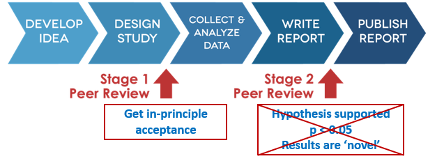{fig-align=center width=60% fig-alt="ADD"}

:::footer
[https://www.cos.io/initiatives/registered-reports](https://www.cos.io/initiatives/registered-reports)
:::

::: {.notes}
**Presenter Notes**: The procedure is as follows: We once again write a detailed study plan before conducting the study, including research questions, design, planned analyses etc. We also include the theoretical motivation and relevance and implications of the study, essentially like a full manuscript, excluding the results and discussion section. We then submit this "report" to a journal that accepts registered reports. 

Next, peer reviewers give feedback on our study plan, that is on our hypotheses, experimental procedures, and main analyses, and they do so before data collection or data analyses, so actually at a time where we can still make changes to our methodology. 

The journal then offers in principle acceptance, also known as IPA, which means that our paper will be published *if* we follow through with the approved plan. Next, we conduct the study, after which we add a results and discussion section to our report, splitting the result section into Registered confirmatory analyses and unregistered exploratory analyses. Next, reviewers assess compliance with the preregistered protocol, and whether the conclusions are sound.

Final acceptance of our paper will not be depending on the result that we got, it will only depend on that match between our preregistration and what we actually did, and it will not depend on whether the hypothesis was supported or whether we found a significant effect or not.

This format of paper changes what it takes to get a paper published, in this case it is finally about asking an interesting question and designing rigorous methodology to address this question, rather than the sexiness of the results that we may have found on our "fishing" trip.

Note that journals will retract the in principle acceptance if the deviations from the original approved plan and the conducted study are too large.
:::

---

### Acceptance of registered reports

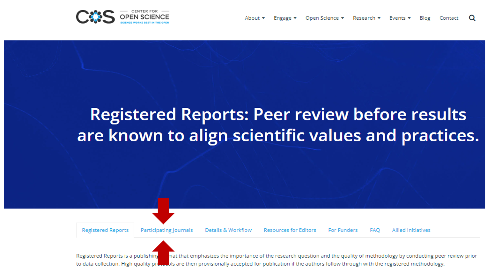{fig-align=center width=60% fig-alt="ADD"}

:::footer
[https://www.cos.io/initiatives/registered-reports](https://www.cos.io/initiatives/registered-reports)
:::

::: {.notes}
**Presenter Notes**: To know which journal has adopted this format already, visit the center for open science registered report webpage and go to the participating journals tab.
:::

---

## 3. Simulations and power analysis

> How to know whether your **planned statistical test** is **appropriate**?

:::incremental
1. **Simulate** random data (*anticipating distribution of variables and sample size*)
2. Run statistical test and **save parameter of interest**
3. Replicate 
4. Check that **results are random** (*significant in only 5% of the case*) 
5. **Generate data** including an effect (*e.g. imposing a correlation between two variables*)
6. Check that your **model is picking up the effect simulated**, in 80% of the cases (*power analysis*)
:::

::: {.notes}
**Presenter Notes**: Whether you simply want to preregister on your own or go the high way and submit a registered report to a journal, you may still wonder how you can best ensure that your planned statistical test is appropriate and don’t have to withdraw your preregistration or submit a transparent change request explaining that after thinking more about it you realized the test you planned isn’t the best approach, possibly blowing up your impostor syndrome.

Here is what I do and recommend doing for each preregistration to avoid that – this is optional in the form – but really I find this the most helpful way of thinking about what analysis I should be doing with the data I’m about to collect.

I simulate data using the distribution and sample size I’m expecting for my real data. I create basically a data frame with experimental treatment allocated at random, I draw random numbers from say a normal distribution if I expect my real variable to be normally distributed,  then I run the statistical test that I’m thinking of preregistering, and then I check that when I repeat this say 100 times, and if I had generated random data, I only get 5 percent of my tests as significant, the tolerated false positive finding rate.

Then I simulate data with an effect of the size I am expecting, say I create a correlation between 2 variables, by simulating the second one based on the first, and run the simulation of data and data analysis one hundred times, I will then check that my planned statistical analyses are able to pick up this effect in at least 80 % of the time. This is what is called a power analysis.

Simulating data, playing with it, trying out different ways of modelling it, this is what helps me decide on which test I will preregister, or if I’m still unsure, this is something concrete I can discuss with colleagues or statistician professionals. 

And finally, by doing this I basically have my script ready to directly feed my real data once I have it cleaned, and get all the results from the preregistered confirmatory analyses in a couple of seconds.
:::

---

## Pre-break quiz

QR code here

---

::: {.panel-tabset}

### Question 1

**What is a preregistration?**

a. A report of the study results that is submitted after data collection

b. A time-stamped record of a study’s research questions, hypotheses, methods, and/or analysis plans made before the research is conducted

c. A requirement to publish all study results regardless of their statistical significance

d. A method for repeating a study using a new sample

### Question 2

**What is a Registered Report?**

a. A preregistration that is kept private until the study is published

b. A research paper that reports the results of a previously published study

c. A publishing format in which the study protocol is peer reviewed before data are collected, followed by a second stage of review after the study is completed

d. A statistical method for determining the required sample size

### Question 3

**What is the main purpose of data simulation when planning a study?**

a. To replace the collection of real data with simulated data

b. To make a study’s results more statistically significant

c. To generate data that can be reported as if they were collected from real participants

d. To explore how different assumptions about the data and analysis may affect the study’s results and inform decisions such as sample size and analysis plans

:::

::: {.notes}
**Instructor Notes**: Correct answers: 1b, 2c, 3d

This pre-break survey serves to examine learners' current understanding of key concepts of the submodule. Guidance on interpreting the results:

- If more than 80% of the learners select the correct response option, show which one it is and move on.

- If less than 80% of answers are correct, let them discuss with each other for 1-2 minutes which one they selected, and why, and afterwards let them re-take the question. If they`re above 80% correct the second time, move on, else show the correct response and explain why it is correct (plus maybe why the others are not).

- If more than 30% select a specific distractor answer, discuss it in class.
:::

---

# Break! 15 minutes

---

## Post-break discussion

 

What remains **unclear** this far? What questions do you have?

::: {.notes}
**Presenter Notes**: What remains **unclear** this far? What questions do you have?

**Instructor Notes**: The aim here is to clarify concepts and aspects that are not yet understood. Highlight specific answers given during the survey, if applicable.
:::

---

## Our path to replicability

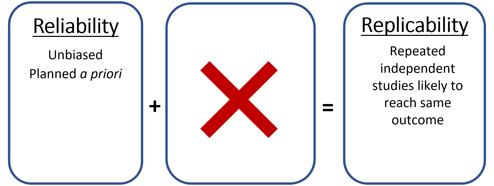{fig-align=center width=100% fig-alt="ADD"}

::: {.notes}
**Presenter Notes**: Going back to our path to replicability. We previously talked about three strategies to increase reliability, the first half of this equation. These three strategies, preregistration registered report and simulations and power analysis were all focused on reducing implicit biases and to make an a priori plan of our research.

The second part of this equation relates to what happens with the data and their processing, or in other words, the reproducibility aspect. Reproducibility, you will remember, is defined as the process by which given the same raw data, the same question, and same method, someone of similar knowledge reaches the same conclusions. We could also talk about method or computational reproducibility here. The second component needed for replicability is reproducibility or, vice versa, one reason for the lack of replicability of studies is their lack of reproducibility.

:::

---

## Reproducibility

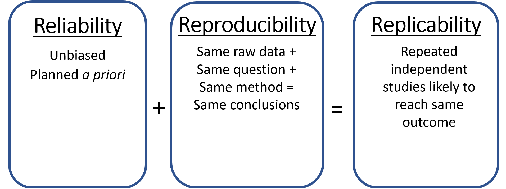{fig-align=center width=100% fig-alt="ADD"}

::: {.notes}
**Presenter Notes**: And that might be surprising because, with the same data, same analyses, we should obviously find the same results, but actually this isn’t always achieved, and this is often the cause for the retraction of papers. Retraction means that papers that have been already published are formally withdrawn from a journal or an outlet.

So, let us talk what reproducibility means, and how it can be achieved.
:::

---

## Click, click, click
### The **manual** workflow

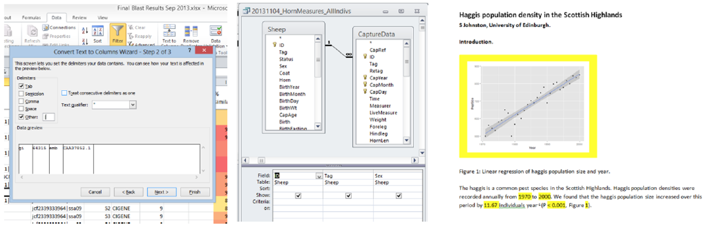{fig-align=center width=100% fig-alt="ADD"}

::: {.notes}
**Presenter Notes**: Let us start with the counter example for a reproducible workflow. If you are familiar with research workflows more generally, you may have seen that there may be two types of workflow.

In a traditional workflow, one manually extract, select, and process their data, and report their analyses using a lot of clicking, copying and pasting, one has to keep track of what would need to be updated, like figures and numbers, if they were to ever slightly change something anywhere in the process. If one goes through this whole process manually, it would be very hard to guarantee that they could repeat it all again and find the same results, yet alone someone else. 
For example, imagine you are studying in a survey whether sleep duration is associated with students’ exam performance. In a traditional workflow, you might download the data from a survey, manually remove participants with missing values in Excel, calculate the average sleep duration, run a regression in SPSS, copy the results into Word, and then copy the numbers into a table and a figure for your manuscript.

Now imagine that you realize one exclusion criterion was incorrect and decide to change it. You would need to redo the analysis, remember which results in the manuscript need updating, regenerate the figure, update the table, and check that all the reported numbers are still consistent. If you forgot to update one number, the manuscript could contain conflicting results.

This brings us to a more automated workflow, or computational reproducibility as another Open Research practise to increase reproducibility and therefore replicability of studies more broadly.
:::

---

## 4. Computational reproducibility

### The **automated** workflow

::: {.columns}

::: {.column width="50%"}

- **code and scripts** for different processing steps, e.g.,
  - load-data.csv
  - clean-data.csv
  - analyze-data.csv

:::

::: {.column width="50%"}

- -> **Reproducible** and more efficient when new data, new collaborator, new project

- -> Possibility to **correct errors**

:::

:::

{fig-align=center width=20% fig-alt="ADD"}

::: {.notes}
**Presenter Notes**: As the name suggests, computational reproducibility is tightly linked to automatization. Using different tools that we will explore more in the next slides, you could write a piece of code to extract, wrangle, and analyze our files or our data, our whole workflow can be repeated exactly the same way when we get new files or come back to a project after a break or involve a new collaborator. And because such workflow is transparent, meaning that all our steps are written in plain text rather than hidden behind a graphical user interface, mistakes have a chance to be corrected by our collaborators or the community.

Taking the sleep study example from before, we could write code or scripts for these steps. The scripts can import the raw data, clean it according to predefined rules, run the statistical analysis, and create the figures and tables. We can then use another tool to connect this analysis directly to our report. The numbers, tables, and figures in the report are generated automatically from the analysis.

Now imagine that we receive an updated dataset with 50 more participants. Instead of repeating all the steps manually, we replace the data file and rerun the workflow. R repeats the same cleaning and analysis steps, and Quarto automatically updates the results, tables, and figures in the report.

This also makes the workflow easier to share. A collaborator can open the scripts and see exactly what was done at each step, rather than trying to remember which options were manually selected by clicking in a graphical interface. They can review, reproduce, or modify the analysis and the entire report can easily then be regenerated from the updated code.

Sounds good, right? Well these tools exist, and we will discuss them in more detail.
:::

---

### Components of computational reproducibility

::: {.columns}

::: {.column width="33%"}
{fig-align=center width=40% fig-alt="ADD"}

1. **Raw data**   (or anonymized or synthetic dataset)

:::

::: {.column width="33%"}

{fig-align=center width=50% fig-alt="ADD"}

2. **Code and documentation**   to reproduce data processing and data analyses 

:::

::: {.column width="33%"}

{fig-align=center width=50% fig-alt="ADD"}

 

3. **Specifications**   of your **computational   environment**

:::

:::

::: {.notes}
**Presenter Notes**: To achieve computational reproducibility, we would need three components: raw data, code and corresponding documentation to reproduce all processing steps and the analyses and finally, the specs or specifications of our computing environment.

To go into more detail, one would need to share the raw data, or,  when we work with sensitive data,an  anonymized dataset, or a synthetic dataset, which is a simulated dataset whose properties are similar to the real dataset. 

We should also share  our code and documentation that process and analyze the data, and finally, the specifications of our computational environment  so one can actually run our code with the same software version and get the same results.  

In the following sections, we will focus on the second element of computational repproduciblity, namely code and documentation in more detail.
:::

---

## 4a. Raw data (or anonymized or synthetic datasets)

### Data availability

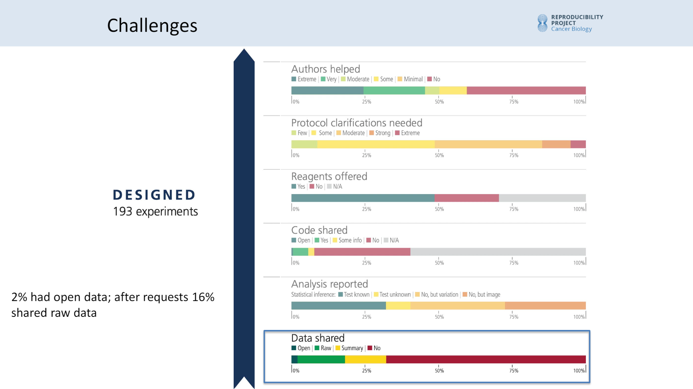{fig-align=center width=100% fig-alt="ADD"}

:::footer
Slide copied from Tim Errington: [https://osf.io/dnym9/files/k8sfv](https://osf.io/dnym9/files/k8sfv)
:::

::: {.notes}
**Presenter Notes**: To come back to these huge replication projects of cancer research studies that we discussed last session – estimating that only 10 or 20% of the studies that were conducted again with new data collection would find the similar results  well before being able to conduct replications, they first tried to access all material to make sure that their planned replications could be as closed to the original as possible. 

The first thing they try to access was the data: 2% had open data, and after requests, 16% shared the raw data…. 

Overall, most of the data was never made accessible. 
:::

---

### Data sharing??

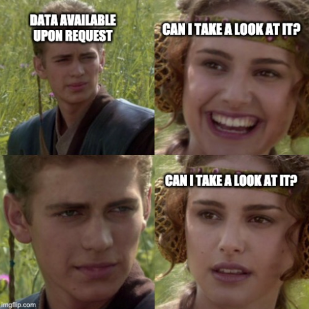{fig-align=center width=100% fig-alt="ADD"}

:::footer
[https://twitter.com/JohnBorghi/status/1405227318876905472?s=20](https://twitter.com/JohnBorghi/status/1405227318876905472?s=20)
:::

::: {.notes}
**Presenter Notes**: So when you see written data upon request… 
What you find out, is that the data is on a hard drive of one team member who left, not documented, with lots of version and nobody knows which version went into the article.

An issue here is that there is a lack of professional training on data management when becoming a researcher. Even though, this is required by the LMU and funders like the DFG.What they request is for data to be made open when possible, but minimally they should all follow the FAIR principles.
:::

---

### **FAIR data**

🔎 FINDABLE

<strong>Where is the data?</strong> 
Data and/or metadata are deposited in a repository &nbsp;•&nbsp;
Persistent identifier (e.g., DOI)

🔓 ACCESSIBLE

<strong>Can the data be accessed?</strong> 
Open access or clearly described access conditions &nbsp;•&nbsp;
Metadata remain accessible

🔗 INTEROPERABLE

<strong>Can it work with other data?</strong> 
Standard metadata &nbsp;•&nbsp; Stable, open file formats

♻️ REUSABLE

<strong>Can others understand and use it?</strong> 
Clear documentation (e.g., variable definitions) &nbsp;•&nbsp;
Data usage licence

FAIR = <strong>Findable · Accessible · Interoperable · Reusable</strong>

::: {.notes}
**Presenter Notes**: What does FAIR mean
FAIR is a set of principles that ensure data is usable by machines & humans

The F stands for findable: 
Metadata and data should be easy to find for both humans and computers. That is the data should be deposited in a professional repository not in a supplement file as pdf.

The A stands for accessible: Once the user finds the data, they need to know how they can be accessed, possibly including authentication and authorisation. It doesn’t mean open to all, it can be restricted with clear eligibility criteria or so. Even physically restricting access to the data in a specific server room.

The I stands for interoperable: The data usually need to be integrated with other data, so we need common language, and it needs to be read on various machines, so we basically need files that can be opened by free an open source software.

And the R stands for reusable: to achieve this, metadata and data should be well-described for instance with a data dictionary so that they can be replicated and/or combined in different settings. And for that have appropriate licenses.
:::

---

## 4b. Code and documentation reproducibility

 

::: {.columns}

::: {.column width="30%"}

{fig-align=center width=100% fig-alt="ADD"}

:::

::: {.column width="70%"}

A. Portable and self-contained project

B. Automatize workflow

C. Create dynamic report

D. Version control

:::

:::

::: {.notes}
**Presenter Notes**: There are 4 major principles to achieve code & documentation reproducibility, and I will be briefly going through each of them mentioning tools that are integrated within the RStudio environment, as an example.

This will be a lot of information, but don’t think you have to adopt everything at once, these are teasers to other future sessions and resources throughout. The goal here is to give you an overview of how to achieve code and documentation reproducibility, rather than explicitly practicing each tool. The practicing of each tool is however extensively featured in upcoming sessions.
:::

---

## 4b. Code and documentation reproducibility

 

::: {.columns}

::: {.column width="30%"}

{fig-align=center width=100% fig-alt="ADD"}

:::

::: {.column width="70%"}

A. Portable and self-contained project:   **good project management**

B. Automatize workflow:   **stop clicking, start coding**

C. Create dynamic report:   **write reproducible manuscripts**

D. Version control:   **track your changes**

:::

:::

::: {.notes}
**Presenter Notes**: Here a brief overview what each principle implies and how together they improve the reproducibiity of our workflows.

First, good project management means keeping our data, code, documentation, and outputs together in a portable, self-contained project.

Second, we can automatize our workflow by replacing repetitive clicking with code, so the same steps can be rerun consistently.

Third, we can create dynamic reports with tools like Quarto, where our text, analyses, tables, figures, and results are connected and update automatically. This allows us to write truly reproducible manuscripts.

Finally, version control allows us to keep track of changes to our files and code, making it possible to see what changed, when, and why—and to go back to previous versions when needed.”
:::

---

### A. Portable and self-contained project

**R-Studio Projects**

::: {.columns}

::: {.column width="20%"}

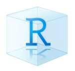{fig-align=center width=100% fig-alt="ADD"}
:::

::: {.column width="80%"}
> **RStudio project .Rproj**: raw data, script and documentation, and outputs in the same project directory
:::

:::

::: {.notes}
**Presenter Notes**: The first principle is to create a portable and organized project so that anyone including yourself in the future can run you codes again. 

One way to organize our work is, for example, through R and an RStudio Project. An RStudio Project is a dedicated workspace for a project, centered around a so-called project directory. The .Rproj file allows RStudio to treat this directory as a separate project, with its own working directory, workspace, history, and source documents.

We can make this project self-contained by intentionally keeping everything we need to work on the project within that directory, for example, our data, scripts, documentation, and files needed to generate our outputs. This means that we don’t need to rely on files scattered elsewhere on our computer.

This makes projects easier to manage, share, and return to later: when we open the RStudio Project, we have the project’s files and working context in one place. Moreover, we could just hand over that entired directory or folder to a collaborator, and they would already have all the necessary files to work on the project too.
:::

---

### A. Portable and self-contained project

**(Standardized) Folder structure**

::: {.columns}

::: {.column width="33%"}

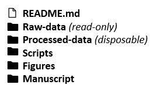{fig-align=center width=90% fig-alt="ADD"}
:::

::: {.column width="33%"}

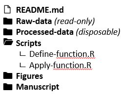{fig-align=center width=90% fig-alt="ADD"}

:::

::: {.column width="33%"}

> Standardized folder structure to **increase clarity** and **reproducibility**

:::

:::

::: {.notes}
**Presenter Notes**: What is important for a portable and self-contained project is the folder structure. To increase clarity and reusability for yourself and for your collaborators, a good folder structure is simple and effective way to ensure your work’s reproducibility.

You should adopt or establish such folder structure convention with your lab group or peers as to the exact subfolders you should have. There are a few non negotiable files or folders in here.

First you should have a README file detailing what files the project contains, the provenance of each file, the order in which they should be used, etc. it is common to write README files with a very simple markup language with plain-text-formatting syntax called Markdown, and when you will share your project online as we will see later, it will display that README file in the homepage of the repository, so that is the first thing that people see when they get access to your project.

In this folder, you also want to share your raw data – when appropriate for your project - and treat them as read only, and have R scripts that process and wrangle the raw data into processed data, which can be treated as disposable. Raw data should stay untouched as you may start calculation and replace values in there and introduce errors without being able to go back to the initial state.

The scripts that will process and analyse the data may be split in different files, depending on the workflow, and the key here is to avoid copy pasting code so that you can adjust something by changing it in only one place, and often to achieve this, it is handy to define functions and then call the names of these functions to apply them repeatedly.
:::

---

### B. Automatize workflow

**Separate your scripts**

::: {.columns}

::: {.column width="10%"}

{fig-align=center width=90% fig-alt="ADD"}
:::

::: {.column width="45%"}

**00-analyse.R**

  - source(“01-load-packages.R”)
  - source(“02-load-data.R”)
  - source(“03-clean-data.R”)
  - source (“04-explore.R”)
  - source (“05-model.R”)
  - source (“06-summarize.R”) 
  
:::

::: {.column width="45%"}

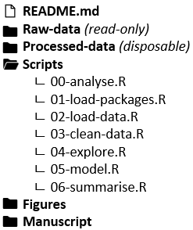{fig-align=center width=90% fig-alt="ADD"}

:::

:::

::: {.notes}
**Presenter Notes**: Moving onto the second principle of code and documentation reproducibility: automatizing workflows. In other words, no more manual work, but everything is automated as much as possible. 

In fact, codes for larger projects can also be separated in tasks that can be all sourced into an overarching analysis file, which makes it simpler to automatize a workflow, and know where things are. 

For example, imagine we have a study where we need to analyze a dataset and produce a manuscript. Rather than putting all of our code into one large script, we can divide the workflow into smaller, clearly defined tasks.

Here, 01-load-packages.R loads the packages we need, 02-load-data.R imports the raw data, 03-clean-data.R cleans and prepares it, 04-explore.R produces our exploratory analyses and figures, 05-model.R runs our statistical models, and 06-summarise.R creates the summaries we need for reporting.

We then have an overarching 00-analyse.R script that sources these scripts in sequence. So instead of manually opening and running six different files, we can run one script and reproduce the entire analysis workflow from beginning to end.

This is what we mean by automating the workflow: each step is written down as code, the steps are connected, and the whole process can be rerun whenever the data or analysis changes.
:::

---

### B. Automatize workflow

**Keep data machine readable**

::: {.columns}

::: {.column width="40%"}

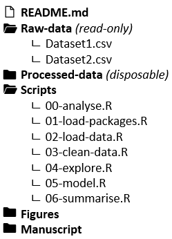{fig-align=center width=90% fig-alt="ADD"}

:::

::: {.column width="60%"}

- **No color coding**
- No comments in **numerical columns**

:::

:::

::: {.notes}
**Presenter Notes**: Of course automatization, starting from loading the data, requires data to be stored in a machine readable format, namely one column with one data type.
:::

---

### B. Automatize workflow

**Comment your code**

- Make sure **you and others** understand **what** the code is doing and **why**
  - More **transparent** workflows
  - Others can **reuse** and reproduce
  
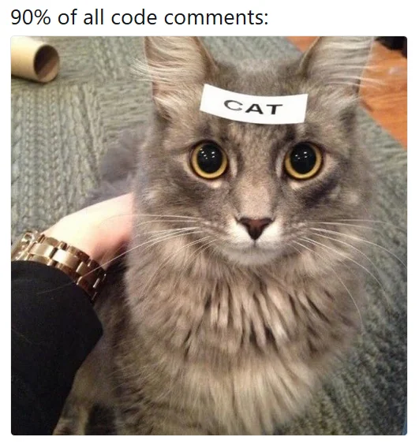{fig-align=center width=100% fig-alt="ADD"}

:::footer
[Reddit Programmer Humor](https://www.reddit.com/r/ProgrammerHumor/comments/8w54mx/code_comments_be_like/)
:::

::: {.notes}
**Presenter Notes**: To be able to interact with your code and make sure your automatization is correct, it is strongly recommended to comment your code. The goals is to make sure that we and others can understand what the code is doing and why, most of all.

It is not only to provide headers to navigate within your script, or to explain what the code is doing for the most complicated parts, but most importantly why you did something, or took a specific decision.

Comments can explain the purpose of a particular step, clarify decisions that might not be obvious from the code itself, and document important assumptions, for example, why certain participants were excluded or why a particular analysis was chosen. For instance if a function needs a parameter value to be specified, explain why you chose a value over another to help you remember in 2 months time, and because these decisions need be reported to allow full reproducibility of your work.

Ultimately, this transparency makes our workflows easier for others to inspect, understand, reproduce, and potentially reuse.
:::

---

### C. Dynamic reports

**Literate programming (e.g., Quarto)**

::: {.columns}

::: {.column width="40%"}

- Code and narrative **in one place**
- Rmarkdown/**Quarto document**:
  - Compiles into a .html, .pdf, .docx...
- **Output updates** as soon as file changes and is recompiled

{fig-align=center width=40% fig-alt="ADD"}

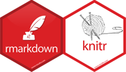{fig-align=center width=40% fig-alt="ADD"}

:::

::: {.column width="60%"}

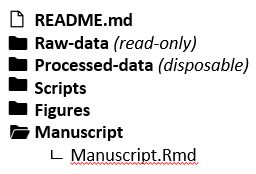{fig-align=center width=70% fig-alt="ADD"}

:::

:::

::: {.notes}
**Presenter Notes**: Coming to the third principle for code and documentation reproducibility, dynamic reports. As the name suggests, this is connected to pulling the different elements of your work, including your well-documented code together and to tell others about all of your research decisions taken at each step of the way.

And one way to facilitate this is to use literate programming. Literate programming is an approach in which explanatory text and computer code are written together as a single, coherent document, so that the reasoning behind an analysis is presented alongside the code that performs it. For our purposes, it means that as researchers we create a living file that explains what they are doing, why they are doing it, and how they did it, while the code is executed to produce the results, tables, and figures shown in the same document. Most importantly, you can compile this file into a document whose output will change automatically if you change something in your analyses. 

As an example, for R, Python and Julia users, it is now common to use Quarto files to do this, which are now replacing Rmarkdown files that were built just for R users, and these files can compile into html, pdf or word documents.
:::

---

### C. Dynamic reports

**Example in RStudio source editor:**

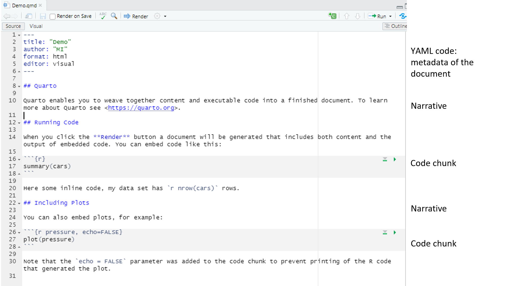{fig-align=center width=100% fig-alt="ADD"}

::: {.notes}
**Presenter Notes**: Just to briefly show you how this looks with a screenshot. In RStudio you can create a quarto files that comes in a template, which can you adapt as you wish. 

The header is the metadata of the document. Then you have some narrative, then some R or python or Julia code chunks, then more narrative, and more code chunks. You can also have some inline code, if you just want to print one value, and when you want that value to automatically adjust if something changes in your data selection for instance.

This is the source file, where you can see all the codes for the formatting, for instance with the two hashtags to make a heading level two.
:::

---

### C. Dynamic reports

**Example in RStudio visual editor:**

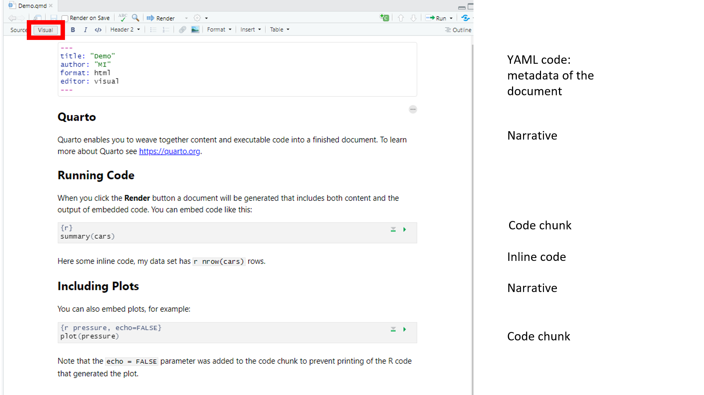{fig-align=center width=100% fig-alt="ADD"}

::: {.notes}
**Presenter Notes**: Here is the visual editor mode, where the code for the formatting is hidden and the formatting is already rendered. You can see the headings level two rendered now for instance.

Then you would compile the full document, that is also run the code to get its results.

Here on the right I chose the html format, and that’s how it renders with the default settings. And you can see that it has now run the code and is displaying its output such as the calculated numbers and the figures.

You can also insert bibliographic references using .bib files or by inputting the doi of the articles or by connecting your Zotero library to Rstudio, and you can also insert images pulling them from your figure subfolder or any online URL.  So using Quarto (or Rmarkdown) is a great way to create dynamic reports and possibly write your entire manuscripts that way, and you can do so collaboratively if you also use a version control system.
:::

---

### D. Version control

::: {.columns}

::: {.column width="40%"}

**Git** as a version control system

{fig-align=center width=30% fig-alt="ADD"}

**GitHub** as software development host

{fig-align=center width=30% fig-alt="ADD"}

:::

::: {.column width="60%"}

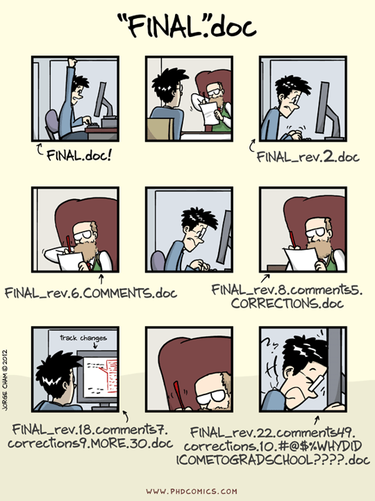{fig-align=center width=80% fig-alt="ADD"}

:::

:::

::: {.notes}
**Presenter Notes**: Coming to the fourth and final principle of code and documentation reproducibility: version control. Version control is a system for keeping track of changes to files over time, allowing you to see what changed, when it changed, and return to an earlier version if needed.

Version control systems track the changes you and others made to all of the files from your Rproject, your different scripts, your living document, so that you do not have to create several full copies of each file and get lost not knowing which version contains what.

Version control systems like Git make any previous versions available to you by storing the changes made, and their authors, somehow in the background of your files.

Git will version control code of any plain text language like R, Python, Julia, Markdown, Rmarkdown, Quarto.

To facilitate sharing and collaboration, you can host online all of your files and their history for instance on GitHub.

Git is not the only version control system and GitHub is not the only platform but this combination is the most commonly used one, and can be integrated within Rstudio.
:::

---

### D. Version control

**Example of version controlled document in RStudio**:

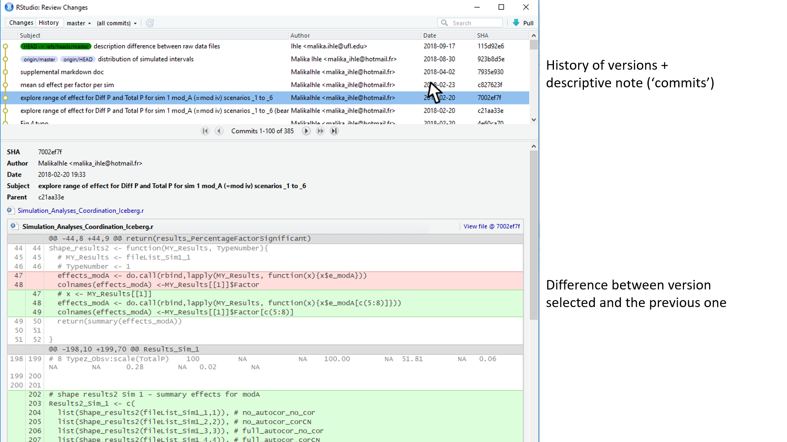{fig-align=center width=100% fig-alt="ADD"}

::: {.notes}
**Presenter Notes**: Again briefly, just to try and make this more tangible, here is a screenshot of the history of the versions of a R code shown through the RStudio environment, and below the difference between a version and the previous one, with additions in green and deletions in red. 

Basically, at least with good version control system, not like with google doc for instance which creates version whenever it wants, in proper version control system you have to decide when to create a frozen image of that difference between versions, and best is that you describe in details what happen to your code in between those two versions to be able to then search through your history for a previous version for instance to get back some deleted piece, etc. 

Once you have your workflow under version control, you are also just one click away for having all of it synchronized to your online GitHub account. This means that you can have all your codes accessible on any computer, and have collaborators working on them while staying in control of accepting or not suggestions made by others. 
:::

---

### Recap tools: code and documentation reproducibility

::: {.columns}

::: {.column width="50%"}

{fig-align=center width=30% fig-alt="ADD"}

{fig-align=center width=30% fig-alt="ADD"}

:::

::: {.column width="50%"}

{fig-align=center width=60% fig-alt="ADD"}

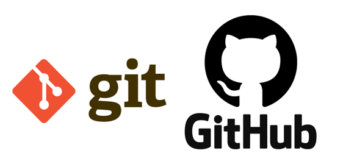{fig-align=center width=60% fig-alt="ADD"}

:::

:::

---

## Recap: Reliability + Reproducibility = Replicability

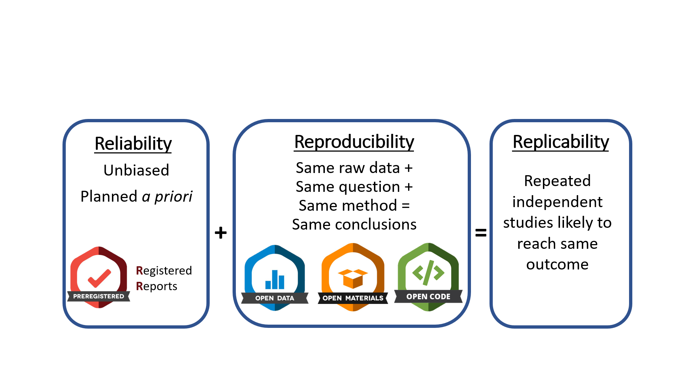{fig-align=center width=100% fig-alt="ADD"}

::: {.notes}
**Presenter Notes**:

:::

---

## Recap: Reliability + Reproducibility = Replicability

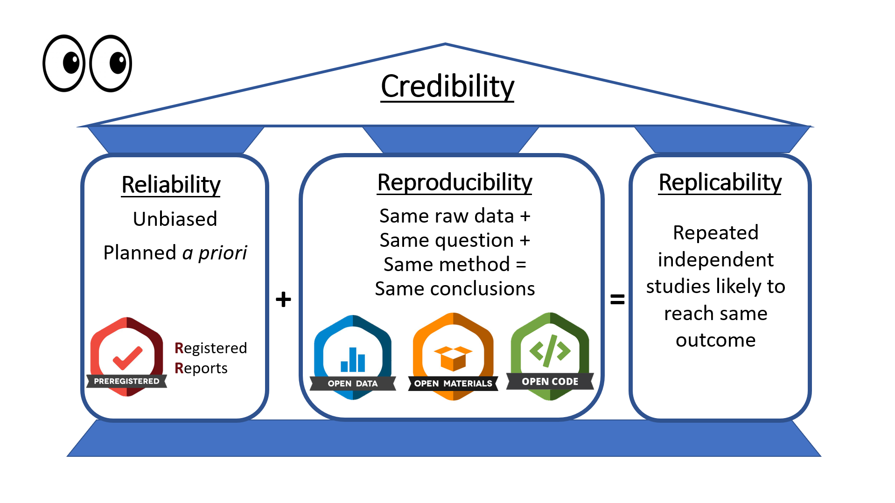{fig-align=center width=100% fig-alt="ADD"}

::: {.notes}
**Presenter Notes**: To summarize, overall, good planning such as preregistration especially in the form of registered reports, 
and transparent workflows are the proof of the reliability and reproducibility of research and make research more credible to other researchers, the public, and most importantly the funding agencies

Such preventive and transparent system make studies unbiased, systematic and objective, as science is meant to be by definition, and make us accountable for it: these are the actual evidence that we can show to anyone. 
:::

---

## Recap: Obtaining replicability through open research practises

**Ultimate goal**: Perform repeated independent studies  likely to reach the same outcome

| **The research practice of**   | **boosts ..**   | **because..**   |
|-------|-------|------------------------------|
| **Preregistration** | Reliability | limits hindsight and cognitive **bias**, **a priori planning**, limits false positives |
| **Registered reports** | Reliability | limits hindsight and cognitive bias, **a priori planning**, limits false positives, **feedback by experts** before conducting the study |
| **Simulations** | Reliability | strengthens confidence in planned statistical analysis |
| **Data sharing** | Reproducibility | making data available to others for reuse with FAIR principles|
| **Code and documentation reproducibility** | Reproducibility | portable projects (Rproj), automatization (README, folders), dynamic reporting (Quarto), version control (Git, GitHub|

::: {.notes}
**Presenter Notes**:

:::

---

## Quiz!

QR code here

---

::: {.panel-tabset}

### Question 1

**Which of the following best reflects the FAIR principles for research data?**

a. Data should always be freely available, stored in the same file format, and understandable without documentation.

b. Data should only be shared after publication and should be accessible without any authentication or restrictions.

c. Data are FAIR when they can be opened and understood by the researcher who originally collected them.

d. Data should be Findable, Accessible, Interoperable, and Reusable, supported by appropriate metadata, identifiers, standards, documentation, and usage licences.

### Question 2

**What is the purpose of an RStudio Project?**

a. To provide a dedicated working environment that makes it easier to organize a project’s files and maintain a portable, self-contained workflow

b. To automatically save all R objects, analyses, and outputs so that a project can be reproduced without sharing its code or data

c. To ensure that all files used in an analysis are stored in a single folder, regardless of whether the analysis depends on files or resources elsewhere

d. To replace version control by maintaining a complete history of changes to the project’s data, scripts, and outputs

Correct answer: a

### Question 3

**What is the main purpose of literate programming with Quarto in an open science workflow?**

a. To keep the research narrative, analysis code, and results connected, making the research process more transparent and reproducible

b. To automate statistical decisions so that researchers do not need to document their analytical choices

c. To separate analysis code from the manuscript so that each can be independently reproduced

d. To produce a polished manuscript without requiring researchers to share their underlying analysis code

Correct answer: a

### Question 4

**What is the main purpose of version control in an open science workflow?**

a. To automatically correct errors in research code and ensure that analyses produce the expected results

b. To track changes to project files over time, making it possible to review, compare, and recover earlier versions of the work

c. To ensure that all researchers working on a project edit the same files simultaneously without creating different versions

d. To automatically make research data and code publicly accessible as soon as they are created

Correct answer: b

:::

---

## Reflection activity

 
 

**One-minute paper**: Imagine you would have to explain the concept of computational reproducibility to a friend. Write down what you would say to them. (*Tip: Include the three core elements and provide concrete strategies and tools for each of the elements*)

::: {.notes}
**Presenter Notes**: Wrapping things up: Imagine you would have to explain 

**Instructor Notes**: Ask for 2-3 volunteers willing to share their papers in class. Alternatively, have your learners either hand you in the pieces of paper they wrote this on, or ask your learners to send you their one-minute-papers by email. 
:::

---

## Take-home message(s) - EDIT

::: {.callout-tip}
## Tip with Title
Add one practical tips or take-home message.
:::

::: {.notes}
**Presenter Notes**: Script for the slide here. 

**Instructor Notes**:

- **Aim**: End lesson on clear take-home message that are interactively compiled by learners.
:::

---

## To conclude: Survey time!

QR code here

::: {.notes}
**Presenter Notes**: Script for the slide here. 

**Instructor Notes**:

- **Aim**: This post-submodule survey serves to examine learners' current knowledge about the sumodule's topic.

- Use free survey software such as  particify or formR to establish the following questions (shown on separate slides)

- Use identical questions as in the pre-submodule survey to be able to directly compare
:::

---

**Which of the following concepts or skills do you feel most familiar with in relation to computational reproducibility? (Select all that apply)**

a. Creating and using RStudio projects

b. Using a standardized folder structure for your projects

c. Automatizing workflows through different scripts for different processing steps

d. Commenting my code

e. Using Quarto to combine code, text, figures etc. in one location

f. Version control with Git

g. None of the above

---

## Discussion of survey results

::: {.notes}
**Presenter Notes**: Script for the slide here.

**Instructer Notes**:

- **Aim**: Briefly examine the answers given to each question interactively with the group.

- Compare and highlight specific differences in answers between pre- and post-survey answers
:::

---

# Thanks!

---

## TO DO  Sarah

- [ ] Edit prerequisites
- [ ] Edit learning goals
- [ ] Sort out flow
- [ ] Sort out speaker notes

---

## References

::: {#refs}
:::

---

## Christina Bergmann slides
[https://docs.google.com/presentation/d/1bdICPzPOFs7V5aOZA2OdQgSAvgoB6WQweI21kVpk9Gg/edit?slide=id.p#slide=id.p](https://docs.google.com/presentation/d/1bdICPzPOFs7V5aOZA2OdQgSAvgoB6WQweI21kVpk9Gg/edit?slide=id.p#slide=id.p)

---

## Snake oil salesman vs. researcher

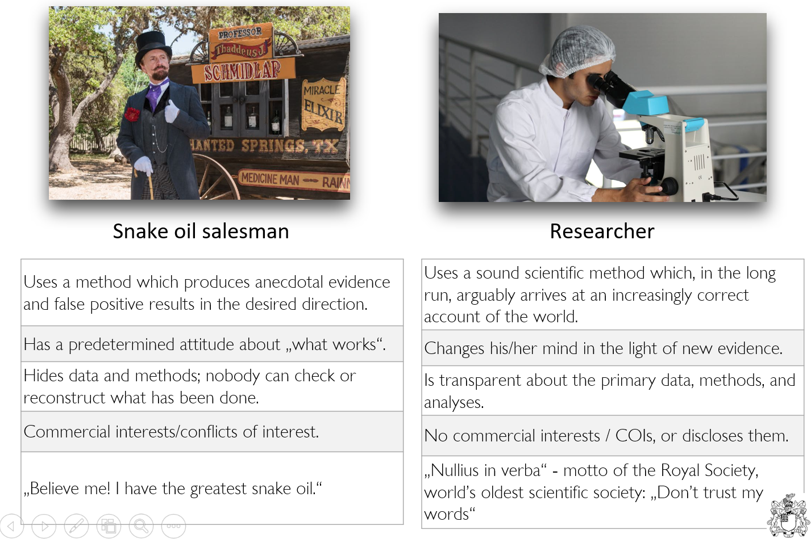{fig-align=center width=100% fig-alt="snakesman analogy"}

::: {.notes}
**Presenter Notes**: First let me state an important distinction we probably all agree on: The difference between a researcher and a snake oil salesman.

The snake oil salesman sells snake oil as an elixir that cures many diseases, from broken bones to skin rashes, and migraines. He uses a method which produces anecdotal evidence and false positive results in the desired direction. You’re not sure how, but he knows „what works“: it’s a ‘cure-all elixir’, will it cure your infection, of course! He has a commercial interest basically shouting ‘believe me, I have the greatest snake oil!’

In contrast, a researcher uses a sound scientific method which, in the long run, arguably arrives at an increasingly correct account of the world.
Changes their mind in the light of new evidence.
is transparent about methods used to reach this conclusion. Has no conflict of interests or if so discloses them. And researchers’ motto, at least of the world’s oldest scientific society is „Nullius in verba“ „Don’t trust my words“, implying ‘here, look at the evidence’.

**Instructor Notes**: 

:::

---

## Additional resources: OSC self-paced tutorials - FIX

<!-- 
 -->

<!-- 
 -->

<!-- ### 🧪 Simulation -->

<!-- **Preregistration** -->

<!-- Simulate data to explore and plan your statistical analysis. -->

<!-- **[→ Tutorial](https://lmu-osc.github.io/Introduction-Simulations-in-R/)** -->

<!-- 
 -->

<!-- 
 -->

<!-- ### 📊 Simulation -->

<!-- **Power analysis** -->

<!-- Use simulation to explore sample size and statistical power. -->

<!-- **[→ Tutorial](https://lmu-osc.github.io/Simulations-for-Advanced-Power-Analyses/)** -->

<!-- 
 -->

<!-- 
 -->

<!-- ### 💻 R -->

<!-- **Introduction to R** -->

<!-- Learn the basics of R for data analysis and visualization. -->

<!-- **[→ Tutorial](https://lmu-osc.github.io/introduction-to-R/)** -->

<!-- 
 -->

<!-- 
 -->

<!-- ### 🌿 Git & GitHub -->

<!-- **Version control** -->

<!-- Learn Git and GitHub within RStudio. -->

<!-- **[→ Tutorial](https://lmu-osc.github.io/Introduction-RStudio-Git-GitHub/)** -->

<!-- 
 -->

<!-- 
 -->

<!-- ### 🤝 Collaboration -->

<!-- **GitHub workflows** -->

<!-- Learn how to collaborate using forks, commits, and pull requests. -->

<!-- **[→ Tutorial](https://lmu-osc.github.io/Collaborative-RStudio-GitHub/)** -->

<!-- 
 -->

<!-- 
 -->

<!-- 
 -->

<!-- ### 🎓 Self-paced -->

<!-- **Learn at your own pace** -->

<!-- Open science tutorials from the LMU OSC. -->

<!-- 
 -->

<!-- 
 -->

<!-- 
 -->

::: {.notes}
**Presenter Notes**: ADDD
:::

---

