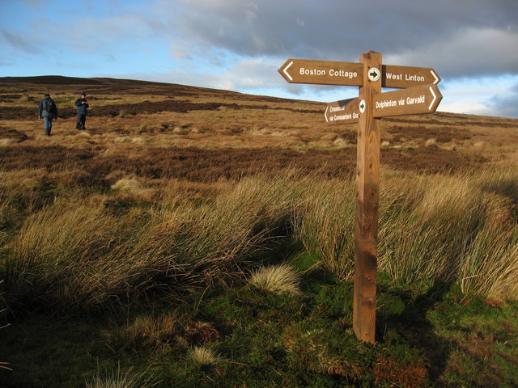

## Licence

{width="10%" fig-align="center"}

<small>This work was originally created by [Malika Ihle](https://www.osc.lmu.de/people/people/malika-ihle.html). This current work by Sarah von Grebmer zu Wolfsthurn and Malika Ihle is licensed under a CC-BY-SA 4.0 [Creative Commons Attribution 4.0 International SA License](https://creativecommons.org/licenses/by-sa/4.0/deed.en). It permits unrestricted re-use, distribution, and reproduction in any medium, provided the original work is properly cited. If you remix, transform, or build upon the material, you must distribute your contributions under the same license as the original.
Code snippets are dedicated to the public domain and licenced under a CC0 1.0 [Creative Commons Universal Licence](https://creativecommons.org/publicdomain/zero/1.0/). You may use, modify, distribute, and sell the code snippets for any purpose, without permission or attribution. The code snippets are provided “as is”, without warranty of any kind.</small>

::: {.notes}
**Presenter Notes**: The Creative Commons Attribution–ShareAlike 4.0 license, or CC BY-SA 4.0, allows others to copy, share, and adapt a work in any medium, including for commercial purposes. These permissions are broad and cannot be withdrawn as long as the license terms are followed. The main requirement is attribution: users must give appropriate credit to the original creator, provide a link to the license, and clearly indicate whether any changes were made, without implying endorsement by the original author. In addition, the ShareAlike condition means that if someone modifies or builds upon the work, the resulting material must be distributed under the same CC BY-SA 4.0 license, or a compatible one. Finally, users are not allowed to apply legal or technical restrictions, such as DRM, that would prevent others from exercising these same rights. Code snippets are dedicated to the public domain and licenced under a CC0 1.0 meaning that users can use, modify, distribute, and sell the code snippets for any purpose, without permission or attribution. The code snippets are provided “as is”, without warranty of any kind.
:::

---

## Contribution statement

**Creator**: Von Grebmer zu Wolfsthurn, Sarah ({fig-alt="orcid logo"}
[0000-0002-6413-3895](https://orcid.org/0000-0002-6413-3895))

**Creator and Reviewer**: Ihle, Malika ({fig-alt="orcid logo"} [0000-0002-3242-5981](https://orcid.org/0000-0002-3242-5981))

**Consultant**: Schönbrodt, Felix ({fig-alt="orcid logo"}[0000-0002-8282-3910](https://orcid.org/0000-0002-8282-3910))

::: {.notes}
**Presenter Notes**: These are the **presenter notes**. You will a script for the presenter for every slide. In presentation mode, your audience will not be able to see these presenter notes, they are only visible to the presenter. 

**Instructor Notes**: There are also **instructor notes**. For some slides, there will be pedagogical tips, suggestons for acitivities and troubleshooting tips for issues your audience might run into. You can find these notes underneath the speaker notes.

**Accessibility Tips**: Where applicable, this is a space to add any tips you may have to facilitate the accessibility of your slides and activities. 
:::

---

## Prerequisites - EDIT

::: {.callout-important}
Before completing this submodule, please carefully read about the prerequisites.
:::

| Prerequisite   |  Description  | Link/Where to find it   |
|------------|------------|------------|
| Topic Name | Basic intro to X | Module + Submodule |
| Software Name | Configuring the environment | [Download Link](https://quarto.org) |

::: {.notes}
**Presenter Notes**: Script for the slide here. 

**Instructor Notes**: These are the prerequisites for this submodule. Before you get started on this submodule with your audience, you need to ensure that the audience fulfills these criteria. Outline any essential prerequisites (software, tools, other submodules etc.) here in table format. If you prefer bullet points to list the prerequisites, delete the table and use bullet points instead. 
:::

---

## Questions from previous submodule

- **Aim**:  This first slide is dedicated to clarifying questions from the previous submodule and/or to discuss assignments. 
- Additional slides may need to be added depending on the nature of the homework assignments. 
- Critical for the learning process to ensure that learners are on the same page and have been able to achieve the learning goals of the previous workshop. 
- Not applicable if this set of slides corresponds to the first submodule of a new module. 

::: {.notes}
**Presenter Notes**: Script for the slide here.  

**Instructor Notes**:  

- **Aim**:  This first slide is dedicated to clarifying questions from the previous submodule and/or to discuss assignments. 
- Additional slides may need to be added depending on the nature of the homework assignments. 
- Critical for the learning process to ensure that learners are on the same page and have been able to achieve the learning goals of the previous workshop. 
- Not applicable if this set of slides corresponds to the first submodule of a new module. 
:::

---

## Before we start: Survey time!

::: {.panel-tabset}


### Question 1

**What is your level of familiarity with [Topic] (e.g., basic concepts, terminology, or tools)?**

a. I have never heard of it before.

b. I have heard of it but have never worked with it.

c. I have basic understanding and experience with it.

d. I am very familiar and have worked with it extensively.


### Question 2


**Which of the following concepts or skills do you feel most confident about in relation to [Topic]? (Select all that apply)**

a. Concept 1

b. Concept 2

c. Concept 3

d. Concept 4

e. I am not sure about any of these concepts.

### Question 3


**On a scale of 1 to 5, how comfortable are you with using [specific tool/technology] related to [Topic]?
(1 = Not comfortable at all, 5 = Very comfortable)**

a. 1

b. 2

c. 3

d. 4

e. 5

:::

---

## Discussion of survey results


What do we see in the results?

::: {.notes}
**Presenter Notes**: Let us have a look at these results. 

**Instructor Notes**:

- **Aim**: Briefly examine the answers given to each question interactively with the group. Use visuals from the survey to highlight specific answers.

**Accessibility Tip**: Have people work in pairs if someone did not bring their phone/does not have a phone. This survey also cannot be completed in an asynchronous setting. 
:::

---

## Where are we at?

**Previously**:

- Point 1
- Point 2

**Up next**:

- Point 1
- Point 2


::: {.notes}
**Presenter Notes**: Script for the slide here.

**Instructor Notes**:  

- **Aim**: Place the topic of the current submodule within a broader context.
- Remind learners what you are working towards and what the bigger picture is.
:::

---

## Covered in this session - EDIT

- Topic 1
- Topic 2
- Topic 3

::: {.notes}
**Presenter Notes**: This slides serves as an overview of the topics that are discussed, presented as bullet points.
:::

---

## Learning goals - EDIT

- **Aim**: Formulate specific, action-oriented goals learning goals which are measurable and observable in line with Bloom's taxonomy (Anderson et al., 2001; Bloom et al., 1956)

- Place an emphasis on the **verbs** of the learning goals and choose verbs that align with the skills you want to develop or assess.
- Examples: 
  - Learners will **describe** the process of photosynthesis or
  - Learners will **construct** a diagram illustrating the process of photosynthesis
  
::: {.notes}
**Presenter Notes**: Script for the slide here.

**Instructor Notes**:  

- **Aim**: Formulate specific, action-oriented goals learning goals which are measurable and observable in line with Bloom's taxonomy (Anderson et al., 2001; Bloom et al., 1956)

- Place an emphasis on the **verbs** of the learning goals and choose verbs that align with the skills you want to develop or assess.

- Examples: 
  - Learners will **describe** the process of photosynthesis or
  - Learners will **construct** a diagram illustrating the process of photosynthesis
  
:::

---

## Key terms and definitions - EDIT

- **Aim**: Introduce key terms and definitions that learners will come across throughout the session.
  
  
- **Key Term 1**: Definition
- **Key Term 2**: Definition
- **Key Term 3**: Definition

::: {.notes}
**Presenter Notes**: Add script for slide here.

**Instructor Notes**: Base yourself on conceptual change theory and examine existing concepts in relation to some key terms. Re-examine the formation of new concepts at the end of the lesson. 
:::

---

## Snake oil salesman vs. researcher

{fig-align=center width=100% fig-alt="snakesman analogy"}

::: {.notes}
**Presenter Notes**: First let me state an important distinction we probably all agree on: The difference between a researcher and a snake oil salesman.

The snake oil salesman sells snake oil as an elixir that cures many diseases, from broken bones to skin rashes, and migraines. He uses a method which produces anecdotal evidence and false positive results in the desired direction. You’re not sure how, but he knows „what works“: it’s a ‘cure-all elixir’, will it cure your infection, of course! He has a commercial interest basically shouting ‘believe me, I have the greatest snake oil!’

In contrast, a researcher uses a sound scientific method which, in the long run, arguably arrives at an increasingly correct account of the world.
Changes their mind in the light of new evidence.
is transparent about methods used to reach this conclusion. Has no conflict of interests or if so discloses them. And researchers’ motto, at least of the world’s oldest scientific society is „Nullius in verba“ „Don’t trust my words“, implying ‘here, look at the evidence’.

**Instructor Notes**: 

:::

---

## Remember the replicability crisis?

{fig-align=center width=100% fig-alt="articles discussing the reproducibility crisis"}

::: footer
Adapted from Malika Ihle: [https: https://osf.io/u3znx](https://osf.io/u3znx)
:::

::: {.notes}
**Presenter Notes**:

**Instructor Notes**:
:::

---

## Remember those..?

{fig-align=center width=40% fig-alt="ADD"}

{fig-align=center width=60% fig-alt="ADD"}

::: {.notes}
**Presenter Notes**:

**Instructor Notes**:
:::

---

## Now what?

{fig-align=center width=100% fig-alt="crossroads"}

::: footer
This image was taken from the [Geograph project collection](https://www.geograph.org.uk/). The copyright on this image is owned by Chris Martin and is licensed for reuse under the Creative Commons Attribution-ShareAlike 2.0 license.
:::

::: {.notes}
**Presenter Notes**: From the last session, remember that there is an approach to research which mitigates many of these challenges we discussed during the last session, such as accidental p-hacking, underpowered studies, biases, human errors etc. These approaches have the aim to raise scientific standards and the quality of research, so that society and researchers can trust the published work. 
:::

---

## A new way of doing research

<br>

<p style="text-align: center; font-size: 1.5em;">
**Open Research** <br>
*a.k.a.* <br>
**A scientific framework for the 21. century**
</p>

::: {.notes}
**Presenter Notes**: This alternative approach is Open Research, which is a framework for how to do research in the 21st century. We will spend this session to dive deeper into what Open Research even means or how it can possibly make research more credible. 

**Instructor  Notes**: Make the shift from describing the problem, threats and challenges of research from the previous session to a more solution-focused framework of reference of this current session.
:::

---

## Introducing Open Research

::: {.panel-tabset}

### Definition

::: {.callout-note}
## UNESCO defines it as:

*"[...] **open  science**  is  defined  as  an  inclusive construct that combines various movements and practices aiming to  **make**  multilingual  scientific  **knowledge  openly  available,  accessible  and  reusable  for  everyone**,  to  **increase  scientific  collaborations**  and  **sharing  of  information** for the benefits of science and society, and to **open the processes** of scientific knowledge creation, evaluation and communication to societal actors beyond the traditional scientific community."*
:::

### Values and principles

{fig-align=center width=100% fig-alt="Figure from the UNESCO Recommendations on Open Science depicting the guiding values and principles of Open Science"}

### Pillars of Open Research

{fig-align=center width=100% fig-alt="Figure from CyVerse 2025 depicting the six pillars of Open Science: open access publications, open data, open educational resources, open methodology, open peer review, and open source software"}


::: {.callout-note}
These pillars are not set in stone, different frameworks and disciplines identify different pillars.
:::

:::footer
Adapted from the [UNESCO Recommendations on Open Science](https://unesdoc.unesco.org/ark:/48223/pf0000379949/PDF/379949eng.pdf.multi) and from [CyVerse (2025)](https://foss.cyverse.org/01_intro_open_sci/#6-pillars-of-open-science).
:::

:::


::: {.notes}
**Presenter Notes**:

**Instructor Notes**:
:::

---

## Open Research in the research workflow

::: {.panel-tabset}

### Research cycle

::: {.columns}

::: {.column width="99%"}

{fig-align=center width=50% fig-alt="Figure by the Center for Open Science depciting the traditional research cycle"}

The Research Life Cycle from the [Open Science Framework](https://osf.io/).

:::

::: {.column width="1%"}

:::

:::

### Open Research "umbrella"

::: {.columns}

::: {.column width="60%"}

{width=100% fig-alt="Figure depicting the umbrella term Open Research and connected research practices"}

:::

::: {.column width="40%"}

  - Adapted from Danielle Robinson and Robin Champieux
  (Robinson, 2018)
  [https://osaos.codeforscience.org/what-is-open/](https://osaos.codeforscience.org/what-is-open/).
  - Badges from the [Center for Open Science](https://www.cos.io/initiatives/badges).

:::

:::

### Integrating Open Research

{fig-align=center width=100% fig-alt="Figure by the Center for Open Science depciting the traditional research cycle"}

::: {.small}
Adapted from [Christina Bergmann](https://docs.google.com/presentation/d/1bdICPzPOFs7V5aOZA2OdQgSAvgoB6WQweI21kVpk9Gg/edit?slide=id.g43f5346e6d_0_1113#slide=id.g43f5346e6d_0_1113)
:::

:::

::: {.notes}
**Presenter Notes**: One way to make Open Research less abstract and more tangible for one's own research flow is illustrated in this figure. The ultimate goal is to share key research outputs across the different stages of the research cycle: preregister your study, share data and materials, make code available, and provide open access to findings.
:::

---

## Threats to reliable science

{fig-align=center width=100% fig-alt="ADD"}

:::footer
Wagenmakers et al 2012 ; Forstmeier et al 2016 ; Munafo et al 2017
:::

::: {.notes}
**Presenter Notes**: Cherry picking results can be done in many insidious ways. It’s often call p-hacking or fishing for significant effect. 


**Instructor Notes**:
:::

---

## Threats to reliable science

{fig-align=center width=100% fig-alt="ADD"}

:::footer
Wagenmakers et al 2012 ; Forstmeier et al 2016 ; Munafo et al 2017
:::

::: {.notes}
**Presenter Notes**: Another version of that is HARKing which stands for hypothesizing after the result are known, that is when a researcher disseminate a result that was found only by chance, by performing a multitude of tests, as if this significant result had been predicted from the start, leading readers unable to assess that this result particularly needs replication to be validated.

HARKing is in fact sometimes still recommended by reviewers or editors to make stories more compelling, even though the likelihood of the results being wrong in such cases is very high.

**Instructor Notes**:
:::

---

## Threats to reliable science

{fig-align=center width=100% fig-alt="ADD"}

:::footer
Wagenmakers et al 2012 ; Forstmeier et al 2016 ; Munafo et al 2017
:::

::: {.notes}
**Presenter Notes**: In fact they are a few more threats to reliable science, highlighted here in this idealized version of the scientific method, whereby scientist first generate a hypothesis, then design a study and conduct it, test their hypothesis with the data collected, interpret result and publish them before generating new hypotheses. 

A solution to most of those problems, here in red, selective attention, low statistical power, p hacking, Harking, publication bias, would be to be transparent with our entire workflow  and blind to the results when we take decisions, and ideally, to get feedback on our study methodology before data collection happen.

**Instructor Notes**:
:::

---

## Our path to replicability

{fig-align=center width=100% fig-alt="ADD"}


::: {.notes}
**Presenter Notes**: Today, I’ll focus on the proximate causes, things researchers could actually do in their daily research to start improving this. 

I’ll argue here that the lack of replicability of studies, that is the fact that when a study is repeated independently, it does not reach the same outcomes, comes from the lack of two things:

First, what should happen before starting data collection, the way a study is planned and therefore whether the output produced are actually reliable.
:::

---

## Reliability

{fig-align=center width=100% fig-alt="ADD"}

::: {.notes}
**Presenter Notes**: 
:::

---

## 1. Preregistration

<br>

::: {.columns}

::: {.column width="30%"}

{fig-align=center width=100% fig-alt="Preregistration badge from the Center for Open Science"}

:::

::: {.column width="70%"}

> =  *"**specifying** your research plan in **advance** of your study and **submitting** it to a **registry**".*

:::

:::


:::footer
Text and badge from the [Center for Open Science](https://www.cos.io/initiatives/badges).
:::


::: {.notes}
**Presenter Notes**: We can do so by preregistering our study, that is, we can write down our hypothesis and intended statistical tests prior to seeing or even collecting the data, put it online behind an embargo, that is it stays private for a while, and then release this plan along our published paper to help prove mostly ourselves but to some extend also others that we were unbiased. 

Preregistering creates a specific plan for the upcoming study. Doing so helps to distinguish planned from unplanned work. Both are important. But the same data cannot be used to generate and test a hypothesis, which can happen unintentionally and reduce the credibility of your results. Addressing this problem through planning improves the transparency of your research. This helps you clearly report your study and helps others who may wish to build on it.

**Instructor Notes**:
:::

---

### Where to preregister?

<br>

{fig-align=center width=60% fig-alt="Resources for preregistration including aspredicted.com, Center for Open Science, Animal Study Registry, ClinicalTrials.gov and PreclinicalTrials.eu"}

::: {.notes}
**Presenter Notes**:
:::

---

### Thinking process (I)

::: {.columns}

::: {.column width="50%"}
#### Decisions needed

- Choosing dependent variable 
- Choosing sample size
- Choosing covariate
- Variable transformation
- Data exclusion criteria
- How to deal with missing data
- What to report

:::

::: {.column width="50%"}
#### **Post-hoc** decision rules

- Confirmation bias
- Hindsight bias
- ...
- Direction of effect that *obviously* makes sense

= **p-hacking**

:::

:::

::: {.notes}
**Presenter Notes**: In preregistration forms and templates, one should lay down all the decisions regarding all those aspects we have reviewed to massively influence chances of getting false positives if these decisions are taken knowing what the p-value of each versions of the test would be,  by choosing the test whose results ‘obviously’ make sense with hindsight.
:::

---

### Thinking process (II)

::: {.columns}

::: {.column width="50%"}
#### Decisions needed

- Choosing dependent variable 
- Choosing sample size
- Choosing covariate
- Variable transformation
- Data exclusion criteria
- How to deal with missing data
- What to report

:::

::: {.column width="50%"}
#### **Post-hoc** decision rules

- Biological relevance
- e.g. Power analysis
- e.g. Collinearity
- if distribution condition is met
- if criteria are met
- Decision rule (average/exclude) 
- All!

:::

:::

::: {.notes}
**Presenter Notes**: Instead by taking these decisions a priori, one can actually more easily base them on something relevant, 

like choosing the dependent variable based on their biological relevance, choosing the sample size based on a power analysis,

And taking all other decisions based on  any condition or criteria one think should be met to chose one analysis route over another. 
:::

---

### The preregistration process

<br>

{fig-align=center width=60% fig-alt="ADD"}

:::footer
[https://www.cos.io/initiatives/prereg](https://www.cos.io/initiatives/prereg)
:::


::: {.notes}
**Presenter Notes**: Alright, so in practice, when one is finally ready to either start data collection  or to look at already existing data for the first time if one works with longitudinal datasets for instance,  one would submit their analysis plan to an online platform, they can put it under an embargo if they are concerned about being scooped so it stays private for a few years, and then they make that file public and give it a doi when they finally publish their paper. 

This, one could always do as part of their workflow basically by working-in more details into their previously written grant proposal and ethic proposal. And one advantage of that, besides being able to prove to ourselves and others that our work is unbiased, is that we will usually also increase our chances of obtaining high quality feedback from our team by giving them a detailed protocol to review prior to conducting our study.

In fact, why not send preregistrations to journals directly so that we also get the feedback from peer reviewers at a time where it is still feasible for us to address their concerns? 

-- How would you feel about that? Do you think that’s a realistic idea?
:::

---

## 2. Registered reports

<br>

::: {.columns}

::: {.column width="30%"}

{fig-align=center width=100% fig-alt="Logo of the Center for Open Science"}

:::

::: {.column width="70%"}

> =  *"a publishing format that emphasizes the importance of the research question and the quality of methodology by conducting peer review **prior to data collection**."*

:::

:::

:::footer
[https://www.cos.io/initiatives/registered-reports](https://www.cos.io/initiatives/registered-reports)
:::

::: {.notes}
**Presenter Notes**: 

:::

---

### The registered report process

<br>

{fig-align=center width=60% fig-alt="ADD"}

:::footer
[https://www.cos.io/initiatives/registered-reports](https://www.cos.io/initiatives/registered-reports)
:::

::: {.notes}
**Presenter Notes**: Well this is possible, and as of today, it is possible in well over 300 journals across disciplines that will either accept or even request such preregistrations, which are then called Registered Reports.  

In this publishing process, peer reviewers give feedback on our preregistration, that is on our hypotheses, experimental procedures, and main analyses, and they do so before data collection or data analyses, so actually at a time where we can still make changes to our methodology. 

The journal then offers in principle acceptance. Which means that our paper will be published if we follow through with the approved plan. and then we conduct the study, after which we add a results and discussion section to our report, splitting the result section into Registered confirmatory analyses + unregistered exploratory analyses.

And then reviewers assess compliance with the preregistered protocol, and whether conclusions are sound.

Final acceptance of our paper will not be depending on the result that we got, it will only depend on that match between our preregistration and what we actually did, and it will not depend on whether the hypothesis was supported or whether we found a significant effect or not.

This format of paper changes what it takes to get a paper published, in this case it is finally about asking an interesting question and designing rigorous methodology to address this question, rather than the sexiness of the results that we may have found on our fishing trip.
:::

---

### Acceptance of registered reports

{fig-align=center width=60% fig-alt="ADD"}

:::footer
[https://www.cos.io/initiatives/registered-reports](https://www.cos.io/initiatives/registered-reports)
:::

::: {.notes}
**Presenter Notes**: To know which journal has adopted this format already, visit the center for open science registered report webpage and go to the participating journals tab.
:::

---

## 3. Simulations and power analysis

> How to know whether your planned statistical test is approporiate?

1. Simulate random data (anticipating distribution of variables and sample size)
2. Run statistical test and save parameter of interest
3. Replicate 
4. Check that results are random (significant in only 5% of the case) 
5. Generate data including an effect (e.g. imposing a correlation between two variables)
6. Check that your model is picking up the effect simulated, in 80% of the cases (= power analysis)

::: {.notes}
**Presenter Notes**: Alright. Whether you simply want to preregister on your own or go the high way and submit a registered report to a journal, you may still wonder how you can best ensure that your planned statistical test is appropriate and don’t have to withdraw your preregistration or submit a transparent change request explaining that after thinking more about it you realized the test you planned isn’t the best approach, possibly blowing up your impostor syndrome.

Here is what I do and recommend doing for each preregistration to avoid that –this is optional in the form– but really I find this the most helpful way of thinking about what analysis I should be doing with the data I’m about to collect.

I simulate data using the distribution and sample size I’m expecting for my real data. I create basically a data frame with experimental treatment allocated at random, I draw random numbers from say a normal distribution if I expect my real variable to be normally distributed,  then I run the statistical test that I’m thinking of preregistering, and then I check that when I repeat this say 100 times, and if I had generated random data, I only get 5 percent of my tests as significant, the tolerated false positive finding rate.

Then I simulate data with an effect of the size I am expecting, say I create a correlation between 2 variables, by simulating the second one based on the first, and run the simulation of data and data analysis one hundred times, I will then check that my planned statistical analyses are able to pick up this effect in at least 80 % of the time. This is what is called a power analysis.

Simulating data, playing with it, trying out different ways of modelling it, this is what helps me decide on which test I will preregister, or if I’m still unsure, this is something concrete I can discuss with colleagues or statistician professionals. 

And finally, by doing this I basically have my script ready to directly feed my real data once I have it cleaned, and get all the results from the preregistered confirmatory analyses in a couple of seconds.

-- Does it seem like a good idea? Do you think it’s too complicated?

:::

---

### Additional resources: OSC self-paced tutorials

::: {.columns}

::: {.column width="50%"}

#### Simulation of data for preregistration
Plan your study statistical plan by playing with fake data:
[https://lmu-osc.github.io/Introduction-Simulations-in-R/](https://lmu-osc.github.io/Introduction-Simulations-in-R/)

:::

::: {.column width="50%"}

#### Simulation of data for power analyses
Determine the sample size you need in your study by simulating fake data: [https://lmu-osc.github.io/Simulations-for-Advanced-Power-Analyses/](https://lmu-osc.github.io/Simulations-for-Advanced-Power-Analyses/)

:::

:::

::: {.notes}
**Presenter Notes**:
:::

---

## Our path to replicability

{fig-align=center width=100% fig-alt="ADD"}

::: {.notes}
**Presenter Notes**:
:::

---

## Reproducibility

{fig-align=center width=100% fig-alt="ADD"}

::: {.notes}
**Presenter Notes**:
:::

---

## 4. Computational reproducibility

### **The "manual" workflow**: click, click, click

{fig-align=center width=100% fig-alt="ADD"}

::: {.notes}
**Presenter Notes**: In a traditional workflow, one manually extract, select, and process their data, and report their analyses using a lot of clicking, copying and pasting, 
Ones has to keep track of what would need to be updated, like figures and numbers, if they were to ever slightly change something anywhere in the process. If one goes through this whole process manually, it would be very hard to guarantee that they could repeat it all again and find the same results, yet alone someone else. 
:::

---

## 4. Computational reproducibility

### **The "automated" workflow**

::: {.columns}

::: {.column width="50%"}

- load-data.csv
- clean-data.csv
- analyze-data.csv

:::

::: {.column width="50%"}

- -> **Reproducible** and more efficient when new data, new collaborator, new project

- -> Possibility to **correct errors**

:::

:::

{fig-align=center width=20% fig-alt="ADD"}

::: {.notes}
**Presenter Notes**: While if you one uses today’s tools: you write a piece of code to extract, wrangle, and analyse our files or our data, our whole workflow can be repeated exactly the same way when we get new files or come back to a project after a break or involve a new collaborator. And because such workflow is transparent, meaning that all our steps are written in plain text rather than hidden behind a graphical user interface, mistakes have a chance to be corrected by our collaborators or the community.
:::


---

### Components of computational reproducibility

::: {.columns}

::: {.column width="33%"}
{fig-align=center width=40% fig-alt="ADD"}

1. **Raw data** <br> (or anonymized or synthetic dataset)

:::

::: {.column width="33%"}

{fig-align=center width=50% fig-alt="ADD"}

2. **Code and documentation** <br> to reproduce data processing and data analyses 

:::

::: {.column width="33%"}

{fig-align=center width=50% fig-alt="ADD"}

<br>

3. **Specifications** <br> of your **computational <br> environment**


:::

:::

::: {.notes}
**Presenter Notes**: To make research perfectly reproducible, one would need to share the raw data, or,  when we work with sensitive data,  an anonymized dataset,  or a synthetic dataset, which is a simulated dataset whose properties are similar to the real dataset.

We should also share  our code and documentation that process and analyze the data, and the specifications of our computational environment  so one can actually run our code with the same software version and get the same results.   
:::

---

## 5. Code and documentation reproducibility

{fig-align=center width=20% fig-alt="ADD"}

A. Portable and self-contained project

B. Automatize workflow

C. Create dynamic report

D. Version control

::: {.notes}
**Presenter Notes**:
:::

---

## 5. Code and documentation reproducibility

{fig-align=center width=20% fig-alt="ADD"}

A. Portable and self-contained project: **good project management**

B. Automatize workflow: **stop clicking, start coding**

C. Create dynamic report: **write reproducible manuscripts**

D. Version control

::: {.notes}
**Presenter Notes**:
:::

---

### A. Portable and self-contained project

**R-Studio Projects**

::: {.columns}

::: {.column width="20%"}

{fig-align=center width=100% fig-alt="ADD"}
:::

::: {.column width="80%"}

> **RStudio project .Rproj**: raw data, script and documentation, and outputs in the same project directory


:::

:::


::: {.notes}
**Presenter Notes**: The first principle is to create a portable and organized project so that anyone including yourself in the future can run you codes again. 
For instance, in RStudio, you could use RStudio projects, that .Rproj file which will manage your folder, make it straightforward to divide your work into multiple contexts, each with their own working directory, workspace, history, and source documents.

Such Rstudio project will be self-contained, if you intentionally organize it so that you don’t need to reach outside of this folder to work on this project, that is essentially if you also store the data in there and all the scripts you may use to create any of your outputs. 
:::

---

### A. Portable and self-contained project

**(Standardized folder structure**

::: {.columns}

::: {.column width="33%"}

{fig-align=center width=90% fig-alt="ADD"}
:::

::: {.column width="33%"}

{fig-align=center width=90% fig-alt="ADD"}

:::

::: {.column width="33%"}

> Standardized folder structure to increase clarity and reproducibility


:::

:::

::: {.notes}
**Presenter Notes**: An  additional very simple but also effective way to ensure your work’s reproducibility is to think about your folder structure, to increase clarity and reusability.
You should adopt or establish such folder structure convention with your peers as to the exact subfolders you should have but there are a few non negotiable files or folders in here.

First you should have a README file detailing what files the project contains, the provenance of each file, the order in which they should be used, etc. it is common to write README files with a very simple markup language with plain-text-formatting syntax called Markdown, and when you will share your project online as we will see later, it will display that README file in the homepage of the repository, so that is the first thing that people see when they get access to your project.

In this folder, you also want to share your raw data – when appropriate for your project - and treat them as read only, and have R scripts that process and wrangle the raw data into processed data, which can be treated as disposable. Raw data should stay untouched as you may start calculation and replace values in there and introduce errors without being able to go back to the initial state.

The scripts that will process and analyse the data may be split in different files, depending on the workflow, and the key here is to avoid copy pasting code so that you can adjust something by changing it in only one place, and often to achieve this, it is handy to define functions and then call the names of these functions to apply them repeatedly.

:::

---

### B. Automatize workflow

**Separate your scripts**

::: {.columns}

::: {.column width="10%"}

{fig-align=center width=90% fig-alt="ADD"}
:::

::: {.column width="45%"}

**00-analyse.R**

  - source(“01-load-packages.R”)
  - source(“02-load-data.R”)
  - source(“03-clean-data.R”)
  - source (“04-explore.R”)
  - source (“05-model.R”)
  - source (“06-summarize.R”) 
  
:::

::: {.column width="45%"}

{fig-align=center width=90% fig-alt="ADD"}

:::

:::

::: {.notes}
**Presenter Notes**: In fact, codes for larger projects can be separated in tasks that can be all sourced into an overarching analysis file, which makes it simpler to automatize a workflow, and know where things are. 
:::

---

### B. Automatize workflow

**Keep data machine readable**

::: {.columns}

::: {.column width="40%"}

{fig-align=center width=90% fig-alt="ADD"}

:::

::: {.column width="60%"}

- **No color coding**
- No comments in numerical columns
- **Structure** your code
- **Comment** your code
  - What the code does
  - **Why** this decision

:::

:::

::: {.notes}
**Presenter Notes**: Of course automatization, starting from loading the data, requires data to be stored in a machine readable format. One column with one data type.
//
And to be able to interact with your code and make sure your automatization is correct, it is strongly recommended to comment your code not only to provide headers to navigate within your script, or to explain what the code is doing for the most complicated parts, but most importantly why you did something, or took a specific decision. For instance if a function needs a parameter value to be specified, explain why you chose a value over another to help you remember in 2 months time, and because these decisions need be reported to allow full reproducibility of your work. 

:::

---

### C. Dynamic reports

**Literate programming (e.g., Quarto)**

::: {.columns}

::: {.column width="40%"}

- Code and Narrative **in one place**
- Rmarkdown/**Quarto document**:
  - Compiles into a html, pdf, docx...

{fig-align=center width=40% fig-alt="ADD"}


{fig-align=center width=40% fig-alt="ADD"}

:::

::: {.column width="60%"}

{fig-align=center width=70% fig-alt="ADD"}

:::

:::


::: {.notes}
**Presenter Notes**: And one way to facilitate reporting decisions taken at each step of the way, is to use literate programming, that is have a succession of chunks of common English explanation of the logic of your research software, and chunks of code, processing or analysing data, and compile that file into a document whose output will change automatically if you change something in your analyses. 

For R, Python and Julia users, it is now common to use Quarto files to do this, which are now replacing Rmarkdown files that were built just for R users, and these files can compile into html, pdf or word documents.
:::


---

### C. Dynamic reports

**Example in RStudio source editor:**

{fig-align=center width=100% fig-alt="ADD"}

::: {.notes}
**Presenter Notes**: Just to briefly show you how this looks with a screenshot. In RStudio you can create a quarto files that comes in a template, which can you adapt as you wish. 
The header is the metadata of the document. Then you have some narrative, then some R or python or Julia code chunks, then more narrative, and more code chunks. You can also have some inline code, if you just want to print one value, and when you want that value to automatically adjust if something changes in your data selection for instance.

This is the source file, where you can see all the codes for the formatting, for instance with the two hashtags to make a heading level two.
:::

---


### C. Dynamic reports

**Example in RStudio visual editor:**

{fig-align=center width=100% fig-alt="ADD"}

---

### D. Version control

::: {.columns}

::: {.column width="40%"}

**Git** as a version control system

{fig-align=center width=30% fig-alt="ADD"}

**GitHub** as software development host

{fig-align=center width=30% fig-alt="ADD"}


:::

::: {.column width="60%"}


{fig-align=center width=80% fig-alt="ADD"}

:::

:::

::: {.notes}
**Presenter Notes**: Version control system track the changes you and others made to all of these files, so that you do not have to create several full copies of each file and get lost not knowing which version contains what.
Version control systems like Git make any previous versions available to you by storing the changes made, and their authors, somehow in the background of your files.
Git will version control code of any plain text language like R, Python, Julia, Markdown, Rmarkdown, Quarto.

To facilitate sharing and collaboration, you can host online all of your files and their history for instance on GitHub.

Git is not the only version control system and GitHub is not the only platform but this combination is the most commonly used one, and can be integrated within Rstudio.

:::

---


### D. Version control

**Example of version controlled document in RStudio**:

{fig-align=center width=100% fig-alt="ADD"}

::: {.notes}
**Presenter Notes**: Again briefly, just to try and make this more tangible, here is a screenshot of the history of the versions of a R code shown through the RStudio environment, and below the difference between a version and the previous one, with additions in green and deletions in red. 
Basically, at least with good version control system, not like with google doc for instance which creates version whenever it wants, in proper version control system you have to decide when to create a frozen image of that difference between versions, and best is that you describe in details what happen to your code in between those two versions to be able to then search through your history for a previous version for instance to get back some deleted piece, etc. 
//
Once you have your workflow under version control, you are also just one click away for having all of it synchronized to your online GitHub account. This means that you can have all your codes accessible on any computer, and have collaborators working on them while staying in control of accepting or not suggestions made by others. 
:::


---

### Recap tools: code and documentation reproducibility

::: {.columns}

::: {.column width="50%"}

{fig-align=center width=30% fig-alt="ADD"}

{fig-align=center width=30% fig-alt="ADD"}


:::

::: {.column width="50%"}

{fig-align=center width=60% fig-alt="ADD"}


{fig-align=center width=60% fig-alt="ADD"}


:::

:::

---

# continue from here


---

## Practical exercise 1

- **Aim**: Design more practical exercises for learners to apply the new skills in practice.
- Depending on the topic, the exercises should be in accordance with the learning objective(s).
- Add a description of the task, as well as a checklist as an overview of that your learners need to be doing. 

- [x] Step 1
- [ ] Step 2
- [ ] Step 3

::: {.notes}
**Presenter Notes**: Script for the slide here.

**Instructor Notes**:

- **Aim**: Design more practical exercises for learners to apply the new skills in practice.

- Depending on the topic, the exercises should be in accordance with the learning objective(s).

- Add a description of the task, as well as a checklist as an overview of that your learners need to be doing. 
:::

---

## Pre-break quiz

- **Aim**: This pre-break survey serves to examine learners' current understanding of key concepts of the submodule

::: {.notes}
**Presenter Notes**: Interactive quiz to check understanding and retention of learners. Use free survey software such as [Particify](https://www.particify.de/en/) to establish the following questions (shown on separate slides).

**Instructor Notes**: This pre-break survey serves to examine learners' current understanding of key concepts of the submodule. Guidance on interpreting the results:

- If more than 80% of the learners select the correct response option, show which one it is and move on.

- If less than 80% of answers are correct, let them discuss with each other for 1-2 minutes which one they selected, and why, and afterwards let them re-take the question. If they`re above 80% correct the second time, move on, else show the correct response and explain why it is correct (plus maybe why the others are not).

- If more than 30% select a specific distractor answer, discuss it in class.
:::

---

**Which species is the largest type of penguin**?

a. Chinstrap Penguin

b. Emperor Penguin ✅

c. Adélie Penguin

d. King Penguin

---

**What is the key biological feature that helps penguins swim efficiently?**

a. Hollow bones for buoyancy

b. Webbed feet for paddling

c. Waterproof feathers and flipper-like wings ✅

d. Gills to breathe underwater

---

# Break! 15 minutes

---

## Post-break survey discussion

- **Aim**: To clarify concepts and aspects that are not yet understood
- Highlight specific answers given during the survey

::: {.notes}
**Presenter Notes**: Script for the slide here.

**Instructor Notes**:

- **Aim**: To clarify concepts and aspects that are not yet understood

- Highlight specific answers given during the survey
:::

---

## Practical exercise 2

- **Aim**: Design more practical exercises for learners to apply the new skills in practice.
- Depending on the topic, the exercises should be in accordance with the learning objective(s).
- Add a description of the task, as well as a checklist as an overview of that your learners need to be doing. 

- [x] Step 1
- [ ] Step 2
- [ ] Step 3

::: {.notes}
**Presenter Notes**: Script for the slide here.

**Instructor Notes**:

- **Aim**: Design more practical exercises for learners to apply the new skills in practice.

- Depending on the topic, the exercises should be in accordance with the learning objective(s).

- Add a description of the task, as well as a checklist as an overview of that your learners need to be doing. 
:::

---

## Relevance and implications

- **Aim**: To work out the relevance of the topic to your learners.
- In an interactive setting, discuss how the new skills could be applied in practise with specific examples.
- Examine downfalls and practical obstacles.

::: {.notes}
**Presenter Notes**: Script for the slide here. 

**Instructor Notes**:

- **Aim**: To work out the relevance of the topic to your learners.

- In an interactive setting, discuss how the new skills could be applied in practise with specific examples.

- Examine downfalls and practical obstacles.
:::

---

## Assignment

- **Aim**: Explain the homework assignment and the rationale behind the homework.
- Examine whether/how it will be assessed
- Mention scoring rubrics, if applicable
- Design a peer-review system for assignments to place learners in role of reviewer and author

::: {.notes}
**Presenter Notes**: Script for the presentation here. 

**Instructor Notes**:

- **Aim**: Explain the homework assignment and the rationale behind the homework.

- Examine whether/how it will be assessed

- Mention scoring rubrics, if applicable

- Design a peer-review system for assignments to place learners in role of reviewer and author
:::

---

## Take-home message(s)

- **Aim**: End lesson on clear take-home message that are interactively compiled by learners.

::: {.callout-tip}
## Tip with Title
Add one practical tips or take-home message.
:::

::: {.notes}
**Presenter Notes**: Script for the slide here. 

**Instructor Notes**:

- **Aim**: End lesson on clear take-home message that are interactively compiled by learners.
:::

---

## Recap: What have we done so far?

::: {.notes}
**Presenter Notes**: Script for the slide here. 

**Instructor Notes**:

- **Aim**: Provide overview of the topics covered today and remind learners of the bigger picture.
:::

---

## To conclude: Survey time!

- **Aim**: This post-submodule survey serves to examine learners' current knowledge about the sumodule's topic.
- Use free survey software such as  particify or formR to establish the following questions (shown on separate slides)
- Use identical questions as in the pre-submodule survey to be able to directly compare

::: {.notes}
**Presenter Notes**: Script for the slide here. 

**Instructor Notes**:

- **Aim**: This post-submodule survey serves to examine learners' current knowledge about the sumodule's topic.

- Use free survey software such as  particify or formR to establish the following questions (shown on separate slides)

- Use identical questions as in the pre-submodule survey to be able to directly compare
:::

---

**What is your level of familiarity with [Topic] (e.g., basic concepts, terminology, or tools)?**

a. I have never heard of it before.

b. I have heard of it but have never worked with it.

c. I have basic understanding and experience with it.

d. I am very familiar and have worked with it extensively.

---

**Which of the following concepts or skills do you feel most confident about in relation to [Topic]? (Select all that apply)**

a. Concept 1

b. Concept 2

c. Concept 3

d. Concept 4

e. I am not sure about any of these concepts.

---

**On a scale of 1 to 5, how comfortable are you with using [specific tool/technology] related to [Topic]? (1 = Not comfortable at all, 5 = Very comfortable)**

a. 1

b. 2

c. 3

d. 4

e. 5

---

## Discussion of survey results

- **Aim**: Briefly examine the answers given to each question interactively with the group.
- Compare and highlight specific differences in answers between pre- and post-survey answers

::: {.notes}
**Presenter Notes**: Script for the slide here.

**Instructer Notes**:

- **Aim**: Briefly examine the answers given to each question interactively with the group.

- Compare and highlight specific differences in answers between pre- and post-survey answers
:::

---

## References {.smaller}

::: {#refs}
:::

::: {.notes}
**Presenter Notes**: Script for the slide here. 

**Instructor Notes**: Highlight particularly relevant reading for your learners in bold. 
:::

---

# Thanks!

See you next class :)

---

## Pedagogical add-on tools for instructors

- This section is dedicated to ideas on how to incorporate pedagogical tools into teaching for this specific submodule topic. This could mean:
  - Information about the scientific evidence on the theory of the pedagogical add-on tool and the evidence for its efficacy.
  - Discussion/reflection on how tools can be incorporated into the teaching for this particular content.
  - Extra exercises for faster learners.	

---

## Additional literature for instructors

- References for content
- References for pedagogical add-on tools	
- Other resources (videos etc.)	

---

# Formatting elements for instructors

- **Aim**: This section contains templates for different formatting elements, which can be modified and adapted for the instructor's individual purposes. 

---

## Text with example links

- [Quarto Documentation](https://quarto.org/docs/)
- [Reveal.js Documentation](https://revealjs.com/)
- [Markdown Guide](https://www.markdownguide.org/)
- [GitHub](https://github.com/)

---

## Basic text formatting

- **Bold:** `**bold**` → **bold**
- *Italic:* `*italic*` → *italic*
- ~~Strikethrough:~~ `~~text~~` → ~~text~~
- `Inline code:` `` `code` `` → `code`
- > Blockquote: `> Quote` →  
  > "This is a quote"
  
---

## Text with references

- Sample text for adding a reference in brackets [@abele-brehmWerSollProfessur2016]. **Use square brackets in the qmd file.**

- Sample text for adding in text-citation: @abele-brehmWerSollProfessur2016 argue that climate change is accelerating. **No brackets used in the qmd file.** 

---

## Call-out boxes

::: {.callout-caution}
Include text here. 
:::

::: {.callout-warning}
Include text here. 
:::

::: {.callout-tip}
Include text here. 
:::

::: {.callout-note}
Include text here. 
:::

---

## Figure (centered) with caption and alt text


::: {.notes}
**Note for pptx template**: Images are usually centered by default in PPTX output.
However, the font size and the image size must be controlled in the PowerPoint template, not in Markdown. The text in quotes represents the alt text that is visible when hovering over the image in the slides. The alt text does *not* appear in the pptx and has to be added manually in PowerPoint.
:::

---

## Figure with specific width and height - not possible for pptx


::: {.notes}
**Note for pptx template**: Markdown does not support specific width, height, or styling of an image or the caption. You would need to handle those styles within PowerPoint after rendering or use a custom template for PowerPoint output (in .pptx format).
:::

---

## Figure with bullet points

::: columns
::: column

:::

::: column
- First bullet point
- Second bullet point
- Third bullet point
:::
:::

---

## Side-by-side figures

::: columns
::: column


: Figure 1: Penguin
:::

::: column


: Figure 2: Seal
:::
:::

---

## Stacked figures with text

::: columns
::: column


:::

::: column
- First bullet point
- Second bullet point
- Third bullet point
:::
:::


::: {.notes}
**Note for pptx template**: Stacked figures cannot be resized in markdown but need to be resized afterwards in pptx directly. 
:::

---

## Two-column text slide

::: columns
::: column
**Column 1**

Lorem ipsum dolor sit amet, consectetur adipiscing elit.  
Vivamus lacinia odio vitae vestibulum vestibulum.  
Cras venenatis euismod malesuada.
:::

::: column
**Column 2**

Sed do eiusmod tempor incididunt ut labore et dolore magna aliqua.  
Ut enim ad minim veniam, quis nostrud exercitation ullamco laboris.
:::
:::

---

## Three-column text slide

::: columns
::: column
**Column 1**

Lorem ipsum dolor sit amet, consectetur adipiscing elit.  
Vivamus lacinia odio vitae vestibulum vestibulum.
:::

::: column
**Column 2**

Sed do eiusmod tempor incididunt ut labore et dolore magna aliqua.  
Ut enim ad minim veniam, quis nostrud exercitation ullamco laboris.
:::

::: column
**Column 3**

Duis aute irure dolor in reprehenderit in voluptate velit esse cillum dolore eu fugiat nulla pariatur.
:::
:::

---

## Simple table


| Column 1   | Column 2   | Column 3   |
|------------|------------|------------|
| Row 1 Cell | Row 1 Cell | Row 1 Cell |
| Row 2 Cell | Row 2 Cell | Row 2 Cell |
| Row 3 Cell | Row 3 Cell | Row 3 Cell |
| Row 4 Cell | Row 4 Cell | Row 4 Cell |

---

## Complex Table

| **Category** | **Metric**     | **Q1** | **Q2** | **Q3** | **Q4** |
|-------------|----------------|------:|------:|------:|------:|
| **Sales**   | Revenue        | 12,000 | 14,500 | 15,200 | 16,800 |
|             | Units Sold     | 1,200  | 1,450  | 1,520  | 1,680  |
| **Costs**   | COGS           | 5,000  | 5,200  | 5,400  | 5,600  |
|             | Operating Exp. | 2,300  | 2,400  | 2,450  | 2,500  |
| **Profit**  | Gross Profit   | 7,000  | 9,300  | 9,800  | 11,200 |
|             | Net Profit     | 4,700  | 6,500  | 7,000  | 8,100  |

> Note: Values are in USD thousands.


::: {.notes}
**Notes for the pptx template**: Font size, padding or row and colour number cannot be coded in markdown and have to be changed manually in the pptx output. 
:::

---

## Task list

- [ ] Collect data
- [ ] Evaluate results
- ✅ Done  (for PowerPoint conversion)-
- ⬜ To do pptx friendly

::: {.small}
- [ ] Task one
- [ ] Task two
:::


::: {.notes}
**Note**: This slide converts to pptx, but will not be interactive with adding or eliminating a tick mark. This will convert into simple bullet points. 
:::

---

## Coloured text bubbles: scattered - not possible in pptx

|     |     |     |
|-----|-----|-----|
| human bias |     | lack of resources |
|     | methodological flaws |     |
| pressure | ?? |     |
|  |     |   lack of statistical knowledge  |
 


::: {.notes}
**Note**: Markdown has no support for absolute positioning, custom colors or text bubble shapes and cannot recreate scattered layout without HTML/CSS.
:::

---

## Embedding videos - not possible in pptx

[Watch the video on YouTube](https://www.youtube.com/watch?v=q3uXXh1sHcI)


::: {.notes}
**Note**: Markdown has no native video embed syntax and PPTX does not support iframe embeds, meaning that reveal.js can show embedded videos, but PPTX cannot. Alternative: add link to follow the video to its external source.
:::

---

## Linking to video with thumbnail

[](https://www.youtube.com/watch?v=q3uXXh1sHcI)

---

## Code blocks

```{r}
# A basic R code chunk
x <- 1:10
mean(x)

# A simple plot
hist(rnorm(100), main = "Histogram of Random Normals")

```


::: {.notes}
**Note**: PowerPoint *cannot run R code*, therefore the code block this will appear as *formatted code text*, not executed output.
:::

---

## Interactive slide with questions + answers - not possible in pptx

Decide whether each scenario is an example of **reproducibility** or **replicability**.

1. A computational neuroscientist reruns a published fMRI analysis using the original dataset and Python scripts to verify the reported brain activation patterns.  
   **Answer:** Reproducibility

2. An environmental scientist repeats a field experiment on soil nutrient levels using the same sampling protocol at a different site.  
   **Answer:** Replicability

3. A linguist reanalyzes a corpus of historical texts using the same annotation guidelines and code to verify reported patterns of syntactic structures.  
   **Answer:** Reproducibility

---

## Overlapping and rotated images - not possible in pptx


--- 

## Features supported in html but not pptx 

Here is an overview of which features cannot be transferred to a pptx file from Quarto reveal js file:

- Custom HTML/CSS layout
  - Absolute positioning (position: absolute)
  - Flexbox / Grid layout
  - Custom margins, padding, alignment
  
---

## Features supported in html but not pptx 

(continued)

- Fragments / incremental reveal
  - Click-to-reveal bullets or elements (.fragment)
  - Animations & transitions
  - CSS animations (@keyframes)
  - Reveal.js slide transitions (fade, zoom, etc.)
  
---

## Features supported in html but not pptx 

(continued)

- Interactive JavaScript components
  - Plotly, Shiny apps, interactive charts
  - Custom JS widgets
  - Embedded iframes and external content
  - YouTube embeds
  - Google Maps
  - Embedded websites

---

## Features supported in html but not pptx 

(continued)

- Dynamic sizing / responsive behavior
  - Percent-based sizing (width: 50%)

- Text shadows, letter spacing
- Custom tables with HTML styling

- Colored headers or rows

- Cell borders and padding via CSS

- Overlapping or rotated elements

---

## Features supported in html but not pptx 

(continued)

- Rotated images or text

- Speech bubbles and callout shapes

- Bubble-style layouts

- Decorative shapes using CSS

- Embedded fonts and icon libraries

- Interactive quizzes or logic

---

## Text size - does not currently work

::: {.small}
This text is smaller
:::

::: {.large}
This text is larger
:::


---

## References

::: {#refs}
:::

---

## Christina Bergmann slides
[https://docs.google.com/presentation/d/1bdICPzPOFs7V5aOZA2OdQgSAvgoB6WQweI21kVpk9Gg/edit?slide=id.p#slide=id.p](https://docs.google.com/presentation/d/1bdICPzPOFs7V5aOZA2OdQgSAvgoB6WQweI21kVpk9Gg/edit?slide=id.p#slide=id.p)

---
