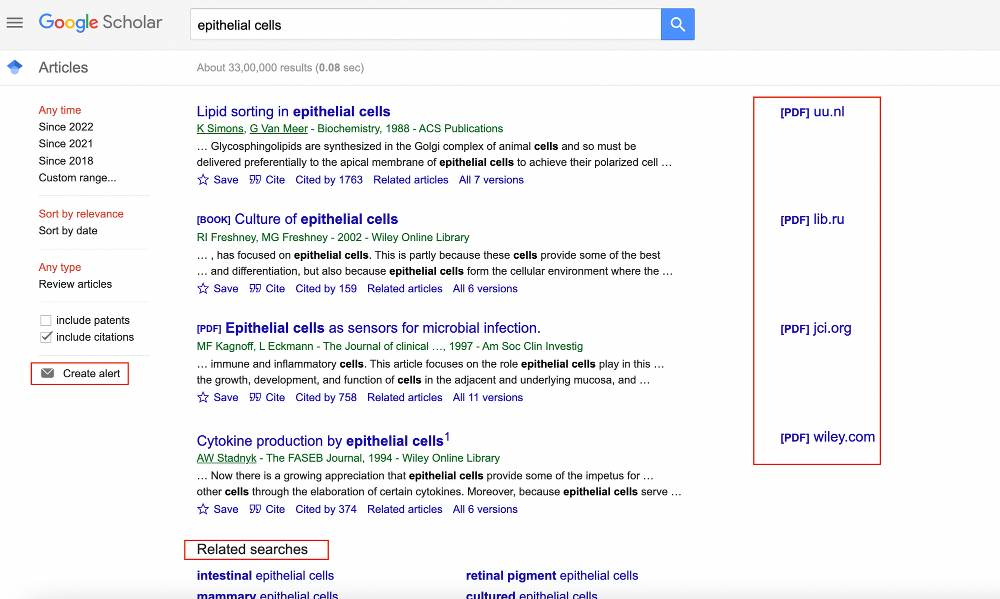
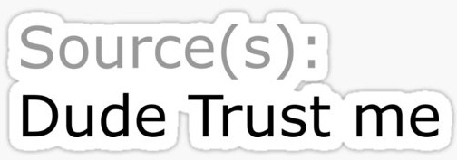
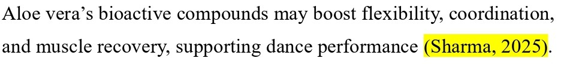
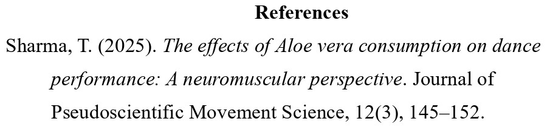
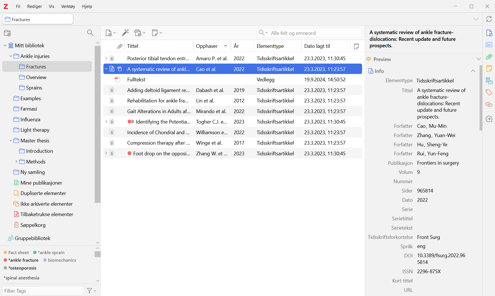

## Feedback slide - delete at the end

  - Revise your learning goals in terms of Blooms Taxonomy, levels 1 - 4
  - Align your learning goals with the learning activities you are asking your learners to complete during the session

---

## Licence

 

  

This work was originally created by Pat Callahan and Dejana Damjanovic under a CC-BY-SA 4.0 [Creative Commons Attribution 4.0 International License](https://creativecommons.org/licenses/by-sa/4.0/deed.en) and a CC0 1.0 [Creative Commons Universal](https://creativecommons.org/publicdomain/zero/1.0/) licence for code snippets. It was subsequently adapted and revised by [Sarah von Grebmer zu Wolfsthurn](https://orcid.org/0000-0002-6413-3895) during her time at Reproducible Research Oxford. This current work by Tejaswini Sharma and Sarah von Grebmer zu Wolfsthurn is licensed under a CC-BY-SA 4.0 [Creative Commons Attribution 4.0 International SA License](https://creativecommons.org/licenses/by-sa/4.0/deed.en). permits unrestricted re-use, distribution, and reproduction in any medium, provided the original work is properly cited. If you remix, transform, or build upon the material, you must distribute your contributions under the same license as the original. Code snippets are dedicated to the public domain and licenced under a CC0 1.0 [Creative Commons Universal Licence](https://creativecommons.org/publicdomain/zero/1.0/). You may use, modify, distribute, and sell the code snippets for any purpose, without permission or attribution. The code snippets are provided “as is”, without warranty of any kind.

::: {.notes}
**Speaker Notes**: The Creative Commons Attribution–ShareAlike 4.0 license, or CC BY-SA 4.0, allows others to copy, share, and adapt a work in any medium, including for commercial purposes. These permissions are broad and cannot be withdrawn as long as the license terms are followed. The main requirement is attribution: users must give appropriate credit to the original creator, provide a link to the license, and clearly indicate whether any changes were made, without implying endorsement by the original author. In addition, the ShareAlike condition means that if someone modifies or builds upon the work, the resulting material must be distributed under the same CC BY-SA 4.0 license, or a compatible one. Finally, users are not allowed to apply legal or technical restrictions, such as DRM, that would prevent others from exercising these same rights.
:::

---

## Contribution statement

 

**Creator**: Sharma, Tejaswini ({fig-alt="orcid logo"}
[0000-0002-6413-3895](https://orcid.org/0009-0000-0305 9751))

**Reviewer**: Von Grebmer zu Wolfsthurn, Sarah ({fig-alt="orcid logo"}
[0000-0002-6413-3895](https://orcid.org/0000-0002-6413-3895))

---

## Prerequisites

::: {.callout-important}
Before completing this submodule, please carefully read the following prerequisite.
:::

- [ ] Have a familiarity with the concept of **literature review**; how and where to access scientific papers, such as *Google Scholar*. 
  

  

::: {.notes}
**Speaker Notes**: Before we begin this submodule, please take a moment to review the prerequisite listed here.
You should already be familiar with the basic idea of a literature review, including how to search for and access scientific papers, on platforms such as like Google Scholar. Here is an image of the Google Scholar interface with some papers displayed.  
**Instructor Notes**: Before proceeding, briefly confirm that students are comfortable with the concept of a literature review and know how to locate academic articles. If needed, give a detailed overview of the Google Scholar interface, or have them navigate it online by themselves.
:::

---

## Before we start: Survey time!

- **Aim**: The pre-submodule survey serves to examine learners' prior knowledge about citing literature and using Zotero.

::: {.notes}
**Speaker Notes**: Before we move on, we’ll take a short survey.
The aim here is simply to understand your current familiarity.  
In the next few slides, you’ll see some questions that invite you to reflect on where you’re starting from.
This isn’t a test, and it’s not about getting the right answers.
If you’re unsure, that’s completely fine — just respond based on what feels closest to your current understanding.   
**Instructor Notes**: Set a low-stakes, supportive tone before beginning the survey. Emphasise that uncertainty is expected and valuable for measuring learning progress.
:::

---

**What is your level of familiarity with citing and referencing scientific papers?**

a. I have never heard of it before.

b. I have heard of it but have never worked with it.

c. I have basic understanding and experience with it.

d. I am very familiar and have worked with it extensively.

---

**How confident do you feel with the Zotero workflow of collection, organisation, and citing?** 
*(1 = Not confident at all, 5 = Very confident)*

a. 1

b. 2

c. 3

d. 4

e. 5

---

## Discussion of survey results

 

What do we see in the results?

::: {.notes}
**Speaker Notes**: Let us have a look at these results.  
**Instructor Notes:** The aim is to understand the group’s current standing in terms of knowledge and familiarity with citing literature and using Zotero. Emphasise explicitly that the survey is not about correct or incorrect answers. Avoid evaluating answers or revealing correct ones.
:::

---

## Learning goals

:::incremental
- To **explain** the importance of citing scientific literature.
- To **distinguish** between citations and reference lists.
- To **analyse** the elements of a citation and reference.
- To **compare** different citation styles.
- To **demonstrate** writing a citation and reference of a paper manually.
- To **set up and organize** a personal Zotero library.
- To **develop** a citation workflow for academic writing.
:::

~~I think your learning goals should go beyond understanding (think about Blooms taxnomy, levels 1-4, this is what we would like to incorporate here). The session is quite practical, so learners will go beyond just understanding, right? Think about the activities that you have your learners complete in the course of this session, and then think about how to align your learning goals accordingly.~~ 

  
::: {.notes}
**Speaker Notes**: This slide outlines the learning goals for the session.At this stage, you’re not expected to fully understand or master all of these points. Think of them as a roadmap rather than a checklist; they show where we’re headed, not what you already need to know. You can use these goals to keep track of your learning, notice what feels clear, and identify areas where you might want to ask questions later.

**Instructor Notes**: Use this slide to set expectations and reduce pressure. Emphasise that learning goals will be revisited throughout the session for reflection and self-assessment. Avoid explaining each goal in detail here; instead, frame them as guiding anchors that will be unpacked gradually through activities and tutorials.

**Accessibility Tip:** Pause briefly between them to reduce cognitive load.
:::

---

## What are citations and references?

::: {.callout-tip}
## Imagine this
Imagine reading various scientific papers to collect knowledge (**review of literature**).  
And when you share this knowledge, you'd be asked: *"What is the source?"*
:::

  

~~The image quality could be sharper, perhaps download the image again and make smaller in size? And convert  jfif to png? Also check out the content creation manual again about image naming.~~

::: {.fragment}
Thus, you need to **cite** the source of your knowledge; in this case, a scientific paper.
:::

::: {.notes}
**Speaker Notes**:  
“Imagine reading various scientific papers to collect knowledge (review of literature).
When you share this knowledge, you’d be asked: “What is the source?” Let’s imagine a bizarre example: someone claims that eating aloe vera improves your dance skills.   
In everyday life, you might respond, ‘Trust me, bro!’ and leave it at that.  
But in the scientific world, we need to provide evidence for every claim we make.  
When you collect knowledge from scientific papers, e.g., your literature review, and share it, others will naturally ask, ‘Where did this information come from?’   
This is why we cite sources: to show the origin of our knowledge and allow others to verify or follow up on it.”

**Instructor Notes**:  Use this humorous, relatable example to introduce the concept of citations and references (feel free to edit the example). Highlight the difference between casual claims and scientific claims to make the importance of referencing concrete. Encourage students to think of examples from their own fields where citing sources would be necessary.
:::

---

## What are citations and references?

:::incremental
- **Citations** are the in‑text pointers to sources you use (e.g., Sharma, 2025). 

  
  
<em>Example of a citation.</em>

- Whereas, **references** are the full bibliographic details listed at the end of a paper [@aksnes_citations_2019].

  
  
<em>Example of a reference (list).</em>

:::

::: {.notes}
**Speaker Notes**:   This slide shows the difference between citations and references.  Citations are the short pointers you include directly in the text to indicate where a piece of information comes from, typically with an author name and year. Citations help you navigate to the reference list, where you can discover the complete details of the mentioned paper.   
References, on the other hand, appear at the end of a paper and provide the full details needed to locate the source. This will allow you to access the 'source of the information' and see for yourself what the paper entails.Together, citations and references make it possible for others to trace your claims back to the original research.

**Instructor Notes**:  Emphasize the functional distinction between citations and references rather than formatting details. Discuss the workflow of navigating citations and references while reading a research paper. Use the images as visual anchors to reinforce where each appears in a paper. Avoid going into citation styles here; the goal is conceptual clarity, not technical mastery.

**Accessibility Tips**:  
Verbally describe what is shown in each image for students who may not be able to see them clearly. Allow a brief pause after each definition so students have time to connect the text explanation with the visual example.
:::

---

## Why are they needed?

~~I vaguely remember from your outline that you thought about a small think-pairshare activity here? Or did I mix it up? I think this would fit here quite well - now they know what citing is, activiate their thinking brain :)~~  
TS: as we discussed, planning to add this activity at the end in the "pedagogical add-on" so that the professor can choose to integrate based on needs and time constraint.

:::incremental
- **Show what comes from others:** References show which ideas and words are yours and which are taken from other people, so you do not steal their work and they get credit.

- **Back up what you say:** References point to earlier studies that support your claims, so readers can see where your ideas fit and how trustworthy they are.

- **Let others double-check you:** Clear citations help others follow your steps, spot mistakes or misquotes, and use your work to do new studies.

- **Connect ideas and track influence:** Citations link papers into a big web of knowledge and are often used (not perfectly) to see which work has had a big impact.

[@aksnes_citations_2019]

:::

::: {.notes}
**Speaker Notes**:  This slide explains why citations and references are needed in research.  
They show which ideas come from other researchers, so credit goes where it’s due and we avoid presenting others’ work as our own.  
They also help back up what we say by pointing readers to earlier studies that support our claims.  
Citations make it possible for others to double-check our work, spot mistakes, or build on it in future research.  
They also connect ideas across papers, creating a larger network of knowledge and helping us track how research influences later work.  
And just to practice what we’re preaching: these points are taken from a paper by Aksnes and colleagues from 2019.  
So now you know exactly where this knowledge comes from, and if you don’t believe me, you can always check from the reference at the end.

**Instructor Notes**:  Use this slide to reinforce both the practical and ethical reasons for citing sources. The humorous self-reference helps model good scholarly behaviour in action. Emphasise that citations are not about bureaucracy, but about trust, accountability, and connection within the scientific community.
:::

---

## How to cite and refer to a scientific paper?

- **Citation**: In the text, you usually mention **author and year**.   

  
For example: “Recent results support this view (Miller & Rossi, 2021).”

~~I think here you need to perhaps mention first the different citation styles? As in, what you have on the next slide? Else I would say your first statement is more of a "it depends"?~~  
TS: as we discussed, the note at the end of the slide covers this point, and the formatting exaplanation is still general rather than sepcific. Thge professor is instructed to reinforce that the exact formatting depends on the citation style.

- **Reference List**: Here, you provide the full **bibliographic information**:  

  
  1. Author: all authors’ last names and initials.  
  2. Date: When it was published (usually the year).
  3. Title: What the article is called.
  4. Source: Where it was published (journal name, volume, issue, page range, and DOI or URL if online).  
For example: Miller, A. B., & Rossi, L. M. (2021). Title of the article. *Journal Name, 12(3)*, 45–60. https://doi.org/xx.xxx/yyyy.  
*Note: Listed in an alphabetical order.*  

::: {.callout-note}
The *exact formatting* depends on the citation format. 
:::

::: {.notes}
**Speaker Notes**:  
This slide shows the basic idea of how to cite and reference a scientific paper.  
In the text, citations are usually short and include the author’s name and the year of publication.  
At the end of a paper, the reference list contains the full details, such as the authors, year, title, and where the work was published.  
These references are typically listed in alphabetical order.    
Do note: the exact formatting depends on the citation style, and we’ll briefly look at some common formats on the next slide. In the current example, the formatting used is APA.
It’s also useful to find out which citation style your department or field expects you to use.
 
**Instructor Notes**:  
Keep the focus on structure rather than memorising formatting rules. Reinforce that citation styles vary across disciplines and that students should always check departmental or journal guidelines. Use this slide as a bridge to the next one, where citation formats are introduced.
 
**Accessibility Tips**:  
Read the example citation aloud and slow down when listing the reference components to reduce cognitive load. 
:::

---

## Citation styles

  This is nice, and a nice mix of fields! Check APA with the DOI usually as hyperlink, maybe you can make it bold since it becomes blue? And maybe cut out Harvard since no specific field is given? Give the examples in the style of APA where you had Social sciences (e.g., psych, education). Split table across two slides because it is a large table? Add in-text example for IEEE if applicable. 

 
| Style                  | Typical fields/usage                     | In‑text example           | Reference list example (journal article)                                                                                |
| ---------------------- | ---------------------------------------- | ------------------------- | ----------------------------------------------------------------------------------------------------------------------- |
| APA                    | Social sciences (e.g., psychology, education)              | (Smith & Lee, 2023)       | Smith, J., & Lee, K. (2023). Title of the article. *Journal Name*, 12(3), 123–145. [https://doi.org/xx.xxx/yyyy](https://doi.org/xx.xxx/yyyy) ​ |
| MLA                    | Humanities (e.g., literature, languages) | (Smith and Lee 123)       | Smith, John, and Karen Lee. “Title of the Article.” Journal Name, vol. 12, no. 3, 2023, pp. 123–145. ​         |
| Chicago (Notes-Biblio) | Humanities (e.g., history, arts (footnotes/endnotes)       | ¹ or (see note 1)         | Smith, John, and Karen Lee. “Title of the Article.” Journal Name 12, no. 3 (2023): 123–145. ​                  |

::: {.notes}
**Speaker Notes**: This table shows some of the most common citation formats used across different disciplines.  
You’re not expected to learn or memorise any of these.  
Think of this slide as a reference point, showing that citation styles differ depending on the field. 

**Instructor Notes**: Keep this slide brief and exploratory. Avoid explaining each format in detail; the goal is awareness, not mastery. Encourage students to visually compare formats and notice recurring elements such as authors, year, title, and source. 
 
:::

---

## Citation Styles

~~Add speaker notes to previous slide and put the exercise on new slide.~~

 
| Style                  | Typical fields/usage                     | In‑text example           | Reference list example (journal article)                                                                                |
| ---------------------- | ---------------------------------------- | ------------------------- | ----------------------------------------------------------------------------------------------------------------------- |
| Chicago (Author‑Date)  | Natural and social sciences        | (Smith and Lee 2023, 123) | Smith, John, and Karen Lee. 2023. “Title of the Article.” Journal Name 12 (3): 123–145. ​                                        |
| IEEE                   | STEM fields (e.g., engineering, computer science)        | "*...sample text...* [13]"                | ​ [13] J. Smith and K. Lee, “Title of the article,” Journal Name, vol. 12, no. 3, pp. 123–145, 2023.      |

 

::: {.callout-tip}
## Short Exercise
Use a minute to find out which citation format is used in your field. 
:::

::: {.notes}
**Speaker Notes**: Take a moment to scan the table and notice how the same information is organised slightly differently in each format.  
The short exercise is simply to help you identify which citation style is commonly used in your own discipline.

**Instructor Notes**: Use the exercise to prompt independent discovery and reinforce the idea that citation conventions are field-specific.
 
:::

---

## What are citation tools?

**Citation tools** (or **reference managers**) are apps or software that help you *collect, organize, and format citations* for academic essays or scientific research. Examples include,

- Zotero: [https://www.zotero.org/](https://www.zotero.org/)
- Mendeley: [https://www.mendeley.com/](https://www.mendeley.com/)
- Citavi: [https://www.citavi.com](https://lumivero.com/products/citavi/)

~~Add hyperlinks to website for these managers? And for school papers? What do you mean?~~

::: {.notes}
**Speaker Notes**:  
Imagine working on an assignment where you’ve opened dozens — maybe even hundreds — of paper tabs in your browser.  
You’re scrolling back and forth, trying to remember where a quote came from or which paper supported which idea, and things start to feel messy and overwhelming.  
This is where citation tools come in.    
Citation tools, also called reference managers, are apps or websites like Zotero, Mendeley, or Citavi that help you collect, organise, and format your sources in one place.  

**Instructor Notes**:  
Reinforce the practical benefits of citation tools using everyday student experiences. If prompted, you can briefly open the websites of each tool and navigate how each tool is unique in its features.
:::

---

## What are citation tools?

**What can they do?**

- save bibliographic information *in one-click*
- create in-text citation; 
- add references *automatically*.

**Why are they useful?** 

- they are *accurate, consistent, and efficient*; 
- can handle multiple citation formats.

~~I think separate slides are a good idea here, add speaker notes to this slide and the previous slide. In the why are they useful section it feels like you have a point that could go into what can they do?~~  
TS: I think the feature of multiple formats comes across as more of an advantage of using citation tool, hence i mentioned it rather in the 2nd part. Also, it makes the 2nd part look fuller

::: {.notes}
**Speaker Notes**: 
What can these tools do? They can save bibliographic information with one click, generate in-text citations, and automatically build your reference list.   
They improve accuracy and consistency by remembering all the important details — like the author, year, and title — and formatting every citation the same way, so you’re less likely to make mistakes.
They also save a lot of time. Instead of typing citations and reference lists manually, the tool can generate them for you automatically.  
Another big advantage is that they can handle multiple citation styles. If a course or journal asks for a different format, you can switch styles with just a few clicks, rather than rewriting everything from scratch.

**Instructor Notes**:  
Emphasise that these tools reduce errors, save time, and adapt easily to different citation requirements. Avoid framing them as shortcuts; instead, present them as good scholarly practice that supports accuracy and efficiency.
:::

---

# Brief overview of Zotero

---

## How does Zotero work?

:::incremental
- **Collecting**: One-click saving of metadata from literature databases, and websites.
- **Organizing**: Items can be grouped into collections, tagged, and searched.
- **Citing and referencing**: Plugins for Word, Quarto, and Google Docs generate in‑text citations and bibliographies automatically.
:::

::: {.notes}
**Speaker Notes**:  
This slide gives a very brief overview of Zotero.  
Zotero is a citation tool that helps you collect, organise, and cite your sources in one place.  
You can save references with a single click from databases or websites, organise them into collections or with tags, and search through them easily.  
Zotero also connects directly to tools like Word, Quarto, and Google Docs, where you insert citations and build your reference list automatically. 

**Instructor Notes**:  
Keep this introduction surface-level and avoid demonstrating features in detail. The purpose is orientation, not instruction. 
:::

---

## How does Zotero work?

~~Maybe push image to new slide since it feels a little tight on the previous slide? Sort out speaker notes for both slides.~~ 

  
  
<em>Zotero Interface.</em>

::: {.notes}
**Speaker Notes**:  
The image shows the Zotero interface, with your saved items in the centre, collections on the left sidebar, and detailed information for each item on the right sidebar.  
We’ll only briefly look into this, because you’ll move straight into a hands-on tutorial where you’ll learn how to use Zotero in practice.

**Instructor Notes**:  
Use the interface image to help students recognise Zotero when they open it themselves. Let them take a minute to see the interface image to build familiarity. Clearly signal the transition to the practical tutorial, where they will actively work with the tool.
 
**Accessibility Tips**:  
Verbally describe the layout shown in the image for students who may have difficulty seeing it clearly. Reassure students that they will not need to remember details from this slide, as the upcoming tutorial will walk them through the steps at a comfortable pace.
:::

---

## Your turn!

In this next part, you will familiarize yourself with **Zotero** through **hands-on exercices and activities**:

- [Zotero: Hands-on practical activities](https://lmu-osc.github.io/introduction-to-zotero/background/zotero_basics.html)

- Or follow: [https://lmu-osc.github.io/introduction-to-zotero/background/zotero_basics.html](https://lmu-osc.github.io/introduction-to-zotero/background/zotero_basics.html)

:::{.callout-tip}
## Tip
Since this is a self-paced tutorial, *take your time* on navigating it; and it can be finished at home as well. We will have a check-in moment at the end of this session. 
:::

::: {.notes}
**Speaker Notes**: Now we’ll move on to the tutorial part of the session.
You’ll work individually through a self-paced tutorial — focusing introducing Zotero, how to integrate with other platform, and practical exercises for you.
Take your time as you go through them, and work at a pace that feels comfortable.
There’s no expectation to finish everything right now, and you’re welcome to continue working on them at home.
Use this time to explore, experiment, and revisit earlier ideas as they come up in the tutorials.

**Instructor Notes:** Clearly signal the shift from guided instruction to independent work. Remind students that the tutorial is self-paced and that progress will naturally vary. Encourage them to ask questions if they encounter difficulties. Do walk around the room to check up on the progress of the students. 
:::

---

## Assignment 

~~Make sure that your learners complete the remaining tasks and exercises at home~~  
TS: I'm thinking that this slide should come right after the tutorial slide and then they go onto a discussion. What do you think?

- **Aim**: Finish the remaining of the 'Introduction to Zotero' tutorial and its exercises.
- **Self-Reflective Questions**: Use the following questions to assess your learning progress from the tutorial,
  - What is one key concept about citations or Zotero that became clearer after completing the exercises?
  - Which Zotero task can you now perform confidently, and which one still feels challenging?
  - How easy has it been navigating different CSL formats?

::: {.notes}
**Speaker Notes**: 
Now we revert to our slides to wrap up the presentation. As an assignment, you are expected to complete all remaining sections of the Introduction to Zotero tutorial, including every exercise. The goal is to ensure they move from passive understanding to hands-on application of Zotero’s core functions.  
The self-reflective questions are designed to encourage metacognitive awareness. You should not simply state whether something was “easy” or “difficult,” but briefly consider why.  
The first question checks conceptual clarity about citations and reference management.
The second encourages them to assess their practical competence and identify areas needing further practice.
The third focuses specifically on working with different Citation Style Language (CSL) formats, helping them reflect on flexibility and adaptability in citation formatting.

**Instructor Notes**: 
Gently nudge the students back to the tutorial. Emphasize that completion of all tutorial sections and exercises is required. Students should not skip the “Advanced” or “Zotero Groups” sections. Encourage honest self-assessment in the reflective questions; the goal is learning awareness, not perfection.
Remind students that facing difficulty is common and part of the learning process.
:::

---

## Relevance and implications

~~Added in this slide - small final activity on how your learners can and will apply this in their individual contexts and for their own work?~~

##### Time for an open discussion

- **Aim**: discuss how Zotero could support you in your upcoming projects; identify some practical benefits of using it; and what obstacles do you anticipate in using it consistently?

::: {.notes}
**Speaker Notes**:  
Let’s now make this concrete and personal.  
Think about your own academic work this semester — an upcoming essay, a research report, maybe even your thesis. Where exactly could Zotero support you? Would you start using it when you first search for literature? While reading and annotating? Or only once you begin writing?  
What practical advantages do you see? For example, could it help you stay organised, reduce citation mistakes, or save time when formatting references?  
And just as importantly — what might get in the way? Maybe the initial setup feels like effort. Maybe you’re used to copying references manually. Maybe you’re unsure how to integrate it into your current system.  
The goal here is to think realistically about how you could make Zotero part of your own workflow — not just in theory, but in practice.

**Instructor Notes**:  
Facilitate an open discussion. First collect concrete applications, then explicitly ask for potential barriers. Write key themes on the board if possible. End by summarising how consistent early use (during literature search rather than at the writing stage) tends to make implementation smoother.

**Accessibility Tips:**  
Give students a short quiet reflection moment before opening discussion. Paraphrase student contributions clearly and structure them into “benefits” and “barriers” to support comprehension.
:::

---

## Take-home message

- Citations and reference lists are essential to **scientific integrity**. They make research *transparent, traceable, and verifiable*.
- Citations identify the source within the text, while the reference list provides full publication details.
- **Effective citation management** strengthens academic writing, by enabling accuracy, consistency, and efficiency—allowing you to focus on literature review.

~~With your learning goals in mind, sharpen the formulation of these take-home messages.~~

::: {.callout-tip}
## Make Zotero a habit
Zotero can be your go-to tool for saving and citing studies, from assignments to thesis.
:::

::: {.notes}
**Speaker Notes**:
To conclude, citations and reference lists are not just a formal requirement — they are central to scientific integrity. They make research transparent, traceable, and verifiable.  
Citations show readers where specific ideas come from within the text, while the reference list gives the full details so those sources can be located and checked.  
And when you manage citations effectively — for example, with a tool like Zotero — you improve accuracy and consistency, save time, and reduce formatting errors. That allows you to focus your energy on what really matters: critically engaging with the literature rather than manually adjusting commas and brackets.”

**Instructor Notes**:  
Deliver this slide as a concise closing summary. Reinforce the connection between integrity, transparency, and practical efficiency. Avoid introducing new information; this slide should consolidate key ideas from the session.
:::

---

## Learning goals: Check-In 

~~Finalise learning goals at the beginning and then redo this slide - this should probably also go at the end because you want to include the tutorial right?~~

:::incremental
- [ ] To **explain** the importance of citing scientific literature.
- [ ] To **distinguish** between citations and reference lists.
- [ ] To **analyse** the elements of a citation and reference.
- [ ] To **compare** different citation styles.
- [ ] To **demonstrate** writing a citation and reference of a paper manually.
- [ ] To **set up and organize** a personal Zotero library.
- [ ] To **develop** a citation workflow for academic writing.
:::

::: {.notes}
**Speaker Notes**:  
Let’s pause for a quick check-in. Take a moment to look back at the learning goals and reflect on how comfortable you feel with each one.  If you notice any gaps, this is the right moment to bring them up — feel free to ask questions or start a discussion so we can address them before moving on.
 
**Instructor Notes**:  
Use this slide to encourage self-reflection rather than evaluation. Emphasise that students are not expected to feel equally confident about all goals at this stage. Invite questions related to understanding the purpose of citations, the basics of creating citations and bibliographies, or the role of Zotero. Keep the discussion supportive and brief, focusing on clarifying concepts rather than introducing new material.
:::

---

## To conclude: Survey time!

- **Aim**: This post-submodule survey serves to examine learners' current knowledge about citing literature and using Zotero.

::: {.notes}
**Speaker Notes**: To conclude, we’ll take a short survey.
This post-session survey helps us understand your current level of knowledge about citing literature and using Zotero after completing the submodule.
Please answer honestly based on how confident you feel now. 
**Instructor Notes**: The purpose is to compare pre- and post-submodule responses to evaluate learning progress and the effectiveness of the tutorial. Encourage the students to share in class. Use this space to answer doubts, and provide learning or practice tips if the students still feel under-confident in any areas.
:::

---

**What is your level of familiarity with citing and referencing scientific papers?**

a. I have never heard of it before.

b. I have heard of it but have never worked with it.

c. I have basic understanding and experience with it.

d. I am very familiar and have worked with it extensively.

---

**How confident do you feel with the Zotero workflow of collection, organisation, and citing?** 
*(1 = Not confident at all, 5 = Very confident)*

a. 1

b. 2

c. 3

d. 4

e. 5

---

## Discussion of survey results

 

What do we see in the results?

::: {.notes}
**Speaker Notes**: Script for the slide here.

**Instructer Notes**:
- **Aim**: Briefly examine the answers given to each question interactively with the group.

- Compare and highlight specific differences in answers between pre- and post-survey answers
:::

---

## References {.smaller}

::: {#refs}
:::

---

# Thanks!  
See you next class :)

---

## Pedagogical add-on tools for instructors

- **Activity**: Get in a pair, navigate a literature database (Google Scholar), find a paper of your choice with its full text, analyse the citations and the reference list.   Note what features you see and share in class.

::: {.notes}
**Speaker Notes**:  
Time for a short activity. Pair up and pick a paper from a database like Google Scholar. Take a look at how the citations are formatted in the text and how the reference list is structured. Notice any patterns, differences, or special features. Later, share your observations with the class. 

**Instructor Notes**:  
Use this add-on selectively — only if it is needed and time permits. It can be incorporate right after slide #12 'What are citations and references?'. Encourage students to notice key features of citations and references. This reinforces the concepts of citations and references in a real-world context.  

**Accessibility Tips:**  
Ensure that all students can access the database and full text (provide links or PDFs if needed). 
:::

---

## CREDiT Contribution Statement - TO DO

Possible roles using the CRediT contribition system or the Zenodo Contribution System: 

**Name main content creator**: Conceptualization, Software, Writing - Original Draft, Visualization. **Sara Lil Middleton**: Writing - Review & Editing, Supervision. **Sarah von Grebmer zu Wolfsthurn**: Conceptualisation, Writing - Review & Editing, Supervision, Project Administration, Validation.

---
