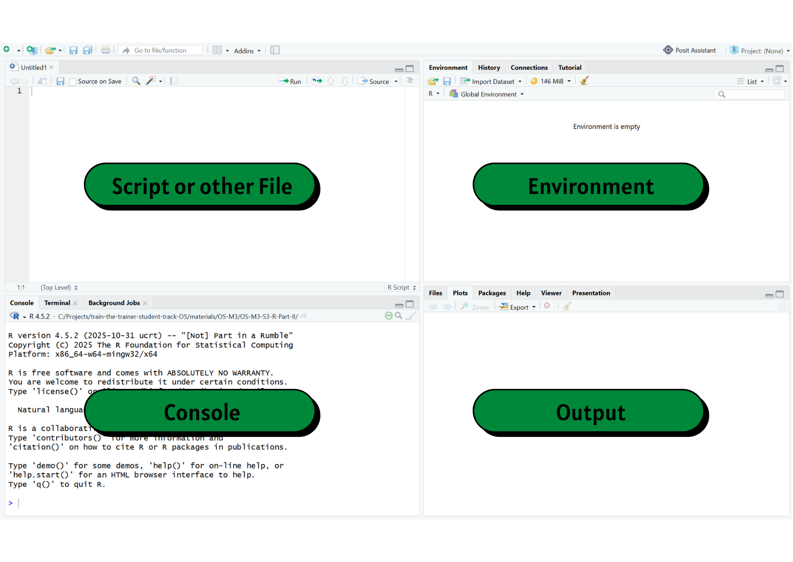
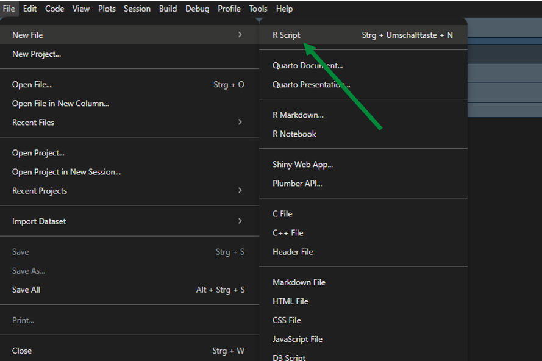
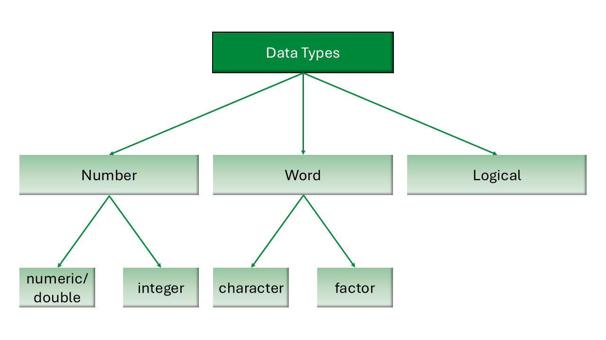
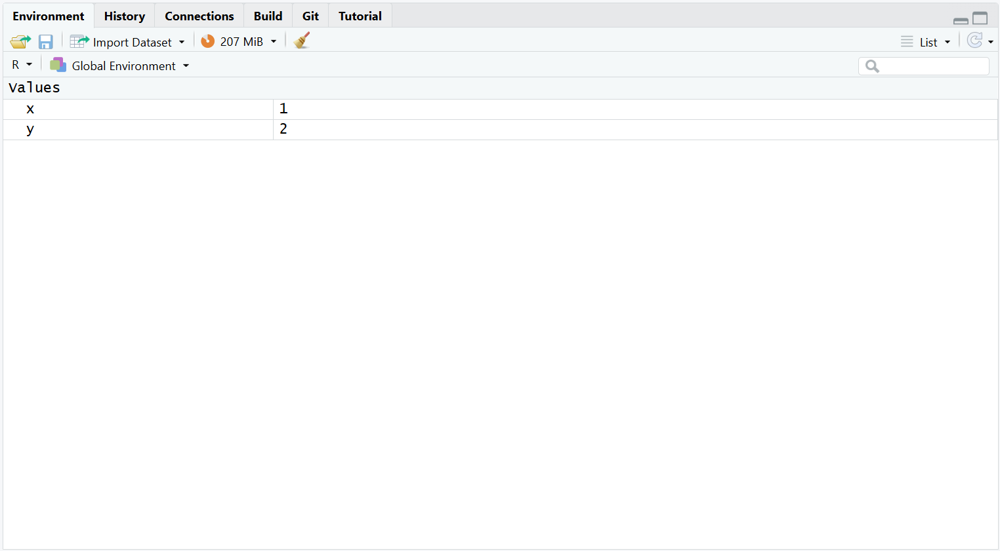
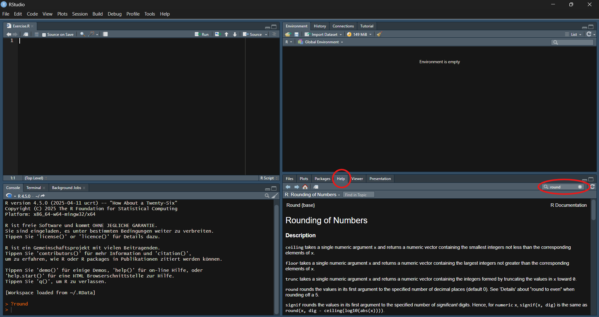
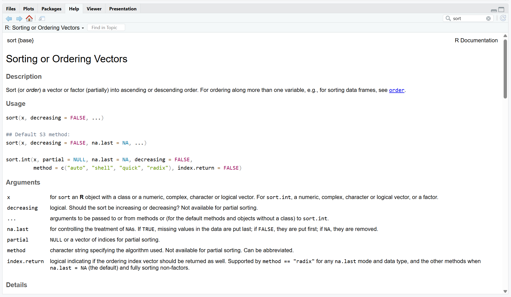

## Licence and citation {.smaller}

<p style="text-align:center;">
  
</p>


This work was originally created by [Nicklas Hafiz](https://orcid.org/0000-0001-9035-4483) and is licenced under a CC-BY-SA 4.0 [Creative Commons Attribution 4.0 SA International License](https://creativecommons.org/licenses/by-sa/4.0/deed.en). It permits unrestricted re-use, distribution, and reproduction in any medium, provided the original work is properly cited. If you remix, transform, or build upon the material, you must distribute your contributions under the same license as the original. Code snippets are dedicated to the public domain and licenced under a CC0 1.0 [Creative Commons Universal Licence](https://creativecommons.org/publicdomain/zero/1.0/).

His work was subsequently adapted by [Caterina Luz Sanchez Steinhagen](https://orcid.org/0009-0006-4783-1110), Tejaswini Sharma, [David Rieger](https://orcid.org/0009-0004-3701-3101), [Elizabeth Waterfield](https://orcid.org/0009-0006-3725-6730) and [Sarah von Grebmer zu Wolfsthurn](https://orcid.org/0000-0002-6413-3895).

Please cite as ADD ZENODO REPO.

::: {.notes}
**Presenter Notes**: The Creative Commons Attribution–ShareAlike 4.0 license, or CC BY-SA 4.0, allows others to copy, share, and adapt a work in any medium, including for commercial purposes. These permissions are broad and cannot be withdrawn as long as the license terms are followed. The main requirement is attribution: users must give appropriate credit to the original creator, provide a link to the license, and clearly indicate whether any changes were made, without implying endorsement by the original author. In addition, the ShareAlike condition means that if someone modifies or builds upon the work, the resulting material must be distributed under the same CC BY-SA 4.0 license, or a compatible one. Finally, users are not allowed to apply legal or technical restrictions, such as DRM, that would prevent others from exercising these same rights. Code snippets are dedicated to the public domain and licenced under a CC0 1.0 meaning that users can use, modify, distribute, and sell the code snippets for any purpose, without permission or attribution. The code snippets are provided “as is”, without warranty of any kind.
:::

---

## Contribution statement
  
**Creator**: Sanchez Steinhagen, Caterina Luz ({fig-alt="orcid logo"}
[0009-0006-4783-1110](https://orcid.org/0009-0006-4783-1110))

**Creator**: Sharma, Tejaswini ({fig-alt="orcid logo"} [0000-0000-0000-0000](https://orcid.org/my-orcid?orcid=0000-0000-0000-0000)) CHANGE

**Creator**: Waterfield, Elizabeth ({fig-alt="orcid logo"} [0009-0006-3725-6730](https://orcid.org/0009-0006-3725-6730))

**Creator**: Rieger, David ({fig-alt="orcid logo"}
[0009-0004-3701-3101](https://orcid.org/0009-0004-3701-3101))

**Reviewer**: Von Grebmer zu Wolfsthurn, Sarah ({fig-alt="orcid logo"}
[0000-0002-6413-3895](https://orcid.org/0000-0002-6413-3895))

::: {.notes}
**Presenter Notes**: These are the **presenter notes**. You will find a script for the presenter for every slide. In presentation mode, your audience will not be able to see these presenter notes, they are only visible to the presenter. 

**Instructor Notes**: There are also **instructor notes**. For some slides, there will be pedagogical tips, suggestions for activities and troubleshooting tips for issues your audience might run into. You can find these notes underneath the speaker notes.

**Accessibility Tips**: Where applicable, this is a space to add any tips you may have to facilitate the accessibility of your slides and activities. 
:::

---

## Prerequisites - CHECK versions

::: {.callout-important}
Before completing this submodule, please carefully read about the prerequisites.
:::

<div style="font-size: 0.6em;"> 
| Prerequisite   |  Description  | Where to find it   |
|------------|------------|------------|
| RStudio installed | Version 2025.05.1+513 or higher | [Download](https://posit.co/download/rstudio-desktop/) |
| R installed | Version 4.4.3 or higher | [Download](https://www.r-project.org/) |
| Accessibility sheet for computers | Fundamentals of computer literacy | [Download ](assets/Accessibility_sheet_for_computers_OSSS26.pdf)
</div>

::: {.notes}
**Presenter Notes**: Before starting this submodule, there are two important technical prerequisites.  
First, you should have R installed, and second, you should have RStudio installed. These are the tools we will use to run and explore simulations during the tutorial.  
The table on the slide shows the recommended versions and where you can download them if needed. If you already worked with R before, you likely already have these installed.  
If not, you can install them using the links provided. If you run into issues, this is a good moment to ask for help before we move on to the tutorial.”
 
**Instructor Notes**: Quickly verify whether learners have the required software installed before moving to the practical tutorial. If several students do not have the software yet, briefly explain that they can still follow conceptually and install it later. Avoid spending too much class time on troubleshooting installations unless the session is designed for setup.

**Accessibility Tips:**  
Consider pairing students if someone does not have the software installed. Refer to the accessibility sheet in the download section.
:::

---

## Before we start: Survey time!

<br>

<div style="background-color: #f0f0f0; padding: 0.1em; border-radius: 5px; font-size: 1em; text-align: center;">

**Let us find out where are you at!**

</div>

::: {.notes}
**Presenter Notes**:  
Before we move on, we’ll take a short survey. The aim here is to understand your current familiarity with specific elements of this session. In the next few slides, you’ll see some questions that invite you to reflect on where you are starting from. This is not a test, and it is not about getting the right answers. If you are unsure, that is completely fine, just respond based on what feels closest to your current understanding.

**Instructor Notes**:  
Set a low-stakes, supportive tone before beginning the survey. Emphasize that uncertainty is expected and valuable for measuring learning progress. 
:::

---

**What is your level of familiarity with R and RStudio?**

a. I have never heard of it before

b. I have heard of it but have never worked with it

c. I have basic understanding and experience with it

d. I am very familiar and have worked with it extensively

---

**On a scale of 1–5, how intimidated do you feel by programming or coding (e.g., R/RStudio)?** <br>
*(1 = Not intimidated at all, 5 = Very intimidated)*

a. 1

b. 2

c. 3

d. 4

e. 5

---

**Have you used any programming language (R, Python, JavaScript, C) before?**

a. No, never

b. Yes, a little (e.g., basic commands)

c. Yes, moderately (e.g., small projects)

d. Yes, extensively (e.g., on an almost daily basis)

---

## Discussion of survey results

<br>

<div style="background-color: #f0f0f0; padding: 0.1em; border-radius: 5px; font-size: 1em; text-align: center;">

What do we see in the results?

</div>

::: {.notes}
**Presenter Notes**: Let us have a look at these results. 

**Instructor Notes**: The aim is to understand the group’s current standing in terms of knowledge and familiarity. Emphasize explicitly that the survey is not about correct or incorrect answers. Avoid evaluating answers.
:::

---

## Learning goals

::: incremental
- To **navigate** the RStudio interface (e.g., Console, Environment, Script, and Plots panes).
- To **differentiate** between basic data types in R (numeric, character, logical, integer) and how they are used.
- To **execute** basic mathematical and logical operations in the R using appropriate operators.
- To **assess** the correctness of logical expressions by predicting and verifying whether given R statements return TRUE or FALSE.
- To **construct** a simple R script that includes object assignment, at least one mathematical operation, and comments.
:::

<span style="color:red; font-size:0.5em;">Of those six learning goals, three are connected to operators; include functions, vectors, lists, dataframes, indexing as well here consistent also with the practical exercises you have them do (no more than 6 goals in total I would say?)</span>


::: {.notes}
**Presenter Notes**: This slide outlines the learning goals for the session. At this stage, you are not expected to fully understand or master all of these points. Think of them as a roadmap rather than a checklist; they show where we’re headed, not what you already need to know. You can use these goals to keep track of your learning, notice what feels clear, and identify areas where you might want to ask questions later.
:::

---

## Key terms and definitions

- **RStudio**
- **R command**
- **Run**
- **Comment**

::: {.notes}
**Presenter Notes**: These are key terms we will revisit throughout the lesson. What comes to mind when you see each of them? Which ones are familiar, and which feel new? Take a moment to think about what they might mean.

**Instructor Notes**: Use a think-pair-share approach. First, have learners reflect individually on their associations with each term for a few minutes, then discuss in pairs for a few minutes, and finally share with the group. Allow about 10 minutes for this activity.
:::

---

## Key terms and definitions

::: incremental
- **RStudio**: A program that provides an easy-to-use interface for writing and running R code.  
- **R command**: A line of code that tells R to do something.  
- **Run**: To execute an R command so that R carries out the instruction and shows the result.  
- **Comment**: Text in your code (starting with `#`) that R ignores. You can use this function to explain what the code does or make notes throughout your work.
:::

::: {.notes}
**Presenter notes**:
Let’s go through what these key terms mean:

- RStudio is the environment we’ll be working in. This is where you write and execute your code. Think of it as your workspace.

- An R command is simply an instruction you give to R. It could be something as simple as a calculation or storing a value.

- When we say “run” code, we just mean executing that command so R actually performs the action and shows you the result.

- Comments are notes you write for yourself or others in your code. They start with a hashtag, and R ignores them.
:::

---

## What is R?

:::incremental
R ([https://www.r-project.org/](https://www.r-project.org/)) is an **free and open source** programming language

- Originally designed by statisticians for statisticians
- Wide range of applications: **data manipulation, visualization, interactive web applications**, **generation of full manuscripts and reports**

Why R?

- Knowledge of statistical software like R  is useful when **conducting quantitative research**
- Has a **large online support** community
- Provides freely available **resources**
:::
    
::: {.notes}
**Presenter Notes**: Let’s start with the basics: What exactly is R?
R is a programming language specifically designed for data analysis and statistics. Originally, R was designed by statisticians for statisticians. That means its core purpose wasn’t general software development, but rather making statistical analysis easier, more accessible, and more reproducible. Over time, however, R has evolved far beyond its original purpose. Today it supports a wide range of applications. It is commonly used for data manipulation, where users can clean, reshape, and transform large datasets efficiently. It is also widely used for data visualization, producing everything from quick exploratory plots to high-quality, publication-ready graphics.

It is also free and open source, which means anyone can download and use it, and developers from all over the world contribute to improving it.
This has resulted in a large online community, so if you ever run into a problem, chances are someone else has had the same issue and posted a solution online.
And because of that community, there are also countless free learning resources: tutorials, blog posts, videos, books, and packages that extend R’s functionality.

**Instructor Notes**:  
Keep this introduction brief and motivational. The goal is not to teach R, but to position it as an accessible and useful tool for research. You may optionally point students to the official R website or a beginner friendly resource, but avoid going into technical detail.
:::

---

## The RStudio environment {.smaller}

:::: {.columns}

::: {.column width="80%"}

::: {style="text-align: center;"}

:::

:::

::: {.column width="20%"}

Open **RStudio** and check if you can see everything that’s on the slide.

<br>

*(You might only see three panes on your screen)*
:::

::::::

::: {.notes}
**Presenter Notes**: RStudio is the main program we’ll be using to interact with R throughout this course. It’s designed to make working with R much more organised and easier to follow.
On this slide, you can see the four main panes of the RStudio interface:
In the top left, you’ll find the script editor, this is where you usually write and edit your code.  
In the top right, there’s the Environment pane, which shows the objects you’ve created, like datasets or variables, so you can keep track of what’s currently loaded.  
In the bottom left is the Console. This is where R actually runs your commands and shows the output.  
And in the bottom right, you’ll see panels for things like plots, help files, and packages.  
Now, take a moment to open RStudio on your device and check if you can identify these panes. You might only see three panes at first, that is completely normal.

**Instructor Notes**: Pause briefly and allow students to open RStudio. Walk around if possible and help students locate panes. Reassure them that layouts may differ slightly (e.g., missing script pane until a file is opened). Keep this activity short and focused on orientation, not functionality.

**Accessibility Tips:** Verbally describe each pane clearly and allow extra time for students to locate them. Offer assistance to students who may struggle with navigation or opening the software.
:::

---

## Mathematical operations

| Symbol   | Operation           |
|----------|---------------------|
| `+`      | Addition            |
| `-`      | Subtraction         |
| `*`      | Multiplication      |
| `/`      | Division            |
| `^`      | Exponentiation      |
| `sqrt()` | Square Root         |
| `log()`  | (Natural) Logarithm |

::: {.notes}
**Presenter Notes**:  
In the Console, which is the bottom left pane in RStudio, we can directly run commands.  
One of the simplest things we can do is perform basic mathematical calculations. R works very much like a calculator, but with more flexibility.  
To do this, we use operators, i.e., symbols that represent mathematical operations. For example, plus for addition, minus for subtraction, and so on.  
On this slide, you can see some of the most common ones. These include multiplication, division, powers, as well as functions like square root and logarithm.  

If you have RStudio open, you can try typing a simple calculation into the Console, like 2 plus 2, and see what happens.

**Instructor Notes**: Keep this very brief and hands-on. Encourage students to try 1–2 simple commands in the Console to build confidence. Avoid going into syntax details beyond basic operators.

**Accessibility Tips**: Say each operator aloud (e.g., “asterisk for multiplication”) to support learners unfamiliar with symbols.
:::

---

## Practical exercise 1

- [ ] Open RStudio on your device

Using the table on the previous slide, run the following math operations directly in the **Console** of RStudio (bottom left pane).

  - [ ] `12+17`
  - [ ] `218/3`
  - [ ] `357^2`

::: {.callout-tip}
## Let's use the Console!

You can run code from the Console by typing in the Console and then pressing Enter on your keyboard.
:::

::: {.notes}
**Presenter Notes**:  We have now reached our first short hands-on exercise.  
Using the Console in RStudio — that’s the bottom left pane — try running the following mathematical operations. Simply type them in and press Enter.  
Note that for division in R, we use the forward slash. So instead of writing it as a fraction, you would type 218 divided by 3 using the slash.  
Take a minute to try these out.  
(pause)

If you’d like to check your answers:  
12 plus 17 gives 29,  
218 divided by 3 is approximately 72.67,  
and 357 squared is 127449.  
If you’re unsure, that’s completely fine, feel free to try again or ask for help.

**Instructor Notes**: Give students 1–2 minutes to complete the exercise. Clarify the correct syntax for division if needed (`218/3`). Optionally demonstrate one example live in the Console. Walk around to assist students who may be unfamiliar with typing commands.

**Accessibility Tips:** Read out each command clearly and explain symbols (e.g., “slash for division”). Allow students to follow along at their own pace and provide support for those who may need help with keyboard input.
:::

---

## R scripts

An R script is a **text file** containing your **R commands**.

-   It is an easy way to save and share code

-   You can run code from an R script by:
 
    - Pressing **Ctrl + Enter** (Windows) OR **Command + Enter** on a (Mac) on the keyboard  
    - click on **Run**

-   Add **comments** or **notes** to your code by using `#`

```{r}
# Here is an example of using a comment 
# sum up two numbers 
4+5
```

::: {.notes}
**Presenter Notes**:  
In the previous exercise we only worked in the Console. But there’s one important limitation: anything you type there is not saved once you close RStudio.  
That’s why we use R scripts. An R script is simply a file where you can write, save, and organize your code so you can come back to it later or share it with others.  
To run code from a script, you place your cursor on a line,or highlight multiple lines, and then press Ctrl + Enter on Windows or Command + Enter on a Mac. You can also click the ‘Run’ button.  
Another useful feature is comments. If you want to add notes or explanations that R should not execute as code, you use the hash symbol. Everything after that on the line is treated as a comment.  
This helps make your code more readable and easier to understand — both for others and for your future self.
:::

---

## Creating a new R script

::: {style="text-align: center;"}

:::

::: {.notes}
**Presenter Notes**:  
Now let’s look at how to create a new R script from scratch.  
To do this, go to the File menu, then choose New File, and then select R Script. Alternatively, you can use the shortcut Ctrl + Shift + N.  
Once the script opens, you can immediately start writing your code or notes.  
It’s important to save your script early and in an organised folder, so you don’t lose your work. To save it, go to File and click Save, or use Ctrl + S.  

**Instructor Notes**:  
Guide students step-by-step while they follow along. Ensure everyone successfully creates and saves a script before moving on. If needed, pause and repeat navigation steps slowly. 
:::

---

## Saving an R script

:::::: {.columns}
::: {.column width="60%"}

**Step 1**: On your device

- Decide where this R script should go 
- Create a *new folder*

:::
::: {.column width="40%"}

{width="30%"}

:::
::::::

**Step 2**: In RStudio

- After making a new R script, click on `File` → then click `Save As...` 
- → Name the file → then choose the designated folder 
- → Click `Save`

::: {.notes}
**Presenter Notes**: It is very important to be organised with how you save and store your work. We want to make sure we know where things are so we can retrieve it later, so here's a quick run-through of some good practices when saving our R Script. First, go to where you want to store this R Script on your device- it can be on your desktop, a folder you already have, or even one you made specifically for this session. Create a new folder there and let's name it "R Lesson". Back in RStudio, after creating a new R Script, we want to save it before we even start adding any code. We do this by clicking on "File" at the top-left corner. In the drop down menu, we click "Save As...", give it a name such as "R Script 1", navigate to the folder we just created for this R Script, and then click "Save". Great! Now you know exactly where your R Script is and everything you add to it in this session can be saved. 

**Instructor Notes**: It may seem like a basic computer skill, but do NOT assume that everyone knows folder management and how to properly store + save Files to their device. This is an important section and can assist learners in how they manage their files beyond this lesson as well. 

**Accessibility Tips**: Keep in mind that actions like "creating a folder" and "renaming" are all, in fact, learned skills that not everyone may have as yet. Always verbalize or demonstrate the instructions for even these seemingly basic tasks. Or, allow learners to work together with others who perform these actions regularly and can help out. 
:::

---

## Practical exercise 2

- [ ] Create a new R script in RStudio
- [ ] Copy the comment below and add it to your empty R script

```{r}
# This is my practice R Script
```

- [ ] Save it to the folder on your device

::: {.notes}
**Presenter Notes**:
If you haven't already, complete this practical exercise: create a new R script, write a comment in the first line using the hash symbol, and save it in a new folder dedicated to this course. If you already created and saved your R Script, add the comment and hit "Save". 
:::

---

## Logical comparisons

With **R**, you can also:

-   Check if two numbers are **equal or unequal**

-   Check if a number is **larger or smaller** than another number

Example:

```{r}
49 == 50

49 < 50 
```

-   R returns a **logical value**:

    -   `TRUE` or `FALSE`

::: {.notes}
**Presenter Notes**:  
R can do more than just calculations; it can also help us make decisions by comparing values. 
These are called logical comparisons. For example, we can ask R whether two numbers are equal, or whether one number is larger or smaller than another.  
On the slide, you can see two simple examples: checking whether 49 is equal to 50, and whether 49 is less than 50.  
When we run these commands, R doesn’t return a number — instead, it gives us a logical value: either TRUE or FALSE.  
So, TRUE means the statement is correct, and FALSE means it is not.  
These kinds of comparisons are very important, because they form the basis for more complex operations later on, like filtering data or writing conditions in code.

**Instructor Notes**:  
Keep the explanation intuitive and avoid introducing too many operators at once. Focus on understanding TRUE/FALSE outputs. Optionally demonstrate one example live. You may briefly mention combining conditions (AND, OR, NOT) but do not go into detail yet.

**Accessibility Tips:**  
Read the code examples aloud and explain symbols clearly (e.g., “double equals means ‘is equal to’”). 
:::

---

## Logical comparisons - operators

| Symbol        | Operation                                  |
|---------------|--------------------------------------------|
| `==`          | Equals                                     |
| `!=`          | Not Equal                                  |
| `>` and `<`   | Greater and Lesser Than                    |
| `>=` and `<=` | Greater Than or Equal / Less Than or Equal |
| `&`           | logical AND                                |
| `|`           | logical OR                                 |
| `!`           | logical NOT                                |

::: {.notes}
**Presenter Notes**:  
Here you can see an overview of the most common logical operators in R.  
These symbols allow us to compare values — for example, checking whether two numbers are equal, not equal, greater than, or less than each other.  
In addition to simple comparisons, we can also combine multiple conditions.  
For example, using AND means that both conditions need to be true, OR means that at least one condition needs to be true, and NOT reverses a condition.  
You don’t need to memorise all of these right now — this is just to familiarise you with what’s possible. You’ll get more comfortable with them as you start using them in practice.”

**Instructor Notes**:  
Present this as a reference slide rather than content to be learned immediately. Focus on recognition, not recall. Avoid demonstrating all operators; one simple example (e.g., `49 < 50 & 50 < 60`) is sufficient if needed.
:::

---

## Practical exercise 3

*`TRUE` or `FALSE`?*

- [ ] Express the following statements in words and evaluate whether they are `TRUE` or `FALSE`.

```{r}
#| eval: false
(36 + 5)> 40

(4 == 5) | (25 > 17)

(5 == (2 + 3)) & (7 >= 8)
```

- [ ] Check your answers by running the statements in the Console.

::: {.notes}
**Presenter Notes**:  
Let’s try another short exercise.  
Here, you’ll see a few logical statements written in R. Your task is to do two things:  
First, translate each statement into plain words — what is it actually asking?  
And second, decide whether the statement is TRUE or FALSE.  
Take a moment to think through them, and then you can check your answers by running them in the Console.  
For example, the first one is asking whether 36 plus 5 is greater than 40.  
Take about one to two minutes to go through all three, and then we’ll quickly review them together.  
(pause)
The correct answers are: TRUE, TRUE, and FALSE.

**Instructor Notes**: Give students 1–2 minutes to attempt the exercise individually or in pairs. Encourage them to verbalise the statements in plain language before running them in R. Afterward, quickly confirm answers and clarify any confusion, especially around logical OR (`|`) and AND (`&`).
:::

---

## Data types

Data types define what **kind** of values you are working with

::: {style="text-align: center;"}

:::

<span style="color:red; font-size:0.5em;">Here I think examples would be useful? Also the presenter notes feel a little thin, perhaps add?. Beth: i rearranged the slides so now there are examples and better explanations on the next slide :) </span>

::: {.notes}
**Presenter Notes**:  
Data types are essentially categories of data. They tell R what kind of value something is and it affects what processes and operations you carry out.
We have already seen one type: logical values, which are simply TRUE or FALSE.  
Numbers in R can be of different kinds. Most commonly, you’ll work with numeric values, including decimals. There are also integers, which are whole numbers without decimals.  
Then we have text data, which are called characters. These always need to be written in quotation marks " ".  
Another important type is factors. These are used for categorical data with predefined levels. The difference between factor and character is a character is just text, but a factor is text that represents a category or group. For example, categories like hair color, such as brown, blonde, or black.

**Instructor Notes**:  
Keep the explanation conceptual. The goal is recognition, not mastery. Avoid going into technical distinctions unless students ask. You may briefly point to examples in the image to anchor understanding.
:::

---

## Data types

- These determine **how R stores** and **processes** data
- Data types can show different behavior across different operations

``` {r}
#| eval: false

Examples:
  
5        # number (integer)
3.14     # number (numeric)

"hello"  # character
factor("brown")  # factor

TRUE     # logical
```

::: {.notes}
**Presenter notes**:
It is important to note that R treats each data type differently, therefore, this affects your operations. In the following examples, we see that 5 without quotation marks is a number. This means you can use it for mathematical operations and R will give you the appropriate result. 

So if you run 5 + 2, for example, it will give you 7 as a result.
If R sees "5" in quotation marks, it reads it as text and treats it as a sequence of characters, not a quantity. Therefore if you try to run "5" + 2 it produces an error because adding numbers to text does not make sense mathematically. 

So, storing data as the correct data type is important, because it determines what operations you can perform on what. Let's look at this example closer on the next slide.
:::

---

## Data types: Operations

**Can R perform the same operation on different data types?**

- Two numeric variables can be summed up:

```{r}
4 + 5
```

- A numeric and a character variable *cannot* be summed up:

```{r}
#| error: true
4 + "5"
```

::: {.notes}
**Presenter Notes**:  
Let’s look at how these different data types behave when we try to use them in operations.  
If we take two numeric values, like 4 and 5, we can easily add them together, and R will return the result as expected.  
However, if we try to mix data types — for example, adding number and character values — R won’t know how to handle that.  
In the second example, we’re trying to add the number 4 and "5" wrapped in quotation marks. Since R now reads `5` as a character and not a number, R returns an error.  
This shows why it’s important to be aware of the data types you’re working with — because not all operations are possible with all types.

**Instructor Notes**:  
Use this slide to reinforce the practical importance of data types. Optionally demonstrate the error live to show how R responds. Emphasize that error messages are normal and informative, not something to be avoided.

ADDITIONAL EXAMPLE:
Another example would be if you use the greater than sign , >. You could run a line of code saying 5 > 2, which would give you TRUE as a result. But, you can also use greater than with character data or text, e.g., "pineapple" > "banana". What do you think it would give us? It would give us TRUE, but not because a pineapple could be larger in size than a banana, but because R performs a lexicographic rather than a numeric comparison: It checks whether alphabetically pineapple comes after banana in the alphabet, which is TRUE.
:::

---

# Objects and assignment

---

## Objects and assignment

Everything in R is an **object**, and oftentimes, we want to work with an object repeatedly.

- **Assign a value** to an object using the assignment arrow **`<-`**

```{r}
x <- 1
y <- 2

# The example assigns the value 1 to the object "x" 
# and the value 2 to the object "y"
```

<span style="color:red; font-size:0.5em;">Can you add the explanation of the example as a comment? Slide feels quite full? Beth: done, changed the content a bit </span>

::: callout-important
## The assignment arrow points to the object
Take note of the order: we put the variable or object name first, then the assignment arrow `<-`, and lastly the number or value. The arrow should be pointing the object- it would not work if you put `1 <- x`
:::

::: {.notes}
**Presenter Notes**:  
In R, almost everything we work with is treated as an object. That could be a number, a dataset, a result of a calculation, or even the outcome of a logical comparison.  
Often, we don’t just want to calculate something once — we want to store it and use it again later. For that, we create objects and give them names.  
We do this using the assignment arrow, written as `<-`.  
For example, if we write `x <- 1`, we are telling R: store the value 1 inside an object called "x" and the value 2 inside "y".  
Once we run this line, the object is saved in the Environment pane in RStudio, where we can see and reuse it anytime.
Also, take note of the placement: the variable name goes in-front of the assignment arrow and the value or number goes behind. This is important for R to assign the value to the variable successfully. 

**Instructor Notes**: Make sure students understand the idea of “storage” rather than just calculation. If possible, demonstrate live how the object appears in the Environment pane. Reinforce that naming objects clearly is important for readability and later use.
:::

---

## Objects and assignment

The object then appears in the **Environment** pane *(top right pane)*.

{fig-alt="Environment Pane Screenshot with x and y as objects"}

::: {.notes}
**Presenter Notes**:  
Here you can see an example of how an object appears in the Environment pane in RStudio.  
Whenever you create an object using the assignment arrow, R stores it here. In this example, you can see the object name, along with its value and type.  
This is very useful because it allows you to keep track of everything you have created during your session. Instead of recalculating something again, you can simply reuse the object from the Environment.  
As you start working more with R, this pane will become your overview of what is currently stored in memory.

**Instructor Notes**:  
Point students’ attention directly to the Environment pane on their own screens if available. Briefly explain how objects may change or accumulate as they run more code. Avoid going into memory management details at this stage.

**Accessibility Tips:**  
Verbally describe what is visible in the screenshot for students who cannot see it clearly. Allow extra time for learners to locate the Environment pane on their own interface.
:::

---

## Practical exercise 4

Try following the example and create your own object!

  - [ ] Assign the value 4 to `x`.
  - [ ] Assign the value 5 to `y`.
  - [ ] Run the line and check out your new objects in the Environment pane.

::: {.notes}
**Presenter Notes**:
Be creative and think of a new variable and value. Remember the placement matters: the variable goes in-front of the arrow and the value goes behind. See the example provided for more clarification on this. Feel free to just copy the example provided or come up with your own! Then, run this line to see how the object appears in your Environment- this also helps you keep track of all the objects you create. 
:::

---

## Objects and assignments

**Okay, I made objects... what now?**

- Assigning objects helps organize your values 
- Call on them and use specific objects in new operations

```{r}
# Let's call on the objects and add them together
x + y
```

<span style="color:red; font-size:0.5em;">The name of the object here does not match the previous slide - should we make it consistent you think?. Beth: I was using different numbers/labels for the examples in the explanation slides vs. practical exercise slides... i'll simplify and change it a bit </span>


::: {.notes}
**Presenter notes**:
Once you assign a value to an object, you don’t have to keep remembering or retyping that value every time. You can just call the object name and use it in your calculations, which makes your code cleaner and much easier to work with.
:::

---

## Practical exercise 5

Let's use the objects in a new operation

  - [ ] Re-assign the `x` object with the value `6`.
  - [ ] Copy the following to your R Script:
  
```{r}
#| eval: false
x + y
```

  - [ ] Run the line and see what happens.
  
::: callout-tip
# Object reassignment
When you reuse an object name and assign it a new value, R overwrites the previous value. 
:::

::: {.notes}
**Presenter Notes**: Let's put this to practice by using our objects in an operation. But first, we will reassign object `x`. We will see that if you assign a new value to the same object name, it simply overwrites the old one. So if x was 4 and is no re-assigned as `x <- 6`, the value is now 6. R always uses the most recent assignment. When we complete this practical exercise what do we observe about object `x`?

**Instructor Notes**: It is an important point to make that you can re-assign objects with new values. Suggestion: Propose the question "*Why would we want to overwrite objects with new values?*". 

Possible answer: This is a useful feature to avoid cluttering of objects- knowing that you can simply swap out the value of an object instead of creating a new object altogether. 
:::

---

# Functions

---

## What is a function?

- A **function** is a reusable block of code that performs a specific task.
- You provide input values (**arguments**), and R returns an **output** based on internal operations.
- Analogous to a mathematical function: 
  - If `f(x) = 2 * x`, then inputting `x = 3` returns `6`.
- Every function has a unique name, followed by parentheses `()`, such as `sum()`.

```{r}
#| eval: false
# Example of a function taking multiple inputs
sum(1, 2, 3, 4)
```

::: {.notes}
**Presenter Notes**: Now that we know how to store data in our working directory, let's talk about how to manipulate it. A function is basically a recipe. You put ingredients in—these are called arguments—and the function gives you a finished dish as output. It saves us from writing complex mathematical formulas from scratch.

**Instructor Notes**: Emphasize the syntax: the function name is always immediately followed by parentheses. This is how R distinguishes a function from an object.
:::

---

## The `c()` function

- **Group items with the `c()` function** to manipulate multiple items at once.

```{r}
#| eval: true
# Example 1: Combine four numbers into one object
my_group <- c(10, 20, 30, 40)

# Now we can apply a function to the entire group
sum(my_group)

# Example 2: Combine four character values into one object
hair_color <- c("brown", "blonde", "black", "ginger", "brown")

# Now we can organize all the items in this object
table(hair_color)

```

<span style="color:red; font-size:0.5em;">I think this could be added as an example function in the table on the next slide, also I think there is too much focus here on combining numbers, when we can actually use this function on multiple data types (behaving differently perhaps, but still) Beth: i won't add it to the table bcus the table is specifically about mathematical functions, but I added an additional example here for combining text types </span>


::: {.notes}
**Presenter Notes**: Before we look at more functions, we need to know one very useful function: the letter 'c'. It stands for combine. Grouping items together allows us to work with groups of information at a time.

Let's look at the first example. First we will group a series of numbers and assign it to the object "my_group". Now, whenever we call on "my_group", we are calling on this group of numbers instead of just one number. So, if we want to calculate the sum of all the numbers, instead of writing out each number, we just run the `sum` operation on the "my_group" object.

In the second example, we first use the c() function to group several text values together into a vector. Because these are character values, mathematical operations such as sum(hair_color) do not make sense and will return an error. However, we can use functions such as table() to count how often each item appears in the object hair_color.
:::

---

## Common built-in functions

R comes with many built-in **numeric** functions:

| Function | What it does | |
| :--- | :--- | --- |
| `sum()` | Adds all values together | |
| `mean()` | Calculates the arithmetic mean (average) | |
| `sd()` | Calculates the standard deviation | |
| `exp()` | Calculates the exponential function ($e^x$) | |
| `round()` | Rounds a number | |

<span style="color:red; font-size:0.5em;">The focus here is primarily on numeric data types right Can we specify this and perhaps mention in the notes or so that functions are not only for numeric data types? Beth: i think including an additional table for other functions here would be a good move to show how r have functions for other data types... </span>


::: {.notes}
**Presenter Notes**: Here are some of the most common mathematical and statistical functions you will use in R when working with numerical values. They do exactly what their names suggest. For example, `sd()` calculates the standard deviation, and `exp()` calculates the exponential.
:::

---

## Practical exercise 6

- [ ] Combine the numbers `4.4`, `14`, `5.26`, and `26` and assign it to an object named "`numbers`"
- [ ] Try out the functions `sum()`, `mean()`, and `sd()` using the object "`numbers`" as the argument and inspect the output

::: {.notes}
**Presenter Notes**: Let's test out the `c()` function to group some values into an object and then run some numerical operations. First we will group a series of numbers and assign it to the object "numbers". Then we can call on this object and run some numerical functions. 

**Instructor Notes**: Give learners about 5-7 minutes. Walk around to ensure they are properly using the `c()` function to create the vector. A common beginner mistake is typing `mean(4.4, 14, 5.26, 26)` directly, which will not work as expected because `mean()` only calculates the mean of the first argument if they aren't combined into a vector first.
:::

---

## Common built-in functions

R also comes with many built-in **character** functions:

| Function | What it does |
| :--- | :--- |
| `sort()` | Sort values in alphabetical order |
| `unique()` | Shows the unique values in the set |
| `table()` | Counts the values in a table |
| `toupper()` | Transforms all the letters to uppercase |
| `tolower()` | Transforms all the letters to lowercase |

::: {.notes}
**Presenter Notes**: As we saw in the example, we can group and work with multiple character values as well. Here are some of the built-in functions that allow us to work with these.
:::

---

## Function arguments

Most functions take multiple arguments (**inputs**).

- Arguments are the pieces of information a function needs to carry out an operation.
- Different functions expect different types and numbers of arguments, and the output of a function often depends on the arguments that are supplied.
- It might look something like this: <br>
`function_name(argument1 = x, argument2 = y)`

::: callout-note
## Do all functions need multiple arguments?

No, not all functions need multiple arguments, but for some, it is required.
:::

<div style="font-size: 0.6em;">
<span style="color:red">Perhaps make this slide more conceptual about function arguments and then introduce the round function as a repetition on the next slide? This slide also feels quite full? Beth: agreed... done! </span>
</div>

::: {.notes}
**Presenter Notes**: Some functions need more than one piece of information. Up to this point, learners have seen functions being used, but may not have thought about what goes inside the parentheses. Emphasize that the values inside the parentheses are called arguments and that they provide the information the function needs to work. Different functions need different information, so the arguments will vary depending on the task.
:::

---

## Function arguments

Example: The `round()` function 

- This function uses two arguments: It approximates a number (**x**) to a specified amount of decimal places (**digits**).
- You can provide arguments by position or by name.

```{r}
#| eval: false
# By position (R assumes the first number is x, the second is digits)
round(3.14159, 2)

# By name (explicitly telling R which argument is which)
round(x = 3.14159, digits = 2)
```

::: {.callout-tip}
# Naming your arguments makes your code easier to read!

If you name the arguments (using the names "x" and "digits"), the order doesn't matter (example: `round(digits = 2, x = 3.14159)` works identically).
:::

::: {.notes}
**Presenter Notes**: For instance, to round a number, R needs to know two things: what number to round and how many decimals to keep. You can just type the numbers in the right order, but explicitly naming the arguments, like writing `digits = 2`, is highly recommended because it makes your script much easier to understand when you read it a month later.
:::

---

## Practical exercise 7

- [ ] Assign a "`my_number`" object using `2.4637`
- [ ] Try out the function `round()` using "`my_number`" and approximating to 3 decimal places.

<span style="color:red; font-size:0.5em;">include the slide with c() perhaps before this one? Thoughts? And could we perhaps "warn" instructors in the notes about potential issues people might run into across all practical exercises? Beth: i made into separate exercises and added some instructor notes </span>


:::: callout-tip
# Ignoring the **digits** argument

If you are curious, try running the `round()` function without specifying the `digits =` argument. What happens? Why might that be?
::::

::: {.notes}
**Presenter Notes**: Next, let's practice specifying arguments using the `round()` function. We can reuse the "my_number" object name, simply re-assign it with a new number. Then, follow the order from the previous slide on how to specify the arguments. 

**Instructor Notes**: It may be confusing to remember the order and to know what goes where.

:::

---

## Pre-break quiz

::: {.notes}
**Presenter Notes**: Before we head into the break, let’s do a quick check-in to see how things are going so far. The questions are designed to help you reflect on your current understanding of R, RStudio, and the key ideas we’ve covered in this first part of the session.

**Instructor Notes**: Use this pre-break survey to gauge learners’ understanding of the submodule’s core concepts.

- If more than 80% of learners select the correct answer, briefly confirm the correct response and continue.

- If fewer than 80% answer correctly, give learners 1–2 minutes to discuss their reasoning with a partner before re-running the question. If results improve above 80%, continue; otherwise, explain the correct answer and address common misunderstandings.

- If a large portion of learners select the same distractor answer, pause to discuss why that option may seem plausible and clarify the misconception.

**Accessibility Tip**: This activity is designed for synchronous teaching settings and may be skipped or adapted if needed.
:::

---

**1. What does the `#` symbol do in R?**

a. Runs the code  
b. Creates a variable  
c. Starts a comment  
d. Multiplies numbers  

::: {.notes}
**Instructor notes**:
The answer for this question is c
:::

---

**2. What happens when you “run” code in R?**

a. The code is deleted  
b. R executes the command  
c. The code becomes a comment  
d. RStudio closes automatically  

::: {.notes}
**Instructor notes**:
The answer for this question is b
:::

---

**3. What will R return for this comparison?**

`49 < 50`

a. TRUE
b. FALSE
c. 49
d. ERROR

::: {.notes}
**Instructor notes**:
The answer for this question is a
:::

---

**4. Which of the following is a character value in R?**

a. TRUE
b. 5
c. "hello"
d. 4.2

::: {.notes}
**Instructor notes**:
The answer for this question is c
:::

---

**5. Why does the following produce an error?**

`4 + "five"`

a. "five" is a logical value
b. The quotation marks are incorrect
c. 4 is not numeric
d. R cannot numerically add different data types together

::: {.notes}
**Instructor notes**: 
The answer for this question is d
:::

---

# Break! 15 minutes

---

## Post-break quiz discussion

<br>

<div style="background-color: #f0f0f0; padding: 0.1em; border-radius: 5px; font-size: 1em; text-align: center;">

What do we see in the results?

</div>


::: {.notes}
**Presenter Notes**: 
Let us have a look at these results. 

**Instructor Notes**:
Briefly examine the answers given to each question interactively with the group. Use visuals from the survey to highlight specific answers. Serves to clarify concepts and aspects that are not yet understood. Highlight specific answers given during the survey.

**Accessibility Tip**: Have people work in pairs if someone did not bring their phone/does not have a phone. This survey also cannot be completed in an asynchronous setting. 
:::

---


## The Help function

**Do I have to memorize all of the functions and arguments?**

::: incremental
- **No!** 
  - There is no need to memorize functions and their arguments.
  - You will **remember** the ones you use frequently **through practice**.
  
- When you need to understand how a function works, what inputs it needs, or what its defaults are, you can consult the **Help Function**.
:::

::: {.notes}
**Presenter Notes**: A common worry when learning a programming language is feeling like you have to memorize a dictionary of functions. Please don't! Even advanced programmers look up functions every single day. The more you use certain functions, the more naturally they will come to you. For everything else, R has a built-in manual called the Help Function.

**Instructor Notes**: Normalize the act of looking things up. You can mention that googling errors or looking at documentation is 80% of programming.
:::

---

## How to access Help in R

There are two main ways to look up a function.

**Method 1: The Console**

- Type a question mark `?` immediately followed by the function name in the Console and press Enter.

```{r}
#| eval: false
?round
```


::: {.notes}
**Presenter Notes**: ADD

**Instructor Notes**: ADD
:::

---

## How to access Help in R

**Method 2: The Help Tab**

- Navigate to the **Help** tab in the bottom right pane of RStudio and type the function name into the search bar.

::: {style="text-align: center;"}
{style="width:65%;"}
:::

::: {.notes}
**Presenter Notes**: Accessing the documentation is very fast. If you know the name of the function, simply type a question mark and the name in the console. For example, `?round`. Alternatively, you can use the search bar in the Help tab located in the bottom right pane of RStudio.

**Instructor Notes**: Briefly demonstrate typing `?mean` or `?sum` in the console so they can see the help pane pop up automatically.
:::

---

## Reading the documentation

Help pages can look intimidating, but you only need to focus on a few key sections:

- **Description:** A brief summary of what the function does.
- **Usage:** Shows the function with all arguments. This is where you see **default values**.
- **Arguments:** Detailed explanations of what each input should look like.

::: {.notes}
**Presenter Notes**: The documentation might look overwhelming at first because it is written very technically. You do not need to read the whole thing. Focus on the "Usage" and "Arguments" sections.
:::

---

## Reading the documentation

Example: 

- For the `sort()` function we can see that it can also use character vectors or values as input and orders them.

::: {style="text-align: center;"}
{style="width:70%;"}
:::

::: {.notes}
**Presenter Notes**: In this example, we use the documentation for `sort()` to see that the function can work not only with numbers, but also with character values. By looking at the *Usage* and *Arguments* sections, we can identify that the first argument, `x`, is the object(s) we want to sort. We can also see that the argument `decreasing = FALSE` means that, by default, the values are sorted in ascending order (A to Z for text). This illustrates how the documentation can help us understand both what a function does and how we can customize its behavior.
:::

---

## Practical exercise 8

- [ ] Type `?sort` in the **Console** and press Enter.
- [ ] Look at the **Usage** and **Arguments** sections in the documentation that opens in the bottom right pane to see which inputs the function accepts.
- [ ] Put the following as the input for the function:

```{text}
c("Tim", "Tom", "Anna", "Pizza", "Burger", "Pasta")
```

- [ ] Read the **Arguments** to put the words in *descending* order


<div style="font-size: 0.6em;">
<span style="color:red">Add perhaps where to write and run the code to sharpen the task instructions? Make object name consistent with previous exercises. I also wonder if we should make the exercise about a different function since round has already been discussed? Like one of the others from the table at the beginning? Beth: I think it could be useful to give the learner more opportunity to use character values as well </span>
</div>

::: {.notes}
**Presenter Notes**: Let's try this exercise to become more comfortable navigating R's documentation. Don't worry if some of the terminology seems unfamiliar. Focus on identifying the important information: what the function does, what inputs it accepts, and how to change its behavior.

**Instructor Notes**: This exercise can be tricky since the Help documentation has a lot of information that can be confusing to learners. It's important to let them know that not every piece of information is relevant and just to focus on the pieces they need to complete the exercise.

Some issues you might encounter: 
- Missing parentheses () around the arguments. 
- Must use the `descending = TRUE/FALSE` argument- `ascending = FALSE` would not work.
- They may feel the need to include the other arguments they see in the document but this is unnecessary. 
:::

---

# Vectors, lists, and data frames

---

## Data structures in R

- Collections of values are called **data**

- R provides ways to store data in different **structures**:
  - **Vectors**
  - **Lists**
  - **Dataframes**

::: {.notes}
**Presenter Notes**: So far, we have mostly worked with single values. Most of the time, we are interested in a collection of values rather than a single value to be able to work with many observations at once. R provides different data structures to help us organize and work with collections of data.
:::

---

## Vectors

**What does a vector do?** Stores multiple values in an object.

- It is a one-dimensional collection of data
- Useful for storing scores, ages, measurements, names, and more

Example:

```{r}
scores <- c(75, 82, 91, 68)
```

::: callout-tip
# Vectors and data type

What do you notice about the values in the example vector? All values in a vector should be of the same data type.
:::

::: {.notes}
**Presenter Notes**: A vector is one of the most common data structures in R. Think of it as a container that stores many related values under a single name. Instead of creating separate objects for each score, we can store them together in one vector. Important to note is that vectors only contain one data type, e.g., all values in a vector are numeric, or all values are character type.
:::

---

## Practical exercise 9

 - [ ] Create a vector containing the numbers `19`, `20`, and `21` and assign it to an object called "`age`".

 - [ ] Create a vector containing the names `Tim`, `Tom`, and `Anna` and assign it to an object called "`name`".

 - [ ] Create a vector containing the foods `Pizza`, `Burger`, and `Pasta` and assign it to an object called "`food`".

 
::: callout-tip
# Word data type

Reminder: word data types need to be wrapped in quotation marks.
:::

::: {.notes}

**Presenter Notes**:

**Instructor Notes**:
Here is the solution
```{r}
age <- c(19,20,21)
name <- c("Tim","Tom","Anna")
food <- c("Pizza", "Burger", "Pasta")
```
:::

<span style="color:red; font-size:0.5em;">Beth: I needed to add the solution in the notes otherwise the slides would not render- got an error code that it could not find the objects since the following slides call on them i.e. they needed to appear in the code chronologically before they are called on.</span>

---

## Lists

**What does a list do?** Stores different types of data together.

- It is also one-dimensional
- *But*, unlike vectors, it can contain different data types (e.g., numeric, character...)

Example:

```{r}
student <- list("Alex", 21, TRUE)
```

::: {.notes}
**Presenter Notes**: Unlike vectors, lists can contain different types of information. For example, text, numbers, and logical values can all be stored together. We won't use lists much in this introductory session, but it's useful to know they exist.
:::

---

## Dataframes

**What does a dataframe do?** Stores data in rows and columns.

- **Rows** represent observations, **columns** represent variables

| Name | Age | Food |
|------|-----|------|
| Tim | 19 | Pizza |
| Tom | 20 | Pizza |
| Anna | 21 | Pasta |

::: callout-note
# Look familiar?
Think of a dataframe like an excel spreadsheet. 
:::

::: {.notes}
**Presenter Notes**: Dataframes are one of the most important data structures in R because most datasets are stored this way. If you've used Excel before, think of a dataframe as a table where rows contain observations and columns contain variables.
:::

---

## Practical exercise 10

Create a dataframe with the `data.frame()` function

 - [ ] Copy the following to combine the vectors you created before into the **dataframe** named "`people_data`"
 
```{r}
people_data <- data.frame(name, age, food)
```
 
 <br> 
 
 - [ ] Call on the dataframe and observe what happens
 
<span style="color:red; font-size:0.5em;">Add to instructor notes how df can be called upon since the solutions are now at the end and what issues people may have at this point</span>

 
::: {.notes}
**Presenter Notes**: Here we're are using the three separate vectors we created in the previous exercise and combine them them into a dataframe with the `data.frame()` function. Notice how each vector becomes a column in the final table.
:::

---

## Indexing

**What does indexing do?** Allows us to access specific parts of our data:

- Select individual values
- Select multiple values
- Access rows and columns in a dataframe

::: {.notes}
**Presenter Notes**: Indexing means selecting a specific part of an object. Instead of viewing all values at once, we can ask R to return only the piece we need.
:::

---

## Indexing vectors

Each element in a vector has a position.

```{r}
age <- c(19, 20, 21)
```

| Position | 1 | 2 | 3 |
|----------|---|---|---|
| Value | 19 | 20 | 21 |

<span style="color:red; font-size:0.5em;">Add presenter notes.</span>

---


## Indexing vectors

**Selecting individual values**

- Use `[ ]` to call on a value by its position

```{r}
# Caling on the value in position 1 
age[1]
```

<br>

```{r}
# Calling on the value in position 3
age[3]
```

<span style="color:red; font-size:0.5em;">Speaker notes need to be a little more detailed. And the 0 indexing comment is comparing between Python and R, so for novices this info might not be relevant.</span>


::: {.notes}
**Presenter Notes**: R starts counting at 1, not 0. The number inside the square brackets refers to the position of the value we want to retrieve.
:::

---

## Indexing vectors

**Selecting multiple values**

You can retrieve more than one value at once.

```{r}
age[c(1,3)]
```

You can also select a range:

```{r}
age[1:3]
```

::: {.notes}
**Presenter Notes**: We can use indexing to select several positions at the same time. The colon operator creates a sequence of positions.
:::

---

## Indexing dataframes

**Accessing rows and columns in a dataframe**

- You can call on values directly from the row and column of data frames.

- To use indexing, use `[ ]` and follow this general format: 

    - `dataframe[row,column]`

```{r}
# Calling the value in row 1, column 1
people_data[1, 1]
```

```{r}
# Calling the value in row 3, column 2
people_data[3, 2]
```

::: callout-important
# Numbers vs names

Calling values by using just numbers can get confusing. Luckily, there is a way to call on the values by using the **column name**.
:::

::: {.notes}
**Presenter Notes**: Unlike vectors, data frames are two-dimensional. We therefore need both a row position and a column position.
:::

---

## Accessing columns by name

**The `$` operator allows us to select a column by name.**

- Used to retrieve values from data frames
- Returns all values from that specific column
- Easier to read than using column numbers

Example:

```{r}
# Calling on the "name" column within the "people_data" data frame
people_data$name
```

::: {.notes}
**Presenter Notes**: The dollar sign (`$`) is a convenient way to access a column in a data frame. Instead of remembering which column number contains the information we want, we can simply use the column's name. This makes code easier to read and understand.
:::

---

## Combining `$` and `[]`

<span style="color:red; font-size:0.5em;">Maybe this could be made into an exercise?.</span>

Look at the following example to see how `$` and `[ ]` can be used together:

```{r}
people_data$food[3]
```

What does this do? 

- `$` selects the **food** column in the `people_data` data frame
- `[]` gives you the **third** value

::: {.notes}
**Presenter Notes**: This is a very common pattern in R. We first select a column and then use indexing to retrieve a specific value from that column.
:::

---

## Practical exercise 11

Using the `people_data` data frame, retrieve the following:

- [ ] The first name
- [ ] The second age
- [ ] The third food item


<span style="color:red; font-size:0.5em;">Add speaker and instructor notes including common troubleshooting tips for instructors</span>

---

# Wrapping Up

---

## Looking into the future

1. **Take a minute to think about the following questions, first for yourself, then in a pair:**
 
  - Can you identify some **practical benefits** of using R/RStudio?

  - What **obstacles** do you anticipate in using it consistently?

  - How can R/RStudio support you in your **upcoming projects**?

 
2. **Share your thoughts with the group.**

::: {.notes}
**Presenter Notes**:  To wrap up, let’s take a moment to bring everything together and think about how this connects to your own work going forward.First, take about one minute to reflect individually on these questions. Then discuss them with a partner.Think about where R/RStudio could realistically support you, for example, in upcoming essays, group projects, or your thesis work. What benefits do you see in using it? What might make it difficult to use it consistently? And how could it fit into your current workflow?  
After that, we’ll briefly share some of your thoughts with the group.

**Instructor Notes**: Facilitate an open discussion focusing on application rather than theory. Encourage concrete examples from learners’ own academic context. Actively prompt for both benefits and barriers. Keep the discussion time-bound to avoid overextension at the end of the session.

**Accessibility Tip**: Allow silent reflection time before discussion. Summarise key contributions aloud for clarity.
:::

---

## Assignment: Consolidating what you learned

**Create a short R script that builds on what was covered today**

  - Assign at least two objects (e.g., numbers)
  - Perform at least one mathematical operation using those objects (e.g., multiplication)
  - Use at least one logical comparison to check a condition
  - Include clear comments ('#') explaining each step
  
  
<span style="color:red; font-size:0.5em;">This assignment only covers parts of the topics today - perhaps extend?</span>

::: {.callout-tip}
## Self-Assessment
Use this assignment to assess your learning of, and progress with, R/RStudio; reflect on any challenges you faced and how you overcame them.
:::

::: {.notes}
**Presenter Notes**: 
To finish, you have a short home assignment that brings together everything we’ve covered so far in R and RStudio.  
You’ll create a small R script where you first define at least two objects, for example, numbers. Then you’ll use those objects in at least one mathematical operation, such as addition or multiplication.  
Next, include at least one logical comparison, where you check a condition and get a TRUE or FALSE result.  
Finally, make sure to add comments throughout your script using the hash symbol, so it is clear what each step is doing.  
This is not about getting everything perfect, it’s about practicing how to structure a script and combine the basic elements we’ve learned.

**Instructor Notes**:  
Clarify that this is a practice exercise rather than an assessment of correctness. Encourage experimentation and reassure students that errors are expected and useful for learning. 
:::

---

## Take-home messages

- R → **your go-to tool** for data analysis and quantitative research.
- RStudio interface → helps you **organize code, outputs, and data** efficiently.
- Writing and saving R scripts ensures your work is **reproducible and well-documented**.

::: {.notes}
**Presenter Notes**:  
To conclude this part, there are three key ideas to remember.  
First, R is your main tool for data analysis and quantitative research. It’s what you will use to run calculations, manage data, and perform statistical analyses.  
Second, RStudio is the environment that makes working with R much more structured. It helps you keep your code, outputs, and data organised in one place so you don’t lose track of your work.  
And third, using R scripts is essential because it ensures your work is reproducible. That means you can go back to your analysis later, or share it with others, and everything can be followed step by step.

**Instructor Notes**:  
Keep this slide concise and use it as a clear closure of the R part 1 section.
:::

---

## Learning goals: Check-In {.smaller}

Where are we at? EDIT when editing the goals a the beginning, perhaps already add this slide before the break?

::: incremental
- [ ] To **identify** key components of the RStudio interface (e.g., Console, Environment, Script, and Plots panes).
- [ ] To **explain** the difference between basic data types in R (numeric, character, logical, integer).
- [ ] To **execute** basic mathematical and logical operations in the R using appropriate operators.
- [ ] To **differentiate** between valid and invalid R operations and interpret resulting error messages.
- [ ] To **assess** the correctness of logical expressions by predicting and verifying whether given R statements return TRUE or FALSE.
- [ ] To **construct** a simple R script that includes object assignment, at least one mathematical operation, and comments.
:::
  
::: {.notes}
**Presenter Notes**:
Let us pause for a quick check-in. Take a moment to look back at the learning goals and reflect on how comfortable you feel with each one.
If you notice any gaps, this is the right moment to bring them up. Feel free to ask questions or start a discussion so we can address them before moving on.

**Instructor Notes**: Use this slide to encourage self-reflection rather than evaluation. Emphasize that learners are not expected to feel equally confident about all goals at this stage.
Keep the discussion supportive and brief,nfocusing on clarifying concepts rather than introducing new material.
:::

---

## To conclude: Survey time!

::: {.notes}
**Presenter Notes**: To conclude, we’ll take a short survey. This post-session survey helps us understand your current level of knowledge after completing the submodule. Please answer honestly based on how confident you feel now. 

**Instructor Notes**: The purpose is to compare pre- and post-submodule responses to evaluate learning progress. Encourage the learnrs to share in class. Use this space to answer doubts, and provide learning or practice tips if the learners still feel under-confident in any areas.
:::

---

**1. How confident do you feel using the RStudio environment after this session?**

a. Not confident at all  
b. Slightly confident  
c. Moderately confident  
d. Very confident  
e. Extremely confident  

---

**2. How comfortable do you feel creating and running simple R commands?**

a. Not comfortable at all  
b. Slightly comfortable  
c. Moderately comfortable  
d. Very comfortable  
e. Extremely comfortable

<span style="color:red; font-size:0.5em;">perhaps make it more specific to elements that were covered today? And bring back the intimidation question from the beginning for a comparison?</span>

---

**3. What part of the lesson, if any, still feels confusing or unclear?**

---

**4. Was there a practical exercise or example that helped your understanding the most? Why?**

---

## Discussion of survey results

<br>

<div style="background-color: #f0f0f0; padding: 0.1em; border-radius: 5px; font-size: 1em; text-align: center;">

What do we see in the results?

</div>

---

# Thanks!

See you next time!

---

## Practical exercise 1: Solutions

```{r}
12+17
218/3
357^2
```

::: {.notes}
**Instructor notes**: Here is the solution to Practical exercise 1
:::

---

## Practical exercise 2: Solutions

```{r}
(36 + 5)> 40
(4 == 5) | (25 > 17)
(5 == (2 + 3)) & (7 >= 8)
```

::: {.notes}
**Presenter Notes**: Here are the final results. Understanding how these operators combine conditions is a core skill for filtering data later on.

**Instructor notes**: Here is the solution to Practical exercise 2
:::

---

## Practical exercise 6 & 7: Solutions

```{r}
#| eval: false
# Create a vector and assign it to "numbers"
numbers <- c(4.4, 14, 5.26, 26)

# Try out sum(), mean(), and sd()
sum(numbers)
mean(numbers)
sd(numbers)

# Assign the number to "my_number"
my_number <- 2.4637

# Try out exp() and round()
round(my_number)
round(x = my_number, digits = 3)
```

---

## Practical exercise 8: Solutions

```{r}
sort(c("Tim", "Tom", "Anna", "Pizza", "Burger", "Pasta"), decreasing = TRUE)
```

---

## Practical exercise 9 Solutions

```{r}
age <- c(19, 20, 21)

name <- c("Tim", "Tom", "Anna")

food <- c("Pizza", "Burger", "Pasta")
```

---

## Practical exercise 10 solution
 
```{r}
people_data <- data.frame(name, age, food)

people_data
```

---

## Practical exercise 11 Solutions

```{r}
people_data$name[1]

people_data$age[2]

people_data$food[3]
```

---

## Additional resources

- Datacamp offers a free, interactive course on R online: [link to the course](https://www.datacamp.com/courses/free-introduction-to-r).

::: {.notes}
**Presenter Notes**:  
If you’d like to continue practicing R after this session, there is an optional additional resource available.  
Datacamp offers a free, interactive introduction to R, where you can practice directly in your browser. It’s a useful way to reinforce what we covered today and get more comfortable with writing code at your own pace.  
You are not required to complete it, but it can be helpful if you want extra practice or a more structured introduction to R outside of class.

**Instructor Notes**:  
Present this as an optional extension, not part of the core learning requirements. Avoid suggesting it as mandatory. Emphasise self-paced learning and reinforcement of basic R skills.

**Accessibility Tips:**  
Ensure the link is accessible through the course platform or slide deck. 
:::

---

<<<<<<< HEAD
=======
## Feedback Beth 

- Changed the R_screen1 image - great!
- Moved the "R Script" section to occur 2nd in the order of slide subtopics - thanks!
- Added Sara Lil's file management as an asset and listed it in the prerequisites (temp.) thanks!
- Added slide 19 for "Saving an R Script" to practice file management on learner's device - good!
- relocated David's "Functions" sections from R part 2 to R part 1
- Added Sections: Vectors, Lists, and Data Frames + Indexing - excellent, thanks!

---

>>>>>>> 9a24a3433d42c7c4affe158d823cd0867ed8e525
## Feedback Beth

Still to do - see also my comments :)

- [ ] Update learning goals + key terms and definitions
- [ ] Check presenter + instructor notes
- [ ] Rework survey + quiz questions to include new content
- [ ] Check feedback from slide 60 onward


---

## Feedback David

- It might be better to place solutions directly after each of the 10 practical exercises. Saving them for the end forces learners to re-engage with old tasks, potentially creates time pressure at the end of the lesson, and delays the immediate feedback they might want before moving to the next topic.
- We could consider not using the c() function as an introductory example for a general function, but rather keep it within the later sections on Vectors, Lists, and Data Frames. It fits there perfectly and avoids redundancy then.
