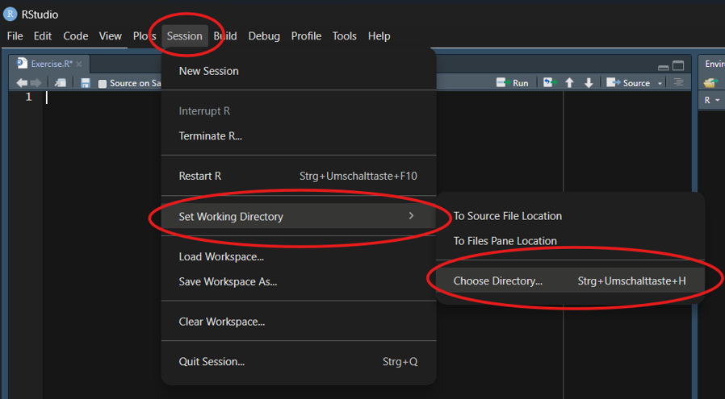
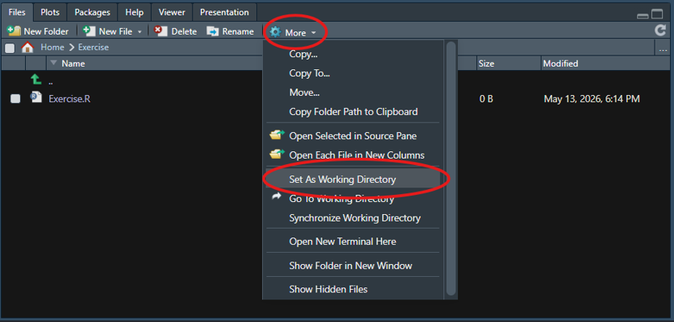
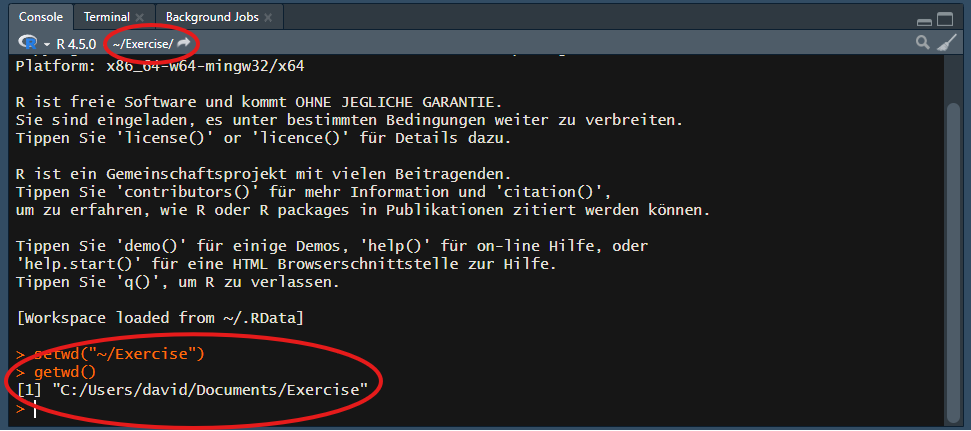
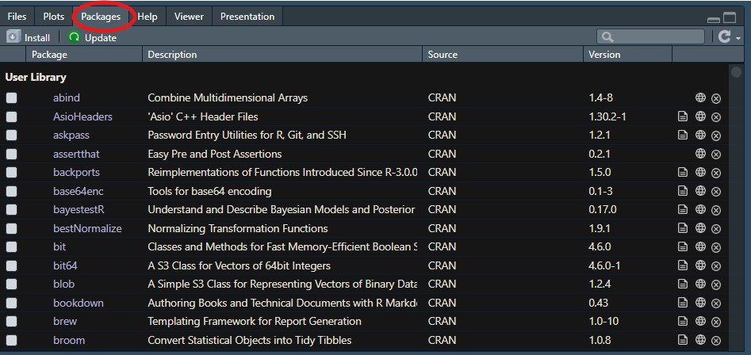
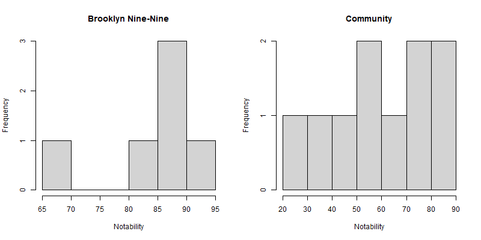

## Licence {.smaller}

<p style="text-align:center;">
  
</p>

This work was originally created by [Nicklas Hafiz](https://orcid.org/0000-0001-9035-4483) and is licenced under a CC-BY-SA 4.0 [Creative Commons Attribution 4.0 SA International License](https://creativecommons.org/licenses/by-sa/4.0/deed.en). It permits unrestricted re-use, distribution, and reproduction in any medium, provided the original work is properly cited. If you remix, transform, or build upon the material, you must distribute your contributions under the same license as the original. Code snippets are dedicated to the public domain and licenced under a CC0 1.0 [Creative Commons Universal Licence](https://creativecommons.org/publicdomain/zero/1.0/).

His work was subsequently adapted by Elizabeth Waterfield, [David Rieger](https://orcid.org/0009-0004-3701-3101) and [Sarah von Grebmer zu Wolfsthurn](https://orcid.org/0000-0002-6413-3895) 
***ADD ALL ORCID or website hyperlinks.***

<div style="font-size: 0.6em;">
<span style="color:red">From David: Here I'm not sure how if I split up the contributions correctly. Also, I don't know all the ORCID IDs.</span>
</div>

::: {.notes}
**Presenter Notes**: The Creative Commons Attribution–ShareAlike 4.0 license, or CC BY-SA 4.0, allows others to copy, share, and adapt a work in any medium, including for commercial purposes. These permissions are broad and cannot be withdrawn as long as the license terms are followed. The main requirement is attribution: users must give appropriate credit to the original creator, provide a link to the license, and clearly indicate whether any changes were made, without implying endorsement by the original author. In addition, the ShareAlike condition means that if someone modifies or builds upon the work, the resulting material must be distributed under the same CC BY-SA 4.0 license, or a compatible one. Finally, users are not allowed to apply legal or technical restrictions, such as DRM, that would prevent others from exercising these same rights. Code snippets are dedicated to the public domain and licenced under a CC0 1.0 meaning that users can use, modify, distribute, and sell the code snippets for any purpose, without permission or attribution. The code snippets are provided “as is”, without warranty of any kind.
:::

---

## Contribution statement

**Creator**: Waterfield, Elizabeth ({fig-alt="orcid logo"} [0009-0006-3725-6730](https://orcid.org/0009-0004-3701-3101))

**Creator**: Rieger, David ({fig-alt="orcid logo"} [0009-0004-3701-3101](https://orcid.org/0009-0004-3701-3101))

**Reviewer**: von Grebmer zu Wolfsthurn, Sarah ({fig-alt="orcid logo"}[0000-0002-6413-3895](https://orcid.org/0000-0002-6413-3895))

::: {.notes}
**Presenter Notes**: These are the **presenter notes**. You will find a script for the presenter for every slide. In presentation mode, your audience will not be able to see these presenter notes, they are only visible to the presenter. 

**Instructor Notes**: There are also **instructor notes**. For some slides, there will be pedagogical tips, suggestons for acitivities and troubleshooting tips for issues your audience might run into. You can find these notes underneath the speaker notes.

**Accessibility Tips**: Where applicable, this is a space to add any tips you may have to facilitate the accessibility of your slides and activities. 
:::

---

## Prerequisites

::: {.callout-important}
Before completing this submodule, please carefully read about the prerequisites.
:::

<div style="font-size: 0.6em;"> 
| Prerequisite   |  Description  | Where to find it   |
|------------|------------|------------|
| Basic R skills | 3.2. Introduction to R - Part I |  Module 3.2. |
| RStudio | Version 2025.05.1+513 or higher | [Download Link](https://posit.co/download/rstudio-desktop/) |
| R | Version 4.4.3 or higher | [Download Link](https://www.r-project.org/) |
</div>


::: {.notes}
**Presenter Notes**: Welcome back! Before we dive into Part II, please make sure you still have R and RStudio installed and ready to go. You should also be familiar with the basic concepts we covered in Part I, like the RStudio interface and creating simple objects.

**Instructor Notes**: Quickly verify whether learners have the required software open. Remind them that they can open the R scripts they saved during the last session.

**Accessibility Tips:**  
Consider pairing students who might need a quick refresher on Part I with those who feel very confident.
:::

---

## Questions from previous submodule

<div style="background-color: #f0f0f0; padding: 0.1em; border-radius: 5px; font-size: 1em; text-align: center;">

Are there any open questions regarding the content or the assignment from **Introduction to R - Part I**?

</div>

::: {.notes}
**Presenter Notes**: Before we start with new topics, are there any lingering questions from Part I? For example, anything regarding data types, logical comparisons, or saving your scripts?

**Instructor Notes**: 
- **Aim**: This first slide is dedicated to clarifying questions from the previous submodule and/or to discuss assignments. 
- Critical for the learning process to ensure that students are on the same page and have been able to achieve the learning goals of the previous workshop. 
:::

---

## Quick Recap Quiz

<br>
<div style="background-color: #f0f0f0; padding: 0.1em; border-radius: 5px; font-size: 1em; text-align: center;">
**Let's test our memories from the last session!**
</div>

::: {.notes}
**Presenter Notes**: To get our brains back into "R mode", let's do a very quick quiz on two core concepts from our last session. Feel free to just call out the answers!

**Instructor Notes**: Use these two quiz slides to actively engage learners instead of just reading out a recap. Ensure everyone understands the assignment operator and basic logical checks before moving on.
:::

---

**Which of the following creates an object named `my_data` containing the number `42`?**

a. `my_data == 42`

b. `my_data <- 42`

c. `my_data < - 42`

d. `42 <- my_data`

::: {.notes}
**Presenter Notes**: The correct answer is B. The standard assignment arrow points to the left without any spaces. Option A uses a double equals sign, which is a logical operator that checks if an existing object is exactly 42, rather than assigning it. Option C contains a space between the less-than sign and the minus sign, which R interprets as a logical question asking if the object `my_data` is smaller than negative 42. Option D places the raw number on the left side of the arrow, which causes an error because the object name receiving the data must always be on the left.
:::

---

**What is the result of the following logical comparison?**

```{r}
#| eval: false
(5 > 3) & (10 == 5)
```

a. TRUE

b. FALSE

c. Error

::: {.notes}
**Presenter Notes**: The correct answer is B, FALSE. While 5 is indeed greater than 3 (which is TRUE), 10 does not equal 5 (which is FALSE). Since we used the AND operator (&), both conditions must be true for the final result to be TRUE.
:::

---

**How do you access a column named age from a data frame called people_data?**

a. people_data[age]

b. people_data(age)

c. people_data$age

d. age$people_data

::: {.notes}
Presenter Notes: The correct answer is C. The dollar sign ($) is used to extract a specific column from a data frame by its name. Option A is missing the necessary quotation marks for basic bracket indexing. Option B incorrectly uses parentheses, which are reserved for functions. Option D reverses the order; the data frame name must always precede the dollar sign.
:::

---

## Before we start: Survey time!

<br>

<div style="background-color: #f0f0f0; padding: 0.1em; border-radius: 5px; font-size: 1em; text-align: center;">

**Let us find out where you are at!**

</div>

::: {.notes}
**Speaker Notes**: Now that we've refreshed Part I, let's take a short survey regarding today's topics. In Part II, we are moving away from R as a simple calculator and starting to work with real data. In the next few slides, you’ll see some questions about concepts we will cover today. As always, this isn’t a test. If you have never heard these terms, that is exactly why we are here!

**Instructor Notes**: Set a low-stakes, supportive tone. Emphasize that uncertainty is expected and valuable for measuring learning progress.
:::

---

**What is your level of familiarity with "Packages" in R?**

a. I have never heard of them.
b. I have heard of them but never installed or loaded one.
c. I have basic experience installing and loading them.
d. I am very familiar and use them regularly.

---

**Have you ever imported a dataset (e.g., an Excel, CSV, or SPSS file) into a statistical software program?**

a. No, never.
b. Yes, using menus (point-and-click).
c. Yes, using code/commands.

---

**How familiar are you with "subsetting" (extracting specific rows or columns from a dataset)?**

a. I have never done this before.
b. I have done it manually (e.g., copying or deleting columns in Excel).
c. I have done it using point-and-click menus in statistical software.
d. I have done it using code (e.g., in R or Python).

---

## Discussion of survey results

<br>

<div style="background-color: #f0f0f0; padding: 0.1em; border-radius: 5px; font-size: 1em; text-align: center;">

What do we see in the results?

</div>

::: {.notes}
**Presenter Notes**: Let us have a look at these results.

**Instructor Notes**: The aim is to understand the group’s current standing in terms of knowledge and familiarity. Emphasize explicitly that the survey is not about correct or incorrect answers. Avoid evaluating answers.
:::

---

## Moving forward: From Part I to Part II

- **Part I (The Basics)**: R as a calculator, data types, basic functions, and writing basic scripts.
- **Part II (The Application)**: Transitioning from calculating to analyzing.
  - Understanding where files are saved (Working Directories).
  - Using tools built by others (Packages).
  - Bringing in real data (Importing & Inspecting).

::: {.notes}
**Presenter Notes**: In Part I, we learned the alphabet of R: data types, math operators, functions, and how to save a script. Today, we start writing sentences. We are shifting from treating R like a calculator to using it as a data analysis tool. By the end of this session, you will know how to load your own research data into R and start exploring it.
:::

---

## Learning goals

::: incremental
- To **identify** and set the correct Working Directory on your computer.
- To **install** and **load** R packages to extend R's functionality.
- To **import** external data into the R environment.
- To **inspect** data structures and **extract** specific columns.
- To **compute** basic statistical summaries on a dataset.
- To **visualize** data distributions using simple histograms.
:::
  
::: {.notes}
**Presenter Notes**: This slide outlines the learning goals for today's session. Just like last time, think of them as a roadmap. They show where we’re headed today. You can use these goals to keep track of your learning and identify areas where you might want to ask questions later.
:::

---

## Key terms and definitions

- **Working Directory**
- **Package**
- **Data frame**
- **Subsetting**

::: {.notes}
**Presenter Notes**: These are key terms we will revisit throughout the lesson. What comes to mind when you see each of them? Which ones are familiar, and which feel new? Take a moment to think about what they might mean.

**Instructor Notes**: Use a think-pair-share approach. First, have learners reflect individually on their associations with each term for a few minutes, then discuss in pairs for a few minutes, and finally share with the group. Allow about 10 minutes for this activity.
:::

---

## Key terms and definitions

::: incremental
- **Working Directory**: The default folder on your computer where R looks for files to read and where it saves your output.
- **Package**: A collection of additional R functions, data, and code that extends the basic capabilities of R.
- **Data frame**: A table-like structure in R where rows represent observations and columns represent variables.
- **Subsetting**: The process of extracting a specific portion of a dataset, such as selecting specific columns or filtering rows.
:::

::: {.notes}
**Presenter notes**:
Let’s go through what these key terms mean:

- The Working Directory is the folder R is currently focused on. It reads files from here and saves outputs here.
- Packages are add-ons. They contain tools and functions created by the R community that expand what base R can do.
- A Data frame is the standard way to store data in R. Think of it like a spreadsheet where each column is a variable and each row is an observation.
- Subsetting allows us to isolate the exact data we need. Instead of working with an entire dataset, we extract only the relevant rows or columns.
:::

---

# The Working Directory

---

## What is the Working Directory?

::: incremental
- The **Working Directory (WD)** is the default folder on your computer.
- It is the location where R looks for files to read.
- It is the location where R saves files you produce (e.g., plots, exported data).
- **Rule:** Always confirm your working directory before beginning an analysis.
:::

::: {.notes}
**Presenter Notes**: The working directory is your anchor point. If you tell R to open a dataset without specifying the full path on your computer, R looks in the working directory. If you tell R to save a plot, it saves it there. Setting it correctly prevents "file not found" errors.

**Instructor Notes**: Use the analogy of a physical desk. If you ask someone to hand you a paper, they will look on the desk they are currently standing at. If the paper is in another room, they won't find it unless you point them to the correct room.
:::

---

## Setting the Working Directory: Method 1 

<div style="font-size: 0.6em;">
Using the top menu bar in RStudio:

1. Click **Session**
2. Hover over **Set Working Directory**
3. Select **Choose Directory...**
4. Navigate to your desired folder and click **Open**.
</div>

::: {style="text-align: center;"}
{style="width:55%;"}
:::

::: {.notes}
**Presenter Notes**: This is the standard graphical way to set your directory. It opens your operating system's standard file browser. 

**Instructor Notes**: Briefly demonstrate this live. Ensure students know how to navigate their local file system (e.g., finding their Documents or Desktop folder).
:::

---

## Setting the Working Directory: Method 2 

<div style="font-size: 0.6em;">
Using the Files pane (bottom right in default layout):

1. Navigate to your desired folder in the **Files** pane.
2. Click the **More** button (gear icon).
3. Select **Set As Working Directory**.
</div>

::: {style="text-align: center;"}
{style="width:55%;"}
:::

::: {.notes}
**Presenter Notes**: This method is often faster if you already see your files in the bottom right corner of RStudio. Clicking 'Set As Working Directory' locks R to that specific folder.

**Instructor Notes**: Remind students that simply navigating to a folder in the Files pane does not automatically set it as the working directory. They must explicitly execute the "Set As Working Directory" command.
:::

---

## Checking the Working Directory

<div style="font-size: 0.6em;">
Verify the current working directory by looking at the top of the **Console** pane (bottom left).
</div>

::: {style="text-align: center;"}
{style="width:60%;"}
:::

::: {.callout-tip}
Alternatively, type `getwd()` in the console and press Enter to print the exact file path.
:::

::: {.notes}
**Presenter Notes**: You can always verify your current location by checking the gray text at the top of your console. If it shows the wrong path, your file imports will fail. You can also run the command `getwd()`, which stands for "get working directory".

**Accessibility Tips**: Read the console path structure aloud (e.g., "C drive, Users, Documents") to help students orient themselves.
:::

---

## Practical exercise 1

**Setting the Working Directory**

1. Locate the folder where you saved your R-script during Part I. 
2. Ensure this folder contains only your script and relevant workshop files.
3. Set this folder as your Working Directory using either Method 1 or Method 2.
4. Verify that the correct path is displayed at the top of your Console.

- [ ] Folder located.
- [ ] Working Directory set.
- [ ] Path verified in Console.

::: {.notes}
**Presenter Notes**: Take a minute to set your working directory to the folder containing your script from the last session. We will need this set correctly when we start importing data later today.

**Instructor Notes**: Walk around the room. Verifying the working directory is a critical step. Do not proceed until all students have successfully set their directory. Check for common issues like OneDrive/Cloud sync folders causing path errors on Windows machines.
:::

---

# Packages

---

## What are Packages?

- R comes with many built-in functions (**Base R**).
- **Packages** provide thousands of additional, specialized functions.
- They are created and shared by the R community to extend functionality.

::: {.notes}
**Presenter Notes**: While Base R is powerful, the real strength of R lies in its packages. These are bundles of code written by other users that add new capabilities, from advanced statistical models to data import tools.
:::

---

## Installing Packages

<div style="font-size: 0.9em;">
- Packages must be **installed once** (or after updating R).
- Use the `install.packages()` function. The package name must be in quotation marks.

```{r}
#| eval: false
install.packages("haven")
```

- Alternatively: Use the **Packages** tab in the bottom right pane of RStudio and click **Install**.
</div>

::: {style="text-align: center;"}
{style="width:50%;"}
:::

::: {.notes}
**Presenter Notes**: You only need to install a package once on your computer. Note that the package name must be enclosed in quotation marks when installing. You can also use the Packages tab in RStudio to install them graphically.
:::

---

## Loading Packages

- Once installed, a package must be **loaded every time** you open a new R session.
- Use the `library()` function. Quotation marks are not required here.

```{r}
#| eval: false
library(haven)
```

::: {.notes}
**Presenter Notes**: Think of installing a package like buying a book and putting it on your shelf. You only buy it once. Loading a package with the library function is like taking the book off the shelf to read it today. You have to do this every time you start a new session in R.

**Instructor Notes**: Emphasize the difference between installing (quotes needed, done once) and loading (no quotes needed, done every session). This is a very common point of confusion for beginners.
:::

---

## Practical exercise 2

**Packages**

- [ ] Install the package `haven`. This package is useful for reading in data files from other software like SPSS, Stata, and SAS.
- [ ] Load the package `haven` so it is ready to use in your current session.

::: {.notes}
**Presenter Notes**: Take a moment to install the haven package and then load it. We will need this package later if we want to import specialized data formats.

**Instructor Notes**: Give learners about 3 minutes. Remind them to look at the console to see the installation progress.
:::

---

## Practical exercise 2: Solutions

```{r}
#| eval: false
# 1. Install the package (run only once)
install.packages("haven")

# 2. Load the package (run every session)
library(haven)
```

::: {.notes}
**Presenter Notes**: First, we use `install.packages` with quotation marks to download the package to our computer. Then, we use `library` without quotation marks to load it into our current session.
:::

---

# Getting Started with Data

---

## Preparation for working with data

- To start analyzing data, we first need to download it to our local machine.
- Click [**here**](https://github.com/nickhaf/r_tutorial/tree/main/raw_data) to download the `characters.rds` file or scan the QR code below.

::: {style="text-align: center;"}
{style="width:30%;"}
:::

::: {.notes}
**Presenter Notes**: Before we can load and inspect data, we need to have it on our computers. Please use the link or scan the QR code to download the `characters.rds` file.

**Instructor Notes**: Ensure learners do not skip this step. The specific instructions for moving the file and setting the directory follow on the next slide.
:::

---

## Practical exercise 3

**Setting up the data**

- [ ] Download the dataset `characters.rds` using the link or QR code from the previous slide.
- [ ] Move the file from your "Downloads" folder into the R folder you created earlier (e.g., "R Lesson").
- [ ] Ensure that this folder is currently set as your **Working Directory** in RStudio.

::: {.notes}
**Presenter Notes**: Once downloaded, make sure to move the file out of your general Downloads folder and into the specific folder we created for this session. Finally, verify that RStudio is pointing to that exact folder as your Working Directory.

**Instructor Notes**: This step often causes friction as participants may struggle to locate their downloads or move files. Use the upcoming break to help anyone who is stuck here. Ensure they do not leave the file in their standard "Downloads" folder, as this will cause pathing issues later.
:::

---

## Loading data into R

<div style="font-size: 0.85em;">
Once your Working Directory is set, you can bring data into RStudio. 
</div>

<div style="font-size: 0.8em;">
- **`.rds` files:** R's native data format. We use the `readRDS()` function to load them.
- **`.csv` files:** The most common text-based data format. Usually loaded with functions from the `readr` package.
- **Other formats (SPSS, Excel, SAS):** Require specific packages (e.g., the `haven` package you installed earlier!). 
</div>

::: {.callout-tip}
## Point-and-Click Import
You don't always have to write the code from scratch! You can go to **File $\rightarrow$ Import Dataset** in the top menu to point-and-click your way through the import process. RStudio will even generate the correct code for you.
:::

::: {.notes}
**Presenter Notes**: Now that R knows where to look, let's load some data. The function you use depends on the file type. Because we downloaded an `.rds` file, which is R's native format, we will use the `readRDS` function. For other common formats like CSVs, or files from SPSS and Excel, you will need different functions and sometimes extra packages like `haven`. If you ever forget how to load a specific file type, simply Google "how to open xlsx in RStudio". Alternatively, you can use the "Import Dataset" button in the menu, which is highly recommended because it gives you a preview of the data and writes the code for you.

**Instructor Notes**: Briefly demonstrate the "Import Dataset" feature via screen share if time permits, showing how it populates the console with code. Emphasize that Googling for specific file type imports is standard practice.
:::

---

## Practical exercise 4

**Loading the data**

<div style="font-size: 0.8em;">
- [ ] In your R script, create a new section using a comment (e.g., `# Loading Data`).
- [ ] Use the `readRDS()` function to read the `characters.rds` file. Remember to put the file name in quotation marks!
- [ ] **Assign** the output of this function to a new object called `characters`.
- [ ] Run the code and check your Environment pane.
</div>

::: {.notes}
**Presenter Notes**: It is time to start our main data analysis script! We will build on this script for the rest of the session, so you can save it and use it as a cheat sheet for your own future projects. Start by writing the code to load the `characters.rds` file and assign it to an object named `characters`. 

**Instructor Notes**: Give learners about 3-5 minutes. Remind them that if they get a "file not found" error, it almost certainly means their Working Directory is not set to the folder where the file actually lives, or they made a typo in the file name. 
:::

---

## Practical exercise 4: Solutions

```{r}
#| eval: false
# Loading Data
characters <- readRDS("characters.rds")
```

::: {.notes}
**Presenter Notes**: Here is the solution. We use the assignment arrow to store the data in an object called characters. The readRDS function tells R to look for the file named "characters.rds" inside our Working Directory. If everything worked correctly, you should now see a new object appear in the top right Environment pane, showing that it has hundreds of rows and several variables.  

**Instructor Notes**: Have the participants confirm they see the dataset in their Environment. Do not move forward until everyone has successfully loaded the data, as the rest of the workshop depends on it. 
:::

---

## Inspecting data structures

<div style="font-size: 0.85em;">
Before analyzing data, you must familiarize yourself with its structure. Built-in functions allow you to verify variables and data types.
</div>

<div style="font-size: 0.8em;">
- **`names()`**: Returns the column names. *(Tip: Variable names are often abbreviated. It is highly advisable to use a **codebook** for precise definitions).*
- **`str()`**: Displays the internal structure (number of rows/columns, data types, and the first few values of each variable).
- **`head()`**: Returns the first six rows of the dataset for a quick preview.
- **`summary()`**: Provides a brief statistical summary of each variable (adapts output based on data type).
</div>

::: {.notes}
**Presenter Notes**: Once the data is loaded, we need to look at it. You should never start analyzing without knowing what variables you have. We use four main functions for this. `names` gives you the column headers. Keep in mind that column names are often short, so having a codebook explaining what each variable means is highly recommended. `str` shows the structure, including whether variables are numbers or text. `head` shows the first six rows. `summary` provides basic statistics, like means for numeric data or counts for categorical data.

**Instructor Notes**: Emphasize the importance of a codebook. Novices often assume variable names are self-explanatory, which leads to analytical errors.
:::

---

## Practical exercise 5

**Inspecting the dataset**

<div style="font-size: 0.8em;">
- [ ] Add a new comment in your script (e.g., `# Inspecting Data`).
- [ ] Run `names(characters)`.
- [ ] Run `str(characters)`.
- [ ] Run `head(characters)`.
- [ ] Run `summary(characters)`.
- [ ] **Question:** Based on the console outputs, can you guess what the data in this dataset is about?
</div>

::: {.notes}
**Presenter Notes**: Let us apply these functions to the dataset we just loaded. Run each function on the `characters` object and look closely at the output in the console. Based on what you see—the variable names and the specific text values—can anyone guess what this dataset is actually about?

**Instructor Notes**: Give learners 5 minutes to run the code and read the outputs. Ask the room to share their guesses regarding the dataset's content.
:::

---

## Practical exercise 5: Solutions

```{r}
#| eval: false
# Inspecting Data
names(characters)
str(characters)
head(characters)
summary(characters)
```

::: {.notes}
**Presenter Notes**: Running these four lines provides a complete overview of the dataset without having to open it like a spreadsheet.
:::

---

## Pre-break quiz

::: {.notes}
**Presenter Notes**: Before we head into the break, let’s do a quick check-in to see how things are going so far. The questions are designed to help you reflect on your current understanding of the key concepts we just covered: working directories, packages, loading data, and inspecting data structures.

**Instructor Notes**: Use this pre-break survey to gauge learners’ understanding of the submodule’s core concepts.

- If more than 80% of learners select the correct answer, briefly confirm the correct response and continue.

- If fewer than 80% answer correctly, give learners 1–2 minutes to discuss their reasoning with a partner before re-running the question. If results improve above 80%, continue; otherwise, explain the correct answer and address common misunderstandings.

- If a large portion of learners select the same distractor answer, pause to discuss why that option may seem plausible and clarify the misconception.

**Accessibility Tip**: This activity is designed for synchronous teaching settings and may be skipped or adapted if needed.
:::

---

**1. What is the primary purpose of the Working Directory in RStudio?**

a. It is the only folder where you are allowed to install R.
b. It is the default folder where R looks for files to read and saves outputs.
c. It is a specific R package used for data manipulation.
d. It is the console pane where R executes commands.

::: {.notes}
**Instructor notes**:
The answer for this question is b
:::

---

**2. Which function is used to load an already installed package into your current R session?**

a. `install.packages()`
b. `load.package()`
c. `open()`
d. `library()`

::: {.notes}
**Instructor notes**:
The answer for this question is d
:::

---

**3. Which command correctly loads an .rds file named `characters.rds` into an object named `my_data`?**

a. `my_data <- readRDS("characters.rds")`
b. `readRDS <- my_data("characters.rds")`
c. `my_data == readRDS("characters.rds")`
d. `my_data <- read_csv("characters.rds")`

::: {.notes}
**Instructor notes**:
The answer for this question is a
:::

---

**4. Which function provides the internal structure of a dataset, including the number of rows/columns and the data types of each variable?**

a. `names()`
b. `head()`
c. `summary()`
d. `str()`

::: {.notes}
**Instructor notes**:
The answer for this question is d
:::

---

**5. What does the `head()` function output when applied to a dataset?**

a. The column names of the dataset.
b. The first six rows of the dataset.
c. A statistical summary of the numeric variables.
d. The total number of variables in the dataset.

::: {.notes}
**Instructor notes**: 
The answer for this question is b
:::

---

# Break! 15 minutes

---

## Post-break quiz discussion

<br>

<div style="background-color: #f0f0f0; padding: 0.1em; border-radius: 5px; font-size: 1em; text-align: center;">

What do we see in the results?

</div>


::: {.notes}
**Presenter Notes**: 
Let us have a look at these results. 

**Instructor Notes**:
Briefly examine the answers given to each question interactively with the group. Use visuals from the survey to highlight specific answers. Serves to clarify concepts and aspects that are not yet understood. Highlight specific answers given during the survey.

**Accessibility Tip**: Have people work in pairs if someone did not bring their phone/does not have a phone. This survey also cannot be completed in an asynchronous setting. 
:::

---

# Data Exploration

---

## Accessing and subsetting columns

<div style="font-size: 0.85em;">
As discussed in **Part I**, we can use indexing tools (`$` and `[]`) to access specific parts of our data. In real-world analysis, we apply this to extract entirely new subsets.
</div>

<div style="font-size: 0.8em;">
- **Accessing a column:** Just like in Part I, use the `$` operator to isolate a single variable (e.g., `characters$uni_name`).
- **Filtering rows:** Use `dataframe[condition, ]` to select specific rows while keeping all columns.
- **Logical operators:** Build conditions using `==` (checks for exact equality) and `|` (logical OR, meaning either condition can be true).
- **Preserving data:** Always assign your subset to a **new object** (e.g., `relevant_data <- ...`). Overwriting the original object deletes your raw data from the environment.
</div>

::: {.notes}
**Presenter Notes**: As you might remember from Part I, indexing allows us to point R to specific data. When working with data frames, subsetting is central because we usually want to focus on specific subgroups rather than the whole dataset. We can access a specific column using the dollar sign, just like last time. To filter rows based on characteristics, we use the square brackets. By placing our logical conditions before the comma, we tell R which rows to keep. We build these conditions using double equals for exact matches and the vertical pipe for "OR". Most importantly, we save this subset as a new object so our original dataset remains untouched.

**Instructor Notes**: Clearly link this back to the indexing exercises from Part I to build confidence. Emphasize how `$` points to the variable inside the condition.
:::

---

## Practical exercise 6

**Subsetting by conditions**

<div style="font-size: 0.8em;">
- [ ] Create a new section in your script using a comment.
- [ ] Apply your indexing knowledge from Part I to filter the rows of the `characters` data frame to include only observations where the `uni_name` is exactly `"Brooklyn Nine-Nine"` **OR** `"Community"`.
- [ ] Assign this subset to a new object named `relevant_data`.
- [ ] Run the code, then use the `table()` function on `relevant_data$uni_name` to check how many characters from each show are in your new subset.
</div>

::: {.callout-tip}
## Syntax Hint
Remember to specify the data frame for each condition (e.g., `data$column == "A" | data$column == "B"`).
:::

::: {.notes}
**Presenter Notes**: Let's apply what we learned in Part I to create our subset. We want to isolate characters from Brooklyn Nine-Nine and Community. Use your indexing knowledge, the dollar sign, and the logical operators we just discussed. After you assign it to the new object `relevant_data`, use the `table()` function on the `uni_name` column of your new subset to verify that it worked.

**Instructor Notes**: Give learners 5-7 minutes. Walk around and monitor for the three common pitfalls: missing the trailing comma inside the brackets, using a single equals sign, or failing to repeat `characters$uni_name` after the OR operator.
:::

---

## Practical exercise 6: Solutions

```{r}
#| eval: false
# Accessing and subsetting columns
relevant_data <- characters[characters$uni_name == "Brooklyn Nine-Nine" |
    characters$uni_name == "Community", ]

# Verify the subset
table(relevant_data$uni_name)
```

::: {.notes}
Presenter Notes: Here is the correct syntax. We specify the row conditions before the comma. Notice that we have to tell R exactly where to look for both sides of the OR condition by writing characters$uni_name twice. Finally, running table() on the newly created object confirms that we only have characters from those two shows.
:::

---

## Basic Summary Functions

<div style="font-size: 0.85em;">
After isolating the relevant data, we can compute descriptive statistics for specific variables.
</div>

<div style="font-size: 0.8em;">
- **Numeric Variables:** We can apply functions like `mean()` or `sd()` to a single column using the `$` operator (e.g., `mean(data$column)`).
- **Categorical Variables:** We can use the `table()` function to count the frequency of specific text or factor values.
- **Combined Operations:** We can subset rows and select a specific column simultaneously within a function using `dataframe[condition, "column_name"]`.
</div>

::: {.notes}
**Presenter Notes**: Now that the subset is established, we can compute basic statistics. We combine summary functions with the dollar sign operator. For numeric data, we apply `mean()` and `sd()`. For categorical data, we use `table()` to count occurrences. Indexing can be nested directly inside functions to calculate statistics for specific subgroups without generating new objects.

**Instructor Notes**: Ensure learners recognize that executing `mean(data)` directly on a data frame fails. They must isolate a numeric vector using `$`.
:::

---

## Practical exercise 7

**Comparing group means**

<div style="font-size: 0.8em;">
- [ ] Add a new section in your script using a comment.
- [ ] Calculate the overall `mean()` and standard deviation (`sd()`) of the `notability` column in the `relevant_data` object.
- [ ] Calculate the mean notability exclusively for `"Brooklyn Nine-Nine"` characters.
- [ ] Calculate the mean notability exclusively for `"Community"` characters.
- [ ] **Question:** Which show features characters with a higher average notability?
</div>

::: {.callout-tip}
## Syntax Hint
To compute the mean for a subgroup, place the row condition before the comma, and the target column name after the comma: `mean(data[condition, "column_name"])`.
:::

::: {.notes}
**Presenter Notes**: Let's execute the commands to determine the overall dispersion and central tendency for the notability variable. We will follow this by extracting the mean notability for each show independently. We can utilize bracket subsetting logic directly inside the mean function.

**Instructor Notes**: Give learners 5 minutes. Monitor for syntax errors when nesting bracket indexing inside the parentheses of the `mean()` function.
:::

---

## Practical exercise 7: Solutions

```{r}
#| eval: false
# Basic summary functions
mean(relevant_data$notability)
sd(relevant_data$notability)

# Mean notability for Brooklyn Nine-Nine
mean(relevant_data[relevant_data$uni_name == "Brooklyn Nine-Nine", "notability"])

# Mean notability for Community
mean(relevant_data[relevant_data$uni_name == "Community", "notability"])
```

::: {.notes}
**Presenter Notes**: The dollar sign operator extracts the full vector for overall statistics. To calculate group-specific means, we nest the row condition inside the mean() function and specify "notability" in the column position after the comma.
:::

---

## Simple plotting: Histograms

<div style="font-size: 0.85em;">
Beyond calculating numbers, we can visualize our data to gain insights quickly. A great starting point for numeric data is a histogram.
</div>

<div style="font-size: 0.8em;">
- **Visualizing distributions:** A histogram groups numeric data into "bins" and shows the frequency (or count) of values falling into each bin.
- **The `hist()` function:** We apply this function directly to a numeric vector to generate a plot in the bottom-right **Plots** pane of RStudio.
- **Customizing plots:** You can add arguments like `main` for the title and `xlab` for the x-axis label to make your plots easier to read.
- **Why it matters:** While means and standard deviations tell us the average, a histogram shows us the actual shape of the data (e.g., are most values clustered in the middle, or skewed to one side?).
</div>

::: {.notes}
**Presenter Notes**: Numbers are great, but visualizing data often makes it much easier to understand. A histogram is one of the most common plots for numeric variables. It shows us how often different values occur in our dataset. We create it using the `hist()` function. When we run this code, the plot will automatically appear in the Plots pane in the bottom right corner of RStudio. We can also customize these plots, for example by changing the title or the axis labels, so they look clean and don't overlap. Histograms are incredibly useful because they show us the entire distribution and actual shape of the data, not just a single summary number like the mean.

**Instructor Notes**: Ensure learners know to look at the bottom-right pane for their output. If their Plots pane is too small, RStudio might throw a "figure margins too large" error. Tell them to simply drag the pane borders to make it larger if that happens.
:::

---

## Practical exercise 8

**Visualizing distributions**

<div style="font-size: 0.8em;">
- [ ] Add a new section in your script using a comment.
- [ ] Copy and run the hint below to allow two plots to be shown side-by-side.
- [ ] Create a histogram (`hist()`) showing the `notability` of `"Brooklyn Nine-Nine"` characters.
- [ ] Create a second histogram showing the `notability` of `"Community"` characters.
- [ ] **Question:** By looking at the plots, how do the distributions of the two shows compare?
</div>

::: {.callout-tip}
## Side-by-Side Plots Hint
Run `par(mfrow = c(1, 2))` *before* creating your histograms. This tells R to split the plotting window into 1 row and 2 columns so we can easily compare both graphs next to each other!
:::

::: {.notes}
**Presenter Notes**: Let's visualize the data we just summarized. We will create two separate histograms—one for each show. Before you plot the data, make sure to run the `par` code provided in the hint to show them side-by-side. Then, nest your subsetting code inside the `hist()` function.

**Instructor Notes**: Give learners 5-7 minutes. Reassure them that they can reuse the exact subsetting syntax (`relevant_data[condition, "column_name"]`) they already wrote for the `mean()` exercise.
:::

---

## Practical exercise 8: Solutions

```{r}
#| eval: false
# Simple Plotting / Histograms

# Set up the plotting area to show 2 plots side-by-side
par(mfrow = c(1, 2))

# Histogram for Brooklyn Nine-Nine
hist(relevant_data[relevant_data$uni_name == "Brooklyn Nine-Nine", "notability"],
    main = "Brooklyn Nine-Nine",
    xlab = "Notability"
)

# Histogram for Community
hist(relevant_data[relevant_data$uni_name == "Community", "notability"],
    main = "Community",
    xlab = "Notability"
)
```

::: {.notes}
**Presenter Notes**: Here is the solution. By reusing our subsetting logic, we can directly plot the notability for each specific show. Notice that we snuck in two extra arguments here: `main` and `xlab`. If you ran your code without them, you probably saw a very long, messy default title generated by R. By adding these arguments, we get clean, readable plots without overlapping text. Looking at the plots, you can visually confirm what the means calculated earlier suggested: the distributions are different, and we can now actually see where the majority of characters fall on the notability scale for each universe.
:::

---

## Practical exercise 8: Output

::: {style="text-align: center;"}
{style="width:90%;"}
:::

::: {.notes}
**Presenter Notes**: This is what your output should look like in the Plots pane. Here you can clearly see the side-by-side comparison of both distributions.
:::

---

# Best Practices and Context

---

## Common mistakes and troubleshooting

<div style="font-size: 0.85em;">
Errors are a normal part of programming. When R throws an error, check for these common culprits first:
</div>

<div style="font-size: 0.8em;">
- **Wrong capitalization:** R is strictly case-sensitive. `Characters` is not the same as `characters`.
- **Forgetting quotation marks:** Text values and file names must be wrapped in quotes (e.g., `"Community"`, not `Community`).
- **Other typos:** A missing comma, an unclosed parenthesis, or spelling `notablity` instead of `notability` will cause failures.
- **Assignment issues:** Ensure the assignment arrow (`<-`) points to the object name on the left, and check if you accidentally overwrote your data.
</div>

::: {.notes}
**Presenter Notes**: Programming involves making mistakes constantly. When R gives you a red error message, do not panic. Most of the time, it is a simple typo. R is strictly case-sensitive, meaning a capital C is completely different from a lowercase c. Another frequent issue is forgetting quotation marks around text. If you type Community without quotes, R thinks you are looking for an object named Community, not the text string. Always double-check your spelling, missing commas, and ensure your assignment arrows are pointing the right way.

**Instructor Notes**: Normalize errors. Remind learners that the console output usually gives a hint about what went wrong (e.g., "object not found" usually means a typo or missing quotes).
:::

---

## Practical Exercise 9: Spot the errors

<div style="font-size: 0.85em;">
What is wrong with the following lines of code?
</div>

```{r}
#| eval: false

# 1. Loading data
my_data <- readRDS(characters.rds)

# 2. Calculating a mean
Mean(my_data$notability)

# 3. Subsetting
brooklyn_data <- my_data[my_data$uni_name == Brooklyn Nine-Nine ]
```

::: {.notes}
Presenter Notes: Let's look at this code. There are three lines, and each contains typical beginner mistakes. Take a moment to read through them and see if you can spot what would cause R to throw an error.
[Pause for responses]
Line 1 is missing quotation marks around the file name. Line 2 uses a capital M for the mean function, but R functions are lowercase. Line 3 is missing quotation marks around the show name AND is missing the crucial comma inside the brackets.

Instructor Notes: Use this only if time permits. It is a highly effective way to test syntax recognition without requiring participants to write new code.
:::

---

## The Big Picture: R in Data Science

<div style="font-size: 0.85em;">
Today, you learned the foundational skills of data handling. In the broader context of research and data analysis, R is a comprehensive ecosystem.
</div>

<div style="font-size: 0.8em;">
- **Import:** Reading data from various sources (e.g., `.rds`, `.csv`, Excel). *(We did this!)*
- **Wrangle & Transform:** Subsetting, cleaning, and reshaping data to fit your needs. *(We did this!)*
- **Visualize:** Creating plots to understand distributions and patterns. *(We did this!)*
- **Model:** Running complex statistical analyses and machine learning algorithms.
- **Communicate:** Generating automated reports, interactive dashboards, or even **these exact presentation slides** using Quarto/RMarkdown!
</div>

::: {.notes}
**Presenter Notes**: Let's take a step back and look at the big picture. What we did today—loading data, subsetting it, and creating histograms—are the exact first steps of any professional data analysis pipeline. R is not just a calculator; it is an entire ecosystem. You start by importing data, then you wrangle and transform it. After that, you visualize it to understand what you are working with. Finally, you model the data statistically and communicate the results. In fact, this entire presentation was created using R!

**Instructor Notes**: Use this slide to bridge the gap between the simple exercises done today and the real-world utility of R. Highlight that the skills learned today are the actual foundation of professional workflows.
:::

---

## The Power of R: What comes next?

<div style="font-size: 0.85em;">
Mastering the basics opens the door to highly advanced, publication-ready tools.
</div>

::: {style="text-align: center; margin-top: 1em; margin-bottom: 1em; font-weight: bold;"}
Import $\rightarrow$ Tidy / Transform $\rightarrow$ Visualize / Model $\rightarrow$ Communicate
:::

<div style="font-size: 0.8em;">
- **Advanced Visualizations:** Packages like `ggplot2` allow you to create stunning, highly customized graphics.
- **Interactivity:** Packages like `shiny` let you build interactive web applications for your data.
- **Reproducibility:** By scripting your analysis, anyone (including future you) can re-run your exact steps with zero guesswork.
</div>

::: {.notes}
**Presenter Notes**: As you continue learning, you will discover that R is incredibly powerful. You can move from simple base R histograms to stunning, publication-ready graphics using packages like ggplot2. You can even build interactive websites. Most importantly, by writing scripts instead of clicking through menus, your research becomes 100% reproducible. 
:::

---

## Final Words

<div style="font-size: 0.85em;">
Learning R is exactly like learning a new spoken language. It takes time, practice, and patience.
</div>

<div style="font-size: 0.8em;">
- **Syntax errors are normal:** Even advanced programmers make typos and get error messages every single day.
- **AI is a standard tool:** Using AI to write code, navigate complex documentation, or troubleshoot errors is standard practice. However, the foundational understanding you built today is essential to verify and adapt the output.
- **Keep practicing:** Save the script you wrote today and use it as a cheat sheet for your next projects. 
</div>

<div style="text-align: center; font-weight: bold; margin-top: 1em; font-size: 1.2em;">
Great job today!
</div>

::: {.notes}
**Presenter Notes**: To wrap up, remember that learning R is like learning a new language. It feels unfamiliar at first, and syntax errors are completely normal. Even professionals use AI constantly to write scripts, bypass lengthy documentation, and troubleshoot errors. However, the foundational understanding you gained today is what allows you to actually evaluate and verify the solutions it provides. Do not get discouraged by red text in the console. Save the script you built today, use it as a reference, and keep practicing. Great job today!

**Instructor Notes**: End on a high note. Emphasize that the frustration of learning a new syntax is universal and temporary.
:::

---

# Wrapping Up

---

## Looking into the future

1. **Take a minute to think about the following questions, first for yourself, then in a pair:**
 
  - Can you identify some **practical benefits** of using R/RStudio?

  - What **obstacles** do you anticipate in using it consistently?

  - How can R/RStudio support you in your **upcoming projects**?

 
2. **Share your thoughts with the group.**

::: {.notes}
**Presenter Notes**:  To wrap up, let’s take a moment to bring everything together and think about how this connects to your own work going forward.First, take about one minute to reflect individually on these questions. Then discuss them with a partner.Think about where R/RStudio could realistically support you, for example, in upcoming essays, group projects, or your thesis work. What benefits do you see in using it? What might make it difficult to use it consistently? And how could it fit into your current workflow?  
After that, we’ll briefly share some of your thoughts with the group.

**Instructor Notes**: Facilitate an open discussion focusing on application rather than theory. Encourage concrete examples from learners’ own academic context. Actively prompt for both benefits and barriers. Keep the discussion time-bound to avoid overextension at the end of the session.

**Accessibility Tip**: Allow silent reflection time before discussion. Summarise key contributions aloud for clarity.
:::

---

## Assignment: Consolidating what you learned

*Still needs to be worked on.*

---

## Take-home messages

*Still needs to be worked on.* 

---

## Learning goals: Check-In

Where are we at?

::: incremental
- [ ] To **identify** and set the correct Working Directory on your computer.
- [ ] To **install** and **load** R packages to extend R's functionality.
- [ ] To **import** external data into the R environment.
- [ ] To **inspect** data structures and **extract** specific columns.
- [ ] To **compute** basic statistical summaries on a dataset.
- [ ] To **visualize** data distributions using simple histograms.
:::

::: {.notes}
**Presenter Notes**:
Let us pause for a quick check-in. Take a moment to look back at the learning goals and reflect on how comfortable you feel with each one.
If you notice any gaps, this is the right moment to bring them up. Feel free to ask questions or start a discussion so we can address them before moving on.

**Instructor Notes**: Use this slide to encourage self-reflection rather than evaluation. Emphasize that learners are not expected to feel equally confident about all goals at this stage.
Keep the discussion supportive and brief,nfocusing on clarifying concepts rather than introducing new material.
:::

---

## To conclude: Survey time!

::: {.notes}
**Presenter Notes**: To conclude, we’ll take a short survey. This post-session survey helps us understand your current level of knowledge after completing the submodule. Please answer honestly based on how confident you feel now. 

**Instructor Notes**: The purpose is to compare pre- and post-submodule responses to evaluate learning progress. Encourage the learnrs to share in class. Use this space to answer doubts, and provide learning or practice tips if the learners still feel under-confident in any areas.
:::

---

*Still needs to be worked on.* 

---

## Discussion of survey results

<br>

<div style="background-color: #f0f0f0; padding: 0.1em; border-radius: 5px; font-size: 1em; text-align: center;">

What do we see in the results?

</div>

::: {.notes}
**Presenter Notes**: Let us have a look at these results.
:::

---

# Thanks!

See you next time!

---

## Additional resources

- Datacamp offers a free, interactive course on R online: [link to the course](https://www.datacamp.com/courses/free-introduction-to-r).

::: {.notes}
**Presenter Notes**:  
If you’d like to continue practicing R after this session, there is an optional additional resource available.  
Datacamp offers a free, interactive introduction to R, where you can practice directly in your browser. It’s a useful way to reinforce what we covered today and get more comfortable with writing code at your own pace.  
You are not required to complete it, but it can be helpful if you want extra practice or a more structured introduction to R outside of class.

**Instructor Notes**:  
Present this as an optional extension, not part of the core learning requirements. Avoid suggesting it as mandatory. Emphasise self-paced learning and reinforcement of basic R skills.

**Accessibility Tips:**  
Ensure the link is accessible through the course platform or slide deck. 
:::

---