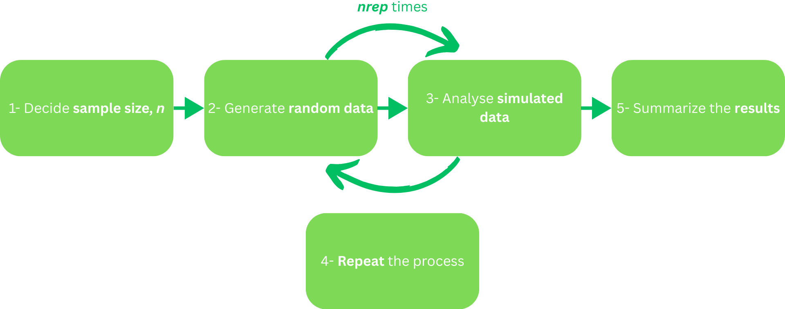
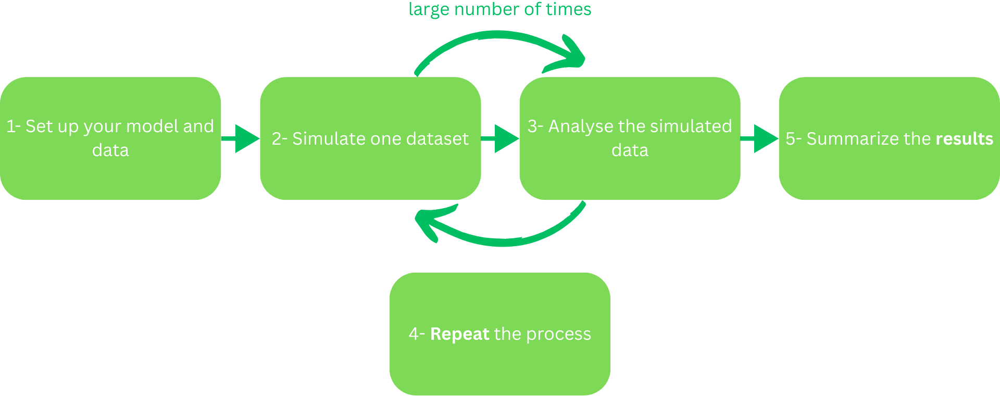

## To Do - delete slide later

- [ ] I made new suggestions for the learning goals, have a look and see what you think?
- [ ] Slide 21: see comment
- [ ] Slide 28 Power analysis the connection to simulations: see comment on slide
- [ ] Slide 29: see comment
- [ ] Added slide 30 and 31 to match with the Zotero slides and the remaining slide decks we created, please complete

---

## Licence

 

  

This work was originally created by [Malika Ihle](https://www.osc.uni-muenchen.de/about_us/coordinator/index.html) based on materials from [Joel Pick](https://joelpick.github.io/), [Hadley Wickham](https://www.yumpu.com/en/document/view/19077330/simulation-hadley-wickham), and [Kevin Hallgren](https://www.tqmp.org/RegularArticles/vol09-2/p043/), with contributions from [James Smith](https://github.com/worcjamessmith).
This current work by Tejaswini Sharma, Sarah von Grebmer zu Wolfsthurn and Malika Ihle is licensed under a CC-BY-SA 4.0 [Creative Commons Attribution 4.0 International SA License](https://creativecommons.org/licenses/by-sa/4.0/deed.en). It permits unrestricted re-use, distribution, and reproduction in any medium, provided the original work is properly cited. If you remix, transform, or build upon the material, you must distribute your contributions under the same license as the original.

::: {.notes}
**Speaker Notes**: The Creative Commons Attribution–ShareAlike 4.0 license, or CC BY-SA 4.0, allows others to copy, share, and adapt a work in any medium, including for commercial purposes. These permissions are broad and cannot be withdrawn as long as the license terms are followed. The main requirement is attribution: users must give appropriate credit to the original creator, provide a link to the license, and clearly indicate whether any changes were made, without implying endorsement by the original author. In addition, the ShareAlike condition means that if someone modifies or builds upon the work, the resulting material must be distributed under the same CC BY-SA 4.0 license, or a compatible one. Finally, users are not allowed to apply legal or technical restrictions, such as DRM, that would prevent others from exercising these same rights.
:::

---

## Contribution statement

 

**Creator**: Sharma, Tejaswini ({fig-alt="orcid logo"}[0009-0000-0305-9751](https://orcid.org/0009-0000-0305-9751))

**Reviewer**: Von Grebmer zu Wolfsthurn, Sarah ({fig-alt="orcid logo"}[0000-0002-6413-3895](https://orcid.org/0000-0002-6413-3895))

**Consultant**: Ihle, Malika ({fig-alt="orcid logo"}[0000-0002-3242-5981](https://orcid.org/0000-0002-3242-5981))

::: {.notes}
**Speaker Notes**: These are the **speaker notes**. You will a script for the presenter for every slide. In presentation mode, your audience will not be able to see these speaker notes, they are only visible to the presenter. 

**Instructor Notes**: There are also **instructor notes**. For some slides, there will be pedagogical tips, suggestions for activities and troubleshooting tips for issues your audience might run into. You can find these notes underneath the speaker notes.

**Acessibility Tips**: Where applicable, this is a space to add any tips you may have to facilitate the accessibility of your slides and activities.
:::

---

## Prerequisites

::: {.callout-important}
Before completing this submodule, please carefully read about the prerequisites.
:::

| Prerequisite   |  Description  | Link/Where to find it   |
|------------|------------|------------|
| R and RStudio installed | Latest R version: '4.4.0+' and RStudio version: '2026.01.0+392' | [Installation Link](https://posit.co/download/rstudio-desktop/) | 
| R basics | e.g., how to select a value in a data frame, how to create a vector | [Tutorial Link](https://lmu-osc.github.io/introduction-to-R/) |
| Familiarity with basic statistical concepts | e.g., hypothesis testing, descriptive statistics, data analysis | [Cheatsheet Link](assets/Cheatsheet.pdf) |

::: {.notes}
**Speaker Notes**: Before we begin this submodule, please take a moment to review the prerequisites listed here.
First, you should already have R and RStudio installed. If not, the link on the slide will guide you through the installation.
Next, you’ll need some basic familiarity with R — for example, how to select values in a data frame or how to create simple vectors. There’s a tutorial by OSC linked here in case you’d like to refresh those skills.
Finally, you should be comfortable with basic statistical concepts, such as descriptive statistics and fundamental data analysis ideas. There is a link to a cheatsheet on these concepts provided here.
If any of these areas feel unfamiliar, I encourage you to explore the resources before moving forward, so the rest of the tutorial is smooth and accessible. 

**Instructor Notes**: These are the prerequisites for this submodule. Before you get started on this submodule with your audience, you need to ensure that the audience fulfills these criteria. With a show of hands, you can know how many learners would want to work through these resources provided; if the majority do, then a bit of time can be provided here, till they are comfortable to move forward.  
:::

---

## Before we start: Survey time!

 

**Let us find out where are you at!**

::: {.notes}
**Speaker Notes**: Before we move on, we will take a short survey. The aim here is simply to understand your current familiarity.

In the next few slides, you will see some questions that invite you to reflect on where you’re starting from. This is not a test, and it is not about getting the right answers. If you’re unsure, that is completely fine, just respond based on what feels closest to your current understanding. 

**Instructor Notes**: 

- **Aim**: The pre-submodule survey serves to examine learners' prior knowledge about simulations and power analysis, and familiarity with R.

- Set a low-stakes, supportive tone before beginning the survey. Emphasise that uncertainty is expected and valuable for measuring learning progress. Do not reveal correct answers or discuss them at this stage.
:::

---

**How confident are you in defining what a “simulation” is in the context of scientific research?**

a. Not confident.

b. Somewhat confident.

c. Confident.

d. Very confident

---

**Simulations are often used in research to… *(Select all you think apply)* **

a. Generate artificial data

b. Visualize complex statistical concepts

c. Replace all statistical analyses

d. Test how models perform under different scenarios

e. No clue

::: {.notes}
**Instructor Notes**: Correct Answer(s): 

a. Generate artificial data
b. Visualize complex statistical concepts
d. Test how models perform under different scenarios
:::

---

**How familiar are you with the concept of “power” in statistics?**

1. I have never heard of it 

2. I heard the term before, but do not know what it means

3. I understand the basics of "power"

4. I am comfortable with calculating power

---

**Power analysis is important for research because… *(Select all you think apply)* **

a. It helps determine how many samples you need

b. It ensures studies always find significant results

c. It helps you design more reliable studies

d. It explains all statistical results

e. No clue

::: {.notes}
**Instructor Notes**: Correct Answer(s): 

a. It helps determine how many samples you need
c. It helps you design more reliable studies
:::

---

**How comfortable are you with performing simulations in R?**

a. Very uncomfortable

b. Somewhat uncomfortable 

c. Neutral

d. Somewhat comfortable

e. Very comfortable

---

## Discussion of survey results

 

What do we see in the results?

::: {.notes}
**Speaker Notes**: Let us have a look at these results.

**Instructor Notes:** The aim is to understand the group’s current standing in terms of knowledge and familiarity with simulations, power analysis, and R. Emphasise explicitly that the survey is not about correct or incorrect answers. Avoid evaluating answers or revealing correct ones.
:::

---

## Learning goals

:::incremental
- To **understand** the concept of simulations
- To **explain** the purpose of simulations in research
- To **summarize** how simulations support hypothesis testing and experimentation
- To **perform** the simulation process in the context of a fictional experiment
- To **understand** the concept of power analysis
- To **explain** the purpose of power analysis in research
- To **summarize** how power analysis supports hypothesis testing and experimentation
- To successfully **perform** a simulation in R
:::

::: {.notes}
**Speaker Notes**: This slide outlines the learning goals for this part of the session.
At this stage, you’re not expected to fully understand or master all of these points.
Think of them as a roadmap rather than a checklist; they show where we’re headed, not what you already need to know. As we move through the session, we’ll revisit these goals in smaller sections. You can use these goals to keep track of your learning, notice what feels clear, and identify areas where you might want to ask questions later.

As our first learning goal, we will focus on understanding what simulations are and what they mean in a research and experimental context. Next, we will explain why simulations are used in research. We will also learn how to summarize how simulations support hypothesis testing and experimentation. The next learning goal is then to practice simulations by performing the simulation process using a fictional experiment. This will help demonstrate each step in a more tangible way.

Our next learning goals is related to understanding what power analysis is and why it is important in research.  We will also learn how to summarize how power analysis supports hypothesis testing and experimentation. Finally, we pull all of our skills together and we will learn how to perform a simulation yourself in R on a hands-on example.  

**Instructor Notes**: Use this slide to set expectations and reduce pressure. Emphasise that learning goals will be revisited throughout the session for reflection and self-assessment. Avoid explaining each goal in detail here; instead, frame them as guiding anchors that will be unpacked gradually through activities and tutorials.

**Accessibility Tip:** Read the learning goals aloud and pause briefly between them to reduce cognitive load.
:::

---

## Learning goals -. delete one of the slides

:::incremental
- To **define** the meaning of simulations and where they are used.
- To **explain** the need for simulations in research.
- To **analyze** the process of running a simulation, and **apply** the process to an example.
- To **recall** the concept of power analysis and its importance.
- To **analyze** the simulation process for power analysis.
- To successfully **perform** a simulation in R.
:::

~~Expand on the speaker notes here and add that you do not expect learners to fully grasp this slide.~~  
TS: I made the notes detailed and added an accessibility tip. Made the learning goals 'incremental'. I incorporated the last goal for the tutorial.
SvG: Nice about the accessibility tip! What I meant though was to include the learning goals as text in the speaker notes (see speaker notes from the previous slide)

::: {.notes}
**Speaker Notes**: This slide outlines the learning goals for this part of the session.
At this stage, you’re not expected to fully understand or master all of these points.
Think of them as a roadmap rather than a checklist; they show where we’re headed, not what you already need to know.
As we move through the session, we’ll revisit these goals in smaller sections.
You can use these goals to keep track of your learning, notice what feels clear, and identify areas where you might want to ask questions later.

**Instructor Notes**: Use this slide to set expectations and reduce pressure. Emphasise that learning goals will be revisited throughout the session for reflection and self-assessment. Avoid explaining each goal in detail here; instead, frame them as guiding anchors that will be unpacked gradually through activities and tutorials.

**Accessibility Tip:** Read the learning goals aloud and pause briefly between them to reduce cognitive load.
:::

---

## Key terms and definitions

:::incremental
- **Simulations**: Simulations are computer experiments that generate artificial data by pseudo-random sampling, allowing researchers to evaluate statistical methods under controlled, known conditions [@morris_using_2019].
- **Power analysis**: Power analysis is a statistical method used to determine the probability that a study will detect a true effect (if it exists) or, equivalently, the probability of correctly rejecting a false null hypothesis [@steidl_statistical_1997]. 
- **Effect size**: Effect size quantifies the magnitude and direction of a difference or relationship between groups or variables [@lorah_effect_2018].
:::

::: {.notes}
**Speaker Notes**: Here are a few key terms that will appear throughout the session.
We’ll use the word simulations to talk about computer-generated data created through pseudo-random sampling.
Power analysis refers to estimating the probability of detecting a true effect.
And effect size tells us how large or meaningful that effect is.
You don’t need to memorise these right now, this is just a quick introduction. We’ll return to these definitions later as we apply them, so for now simply get familiar with the terms.

**Instructor  Notes**: Introduce the terms briefly to activate learners’ prior conceptions. Keep the slide short. 
:::

---

## What are simulations?

**Let's flip a coin**

:::incremental
- Imagine you want to flip a coin *100 times*, and see the results.

- ~~Actually flipping the coin~~ -> Pretend to flip in mind...

- And write down the results each time.
- This pretending is called a **simulation**.

:::

::: {.notes}
**Speaker notes**: Imagine you want to find out how many times you might get heads if you flip a coin 100 times. Instead of flipping the coin for real, you can pretend to flip the coin many times in your mind or on paper and write down the results each time. This pretending is called a simulation.

**Instructor Notes**: Use this basic coin example to set the ground for 'simulations'. Encourage your learners to ponder upon this example as a real experiment for a short bit, to understand how they can 'simulate' the data in their minds.
:::

---

## What are simulations?

:::incremental
- In a simulation, you make up data that **acts like what you expect in the real world**. 
- You do this again and again and see what results you get.
:::

::: {.notes}
**Speaker Notes**: In this part, we’re looking at what simulations really are. A simulation basically means creating data that behaves the way we expect real-world data to behave. We repeat this process many times to see the range of outcomes we might get.
:::

---

## What are simulations?

- In a simulation, you make up data that **acts like what you expect in the real world**. 
- You do this again and again and see what results you get.

  <strong>Your turn!</strong> 
  Get in a pair, first imagine <strong>flipping a coin</strong> <em>100 times</em> and note how many heads and tails you expect.
  Then, discuss <strong>why doing this pretend experiment first is useful</strong> for planning a real study.

::: {.notes}
**Speaker Notes**: To get an intuitive feel for it, there’s a quick activity: take a moment with the person next to you and imagine flipping a fair coin 100 times. How many heads and tails do you expect? You’re not actually flipping the coin, you’re just thinking it through. But that mental experiment already follows the logic of a simulation.

Before we explore why simulations are important in research, we’ll think ourselves why the process of 'making up data' is important. Take a moment to think why doing this pretend experiment first is useful for planning a real study.

**Instructor Notes**: Pause the slide here and give learners about 2 minutes to discuss. Encourage them to state a simple expectation or hypothesis (e.g., “I expect about 50 heads and 50 tails”). Emphasize that there is no single correct answer, the goal is intuition, not precision. When essential, remind the learners that the activity is for them to ponder on simulating an experiment and exploring its usage, rather than 'having correct answers'.

**Accessibility Tips:** Take a brief pause before the activity for the learners to soak in the knowledge before applying it. When needed, maybe give an own formulated example of the activity for ease.
:::

---

## Why are simulations used in research? 

 
 

**What ideas have you come up with during the previous activity?**

::: {.notes}
**Speaker Notes**: Collect what learners have come up with during the previous activity. Summarize and paraphrase as you go along, and potentially collect the answers on a flipchart.
:::

---

## Why are simulations used in research? 

:::incremental
1. **To build “good feeling” about data (intuition)**

2. **To understand chances (probability)**

3. **To check if an experiment is strong enough (power)**

4. **To practice before the real experiment (planning)**

5. **To contribute to open research (transparency)**
:::

::: {.notes}
**Speaker Notes**: Let’s now talk about why simulations are used in research. Some of these aspects you have already mentioned in the discussion of the activity. 

1. One reason is that they help us build an intuitive feel for data. Even when we follow the same rules, results naturally vary. If you imagine simulating many sets of ten coin flips, you’ll notice the number of heads changes from one set to the next, even when the coin is fair. This helps us understand that different outcomes don’t automatically mean something unusual is happening.

2. Simulations also help us understand probability. By repeating an experiment many times, we can see what outcomes are common and which ones are rare.For example, if we imagine a thousand experiments where we flip a coin four times, we’ll see that getting two heads is quite common, while getting zero or four heads is much less likely. This helps us develop a sense of what’s typical versus surprising in data.

3. Simulations are also used to check whether an experiment is "strong" enough. Researchers can simulate an experiment many times to see how often it would successfully detect a real effect. In our coin example, this is like asking how many flips are needed before we can confidently decide whether the coin is fair or biased.

4. Another important use of simulations is planning. Before collecting real data, researchers run pretend or simulated versions of their study to see what outcomes are likely and to identify potential issues early. This is like practicing a play before performing it on stage, so they can fix problems early.

5. Another important reason simulations are used in research is their connection to Open Research. When we work with simulations, we can share the exact code and steps we used to generate and analyse the data. This means others can rerun the same simulation and see how the results were produced, which supports transparency.

**Instructor Notes**: Emphasize intuition over formal definitions here; the goal is to help learners develop a “feel” for variability and probability. If the learners are gaining a basic understanding, you can move over to more technical explanations or terms. Feel free to present some real-life research examples you may have encountered.

Emphasize continuity with the earlier coin-flip example to avoid introducing too many new ideas at once. Highlight that both power and planning are about reducing uncertainty before running the real experiment. Avoid technical definitions here; intuition is the goal. 

Finally, allow the learners to soak in the knowledge and reasoning, before worrying about the technical terms. The terms are mentioned so that the learners become aware of them used in the science world. Prompt them to ask questions if any of the terms are unclear. 

**One additional reason for more advanced learners**: Simulations can also be used to measure uncertainty through techniques like resampling or bootstrapping. Here, we repeatedly reuse the data we already have to see how much our results might vary.

:::

---

## Basic simulation process

  

:::{.callout-tip}
## Your turn!
Time to apply the simulation process to your coin-flip experiment. Get in your pair, and discuss each step according to your experiment. 

*For example, if you flip a coin a 10 times **(n = 10)**, your data could be H, T, H, H, T, T, H, T, H, H **(random data)***.
:::

::: {.notes}
**Speaker Notes**: Here is the basic process behind running a simulation.

First, decide how many data points (sample size) you want, for example, simulating a 100 coin flips. Thus, n = 100.

Next, generate the fake data using a random method that mimics the real outcome, such as randomly assigning ‘heads’ or ‘tails’ with equal probability.

Then analyze this simulated dataset just as you would analyze real data, for example, you might count how many heads you got or calculate a simple summary.

After that, repeat the simulation many times to see how the results vary from run to run.
Finally, bring everything together by summarizing the outcomes across all repetitions.
This gives you a clear picture of the variation you can expect if the experiment were done in real life.

**Instructor Notes**: After discussing the pointers, let the learners work on the activity and justify the simulation of data in their experiment, and share it in class.
:::

---

## Learning goals: Check-in

:::incremental
- To **understand** the concept of simulations ✅
- To **explain** the purpose of simulations in research ✅
- To **summarize** how simulations support hypothesis testing and experimentation ✅
- To **perform** the simulation process in the context of a fictional experiment ✅
:::

::: {.notes}
**Speaker Notes**: Let us pause for a quick check-in. Take a moment to look back at the learning goals for this section and reflect on how comfortable you feel with each one.
If you notice any gaps, this is the right moment to bring them up. Feel free to ask questions or start a discussion so we can address them before moving on.

**Instructor Notes**: Encourage brief reflections rather than detailed discussions. Ask learners to self-assess quietly or with a quick show of hands. Invite a few questions or clarifications, but avoid re-teaching in depth unless a common gap appears.
:::

---

## What is power analysis?

**Let's flip the coin again, *but how many times?* **

:::incremental
- **Power analysis** is like figuring out how many times you need to flip a coin -> to be pretty sure you can tell if the coin is fair or not.

- **Power** = your chance of catching the coin's true nature if it really is biased.

 - If power = 80% -> you have an 80% chance of spotting a bias if it's really there.
 
:::
 
::: {.notes}
**Speaker Notes**: In this section, we’re looking at what power analysis means and why it matters.
Think back to our coin example. The question now is: How many times should we flip the coin to confidently decide whether it’s fair? Power analysis helps us figure that out.

Power is simply the chance of detecting a real effect if it truly exists.
So if the power is 80 percent, that means we have an 80 percent chance of noticing a bias when the coin is actually biased.

**Instructor Notes**: This is the moment to clear out any confusion regarding the neighboring concepts of effect size and significance level. If the learners seem comfortable with the concepts, you can opt for a higher-level explanation reflecting the 'correctly rejecting a false null hypothesis' notion.
:::

---

## What is power analysis?

:::incremental
Power **depends** on:

 - The **effect size** (= *how biased the coin might be*)

 - The **sample size** (= *how many times you flip the coin*)
 
 - The **significance level** (= *how sure you want to be*)
 
:::
 
:::{.callout-tip}
## Your turn!
Get together in your pair, and discuss **why** conducting power analysis for your experiment **could be useful.**
:::

::: {.notes}
**Speaker Notes**: Power analysis is basically about asking: How likely is my study to actually notice something real, if it’s there? That likelihood depends on three main things.

First, the effect size — in our coin example, this means how biased the coin really is. A very slightly biased coin is harder to detect than a strongly biased one.

Second, the sample size. The more times you flip the coin, the more information you collect, and the easier it becomes to spot a real pattern.

And third, the significance level — this reflects how sure we want to be before we say, ‘Yes, this effect is real.’

Time for a short in class activity: before we dive into the importance of power analysis, I need you to think for yourself, namely why conducting power analysis for your experiment could be useful.

**Instructor Notes:** Before starting the activity, clear out any doubts on the concept of 'power'. Encourage learners to reason intuitively. The goal is not to have the right answer, but to reason by themselves first. 

If learners struggle, prompt them with questions like: “What happens if the effect is very small?” or “What changes if you only flip the coin 10 times instead of 100?”
:::

---

## Why is power analysis used in research? 

 
 

**What ideas have you come up with during the previous activity?**

::: {.notes}
**Speaker Notes**: Collect what learners have come up with during the previous activity. Summarize and paraphrase as you go along, and potentially collect the answers on a flipchart.
:::

---

## Why is power analysis used in research? 

:::incremental
1. **Prevents underpowered studies**: By helping you determine the minimum sample size, it makes sure you do not do an experiment that is too weak to detect an effect that is there.

2. **Minimizes wasting resources**: Helps you figure out the most efficient experimental design, which in terms minimizes wasting time, money or human resources.

3. **Required for transparency and publication**: Represents evidence that your experimental plan is thought through, e.g., the sample size, and others can replicate your methods (i.e., in e spirit of *Open Research*)
:::

::: {.notes}
**Speaker Notes**: Power analysis can be important for various reasons. 

1. It can help us avoid studies that are simply too weak to be useful. If a study is underpowered, you might run the experiment, analyse the data, and still fail to detect a real effect, not because the effect isn’t there, but because the study was too small. This is similar to trying to record a sound in a noisy room: You might hear it, not because the sound is not there, but because your setup is not high-tech enough to detect it.

2. Power analysis also helps save time and effort. Instead of guessing how much data you need, it tells you the minimum number of observations required to have a reasonable chance of detecting an effect. This means you’re not running an experiment that’s unnecessarily large, expensive, or time-consuming.

3. Finally, power analysis is increasingly expected for transparency and publication. Many journals and ethics committees want to see that researchers planned their study carefully and that the sample size was not chosen arbitrarily. Showing a power analysis is one way to demonstrate that your research design is solid and justified. Moroever, other researchers can repeat your work and your methods. This is in the spirit of Open Research.

**Instructor Notes**: Emphasize that power analysis is a planning tool, not a guarantee of significant results. Reinforce that its role is to make studies informative, whether results turn out significant or not. If relevant, mention that power analyses are often required in preregistrations, grant proposals, and ethics applications.

**Accessibility Tips**: The technical terms may be overwhelming for some of the learners. Therefore, they need to be clarified with simpler explanations.
:::

---

## Performing a power analysis

:::incremental
Two ways:

1. **Power analysis through a formula** = method that uses a **mathematical formula** to estimate your sample size or effect size (see [G*Power](https://www.psychologie.hhu.de/arbeitsgruppen/allgemeine-psychologie-und-arbeitspsychologie/gpower)). For example, the formula could be used to quickly estimate your required sample size for your experiment. Works best for **simple study designs** (e.g., one-sample t-test, simple linear regression). 

2. **Power analysis through simulations** = **pretending** to do the experiment many times on a computer before **actually doing** it. You input what you expect to happen (e.g., study design, means, etc.). The experiment "runs" using these parameters and you see how often the simulated experiment correctly detects an effect. Works well for **complex study designs** (e.g., longitudinal data) and unusual data. (*This is today's focus*).
:::

::: {.notes}
**Speaker Notes:** There are two main ways to do power analysis. The first is the quick formula method. Here, you use a mathematical formula that links effect size, sample size, and significance level to estimate how much data you need. This works well for very simple designs, like basic comparisons or classic statistical tests. It is fast and intuitive, but it also makes strong assumptions about how the data behave.

The second approach is simulation-based power analysis. Instead of relying only on formulas, you pretend to run your experiment many times on a computer. You generate fake data that reflect how you expect the real data to look, analyse each pretend dataset, and then see how often you detect the effect.

This simulation approach is especially useful when experiments are more complex, for example, when there are multiple variables, lognitudinal data non-standard designs, or assumptions that are hard to check. In those cases, simulations give a more realistic picture of how your study will actually perform.

**Instructor Notes:** Clarify that simulations do not replace theory but extend it when formulas become too simplified or unrealistic. Encourage learners to think about which method fits their own experimental designs and to see simulations as a flexible tool rather than an advanced or intimidating one.
:::

---

## Basic simulation process

  

:::{.callout-tip}
## In-class Activity
Time to apply the power analysis process to your coin-flip experiment. Get in your pair, and discuss at which moment in time you would perform a power analysis. 
:::

Can you recheck the instructions here on the slide checking that it matches with what you want people to do? The speaker notes sound similar to what you had for this slide with this figure before? Should this activity not be more focused on power analysis to extent the simulation process for this part?

::: {.notes}
**Speaker Notes**: Let’s walk through the basic steps of simulation-based power analysis using this process.

First, you set up your model and data. This means deciding what your variables look like and how they behave. For example, are you working with coin flips, test scores, or reaction times? You also choose assumptions like the sample size, the expected effect size, and the type of distribution the data follow. In our coin example, this is where you decide how biased the coin might be and how many flips you plan to run.

Second, you simulate one dataset. Here, you generate fake data on a computer that follow the rules you just defined. If you expect a real effect, you deliberately build it into the data — for example, by making one group slightly different from another. This step is like running your experiment once, but with pretend data.

Third, you analyse the simulated data exactly as you would analyse real data. You apply the statistical test you plan to use later, such as a t-test or a regression, and you record the outcome — for instance, whether the result is statistically significant.

Fourth, you repeat this whole experiment many times. You simulate new data, analyse them again, and store the results. By doing this hundreds or thousands of times, you can see how often your planned analysis successfully detects the effect.

Finally, you summarize and interpret the results. You calculate the proportion of simulations in which the effect was detected. This proportion is your estimated power. In other words, how likely your study is to find the effect if it truly exists.

**Instructor Notes:** Emphasize that the key idea is repetition under known conditions. Encourage learners to connect each step to their earlier coin-flip hypothesis or imagined experiment. During the pair discussion, circulate and prompt learners to identify what choices they would need to make in Step 1 (effect size, sample size) for their own design.

**Accessibility Tips:** Explain each step sequentially and verbally reference the diagram so learners can follow without relying solely on the visual.
:::

---

## Your turn!

In this next part, you will familiarize yourself with **simulations** through **hands-on exercices and activities**:

- [Introduction to Simulations in R: Hands-on practical activities](https://lmu-osc.github.io/Introduction-Simulations-in-R/)

- Or follow: [https://lmu-osc.github.io/Introduction-Simulations-in-R/](https://lmu-osc.github.io/Introduction-Simulations-in-R/)

:::{.callout-tip}
## Tip
Since this is a self-paced tutorial, *take your time* on navigating it; and it can be finished at home as well. We will have a check-in moment at the end of this session. 
:::

::: {.notes}
**Speaker Notes**: Now we’ll move on to the tutorial part of the session.
You’ll work individually through a self-paced tutorial, focusing on gaining hands-on experience with running simulations yourself in R. Take your time as you go through them, and work at a pace that feels comfortable. There is no expectation to finish everything right now, and you’re welcome to continue working on them at home. Use this time to explore, experiment, and revisit earlier ideas as they come up in the tutorial.

**Instructor Notes:** Clearly signal the shift from guided instruction to independent work. Remind learners that the tutorial is self-paced and that progress will naturally vary. Encourage them to ask questions if they encounter difficulties. Do walk around the room to check up on the progress of your learners. Provide a time limit for the activity and inform your learners that you will come together as a group towards the end of the session to wrap up.
:::

---

## Assignment

 

**If you have not completed the tutorial yet**: Complete the rest in your own time. 

::: {.notes}
**Speaker Notes**: For those of you who did not yet finish with the tutorial, this is the assignment for the next session. 

**Instructor Notes**: Explain the homework assignment and the rationale behind the homework. Examine whether/how it will be assessed. Mention scoring rubrics, if applicable.

*Accessibility Tip**: Design a peer-review system for assignments to place learners in role of reviewer and author. This helps learners learn how to give feedback, but also how to receive feedback. 
:::

---

## Learning goals: Check-in

:::incremental
- To **understand** the concept of simulations ✅
- To **explain** the purpose of simulations in research ✅
- To **summarize** how simulations support hypothesis testing and experimentation ✅
- To **perform** the simulation process in the context of a fictional experiment ✅
- To **understand** the concept of power analysis ✅
- To **explain** the purpose of power analysis in research ✅
- To **summarize** how power analysis supports hypothesis testing and experimentation ✅
- To successfully **perform** a simulation in R ✅
:::

::: {.notes}
**Speaker Notes**: Let’s pause for a quick check-in. Take a moment to look back at the learning goals for this section and reflect on how comfortable you feel with each one.

If you notice any gaps, this is the right moment to bring them up — feel free to ask questions or start a discussion so we can address them before moving on.

**Instructor Notes**: Encourage brief reflection rather than detailed discussion. Ask learners to self-assess quietly or with a quick show of hands. Invite a few questions or clarifications, but avoid re-teaching in depth unless a common gap appears.
:::

---

## Relevance to you?

 

Can you imagine using simulations for **your** work/projects/studies?

::: {.notes}
**Speaker Notes**: Let us discuss how these skills could be relevant to you. Where can you imagine applying these new skills? In which context? Or where can you imagine that you *will not* apply these skills? 

**Instructor Notes**: The aim here is to work out the relevance of the topic to your learners. In an interactive setting, discuss how the new skills could be applied in practice with specific examples. Examine downfalls and practical obstacles.
:::

---

## Take-home messages

:::incremental
- **Simulations = safe playground**: You try your study many times with pretend data, so you learn how your experiment might *behave* before touching real data.

- **Power analysis = trial period**: You find the "just right" study size— not too small to miss real effects, not too big to waste resources.

- Together they’re your **research rehearsal**: first you imagine the experiment (*simulate*), then you check if the plan is strong enough (*power*), and only then you go on stage with real data.
:::

::: {.notes}
**Speaker Notes**: To wrap up, here’s the main takeaway.
Simulations act like a safe playground, where you can run your study many times using pretend data and see how your statistics behave before working with real data. Power analysis works like a trial period, helping you decide on a study size that’s large enough to detect real effects, but not larger than necessary. Together, simulations and power analysis form a kind of research rehearsal — you first imagine and test the experiment, then check whether the plan is strong enough, and only after that move on to collecting real data.

**Instructor Notes**: This is a good moment to make sure that your learners feel the need for simulations and power analysis on a ground level. The metaphor can make it easier to remember the reasoning.
:::

---

## To conclude: Survey time!

::: {.notes}
**Speaker Notes**: To conclude, we’ll take a short survey.
This post-session survey helps us understand your current level of knowledge about simulations, power analysis, and working in R after completing the submodule.
Please answer honestly based on how confident you feel now.

**Instructor Notes**: The purpose is to compare pre- and post-submodule responses to evaluate learning progress and the effectiveness of the tutorial. At this stage, the correct answers can be discussed. Encourage your learners to share in class, in case they answered wrongly and navigate them to the correct answer. Use this space to answer doubts, and provide learning or practice tips if the learners still feel under-confident in these areas.
:::

---

**How confident are you in defining what a “simulation” is in the context of scientific research?**

a. Not confident.

b. Somewhat confident.

c. Confident.

d. Very confident

---

**Simulations are often used in research to… *(Select all you think apply)* **

a. Generate artificial data

b. Visualize complex statistical concepts

c. Replace all statistical analysis

d. Test how models perform under different scenarios

::: {.notes}
**Instructor Notes**: Correct Answer(s): 

a. Generate artificial data

b. Visualize complex statistical concepts

d. Test how models perform under different scenarios
:::

---

**How familiar are you with the concept of “power” in statistics?**

1. I’ve never heard of it 

2. I know the term 

3. I understand the basics 

4. I’m comfortable with calculating power

---

**Power analysis is important for research because… *(Select all you think apply)* **

a. It helps determine how many samples you need

b. It ensures studies always find significant results

c. It helps you design more reliable studies

d. It explains all statistical results

e. No clue

::: {.notes}
**Instructor Notes**: Correct Answer(s): 

a. It helps determine how many samples you need

c. It helps you design more reliable studies

:::

---

**How comfortable are you with running basic R code and performing simulation in R?**

a. Very uncomfortable

b. Somewhat uncomfortable 

c. Neutral

d. Somewhat comfortable

e. Very comfortable

---

## Discussion of survey results

 

What do we see in the results?

::: {.notes}
**Speaker Notes**: Let’s take a moment to look at these survey results together. The goal here is not to see who got answers “right” or “wrong,” but to get a sense of where we are as a group right now. These results give us a snapshot of your current familiarity with simulations, power analysis, and R, which helps us understand what feels familiar and what might feel new.  
**Instructer Notes**: The post-survey aims to assess the difference in knowledge and skill before and after the class. Highlight general patterns rather than individual responses (e.g., areas of confidence vs. uncertainty). Avoid correcting answers.
:::

---

## References {.smaller}

::: {#refs}
:::

::: {.notes}
**Speaker Notes**: This slide lists all the sources that informed today’s session. You don’t need to read through them now. They are here so you can see where the ideas and definitions come from and so you can revisit any of these readings later if you’re interested.

**Instructor Notes**: Emphasise that learners are not expected to engage with all sources now; this slide mainly serves documentation and follow-up purposes. 
:::

---

## Additional Resources:

- Hallgren, K. A. (2013). Conducting Simulation Studies in the R Programming Environment. *Tutorials in Quantitative Methods for Psychology, 9(2), 43–60*. [https://doi.org/10.20982/tqmp.09.2.p043](https://doi.org/10.20982/tqmp.09.2.p043)  
- Mullendore, G. L., Mayernik, M. S., & Schuster, D. C. (2021). Open Science Expectations for Simulation-Based Research. *Frontiers in Climate, 3*. [https://doi.org/10.3389/fclim.2021.763420](https://doi.org/10.3389/fclim.2021.763420)  
- Wassertheil, S., & Cohen, J. (1970). Statistical Power Analysis for the Behavioral Sciences. *Biometrics, 26(3), 588.* [https://doi.org/10.2307/2529115](https://doi.org/10.2307/2529115)  
- [Introduction to Power Analysis by Courtney K. Soderberg](https://osf.io/7wfed/files/asf53)

::: {.notes}
**Speaker Notes**: This slide lists the key references and additional resources used throughout the session.
You don’t need to go through these right now.
They’re here so you can revisit the concepts in more depth later, explore practical examples, or follow up on topics that interested you during the tutorial.
Feel free to use these resources at your own pace.
:::

---

# Thanks!  
See you next class :)

---

## Contribution Statement - UNINISHED

Possible roles using the CRediT contribition system or the Zenodo Contribution System: 

**Name main content creator**: Conceptualization, Software, Writing - Original Draft, Visualization. **Sara Lil Middleton**: Writing - Review & Editing, Supervision. **Sarah von Grebmer zu Wolfsthurn**: Conceptualisation, Writing - Review & Editing, Supervision, Project Administration, Validation.

--- 